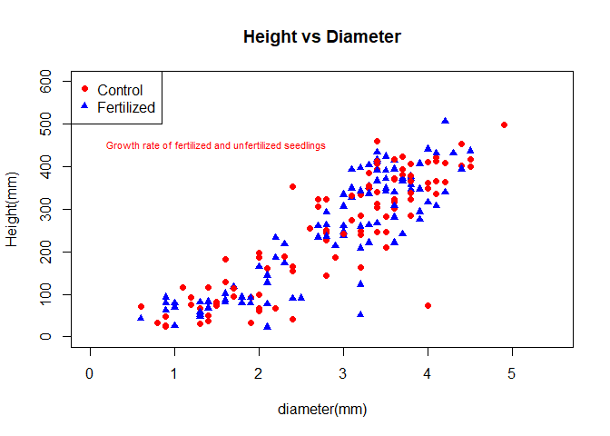

# Sverige LantbruksUniversitet (SLU) Permanent Forest Experiments


## Brief Introduction

This is an analysis done as part of the **Sustainable Forestry in
Southern Sweden** course in the Euroforester program at the SLU campus
at the south of Sweden in
[Alnarp](https://www.slu.se/en/departments/southern-swedish-forest-research-centre/).

The data used for this analysis were provided mainly by the research
centre at Tonnersjoheden and have been [uploaded
here](https://github.com/xrander/SLU-Plantation-Experimentation/tree/master/Data).

## Data Exploration

The first data used is the ‘popdata’

``` r
pop <- read.table('C:/Users/aduol/Documents/Projects/SLU-Plantation-Experimentation/Data/Lab1/popdata.txt', header = T)
head(pop)
```

    ##   block cutw height dia clone fert
    ## 1     1  2.4     71 0.6     A    3
    ## 2     1  0.7     67 1.4     A    3
    ## 3     1  6.5    211 3.5     A    3
    ## 4     1  1.1     69 1.0     A    3
    ## 5     2  2.0    116 1.4     A    3
    ## 6     2  4.9    123 3.2     A    3

**Data description**

-   block: experimental block

-   cutw: cultivar width

-   height: height of the plant

-   dia = diameter

-   clone: clone class

-   fert: Fertilized or not(1 = fertilized and 3 = control)

Creating a column to give name to the values of the fert

``` r
pop$fert_value <- ifelse(pop$fert==1, 'fertilized', 'control')
head(pop)
```

    ##   block cutw height dia clone fert fert_value
    ## 1     1  2.4     71 0.6     A    3    control
    ## 2     1  0.7     67 1.4     A    3    control
    ## 3     1  6.5    211 3.5     A    3    control
    ## 4     1  1.1     69 1.0     A    3    control
    ## 5     2  2.0    116 1.4     A    3    control
    ## 6     2  4.9    123 3.2     A    3    control

Height diameter relationship of the control and fertilized seedlings

``` r
plot(pop$dia, pop$height,
     text(x=01.5, y=450,labels = "Growth rate of fertilized and unfertilized seedlings",col = "red", cex = 0.7),
     xlim = c(0,5.5), ylim = c(0, 600),xlab = 'diameter(mm)',
     ylab = 'Height(mm)', main = "Height vs Diameter",
     pch = c(16,17), col = c('red', 'blue'))
legend("topleft",
       legend = c("Control","Fertilized"),
       pch= c(16,17),
       col = c('red','blue'))
```



t-test between height and diameter

``` r
t.test(pop$dia, mu = mean(pop$dia))
```

    ## 
    ##  One Sample t-test
    ## 
    ## data:  pop$dia
    ## t = 0, df = 188, p-value = 1
    ## alternative hypothesis: true mean is not equal to 2.860317
    ## 95 percent confidence interval:
    ##  2.713675 3.006960
    ## sample estimates:
    ## mean of x 
    ##  2.860317
