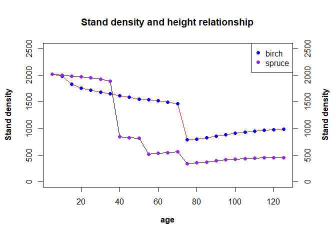
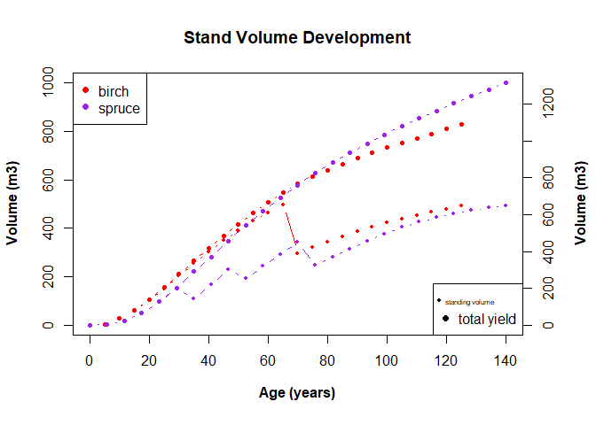
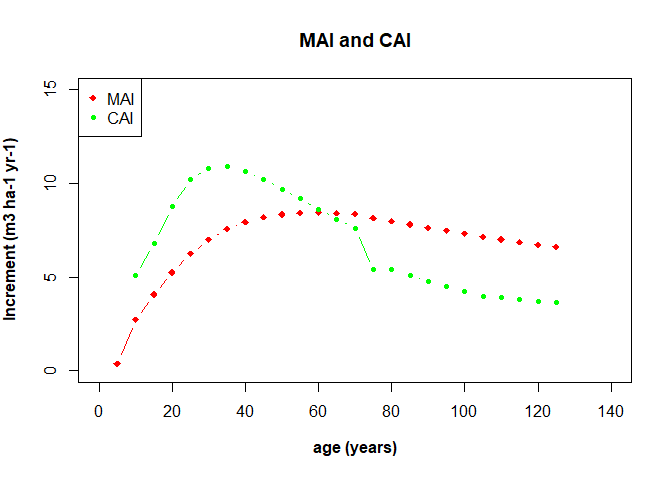

# Sverige LantbruksUniversitet (SLU) Permanent Forest Experiments


# Brief Introduction

This is an analysis done as part of the **Sustainable Forestry in
Southern Sweden** course in the Euroforester program at the SLU campus
at the south of Sweden in
[Alnarp](https://www.slu.se/en/departments/southern-swedish-forest-research-centre/).

The data used for this analysis were provided mainly by the research
centre at Tonnersjoheden and have been [uploaded
here](https://github.com/xrander/SLU-Plantation-Experimentation/tree/master/Data).

I will be taking us through the analysis journey. Terms relating to
forestry will be explained, while syntax of R used won’t be explained. I
will also be taking you through the analysis.

**Data Exploration** The package used is the doBy library doBy, dplyr,
lattice, ggplot, TukeyC and so on To install the package run the command
like this `install.packages('package name')` as an example
`install.packages('dplyr')`.

====NB: For most part of the analysis base r packages will be used====

``` r
library(doBy)
library(dplyr)
library(lattice)
library(ggplot2)
library(car)
library(data.table)
library(TukeyC)
```

------------------------------------------------------------------------

------------------------------------------------------------------------

------------------------------------------------------------------------

------------------------------------------------------------------------

# Thinning Experiment of Birch and Scotch Pine - Exp IV

Data used in this experiment are from different precommercial thinning
treatments (PCT) which are thereafter simulated in Heureka (Swedish
support decision system). The stand development was simulated with some
thinning operations included. Data provided is from every 5 year period.

**Data Description**

-   age: the age of the stand

-   site: the site number (1 for spruce and 6 birch)

-   stdens: stem density (st/ha)

-   ba: basal area (m^2/ha)

-   spruce_dgv: quadratic mean dbh for spruce in cm

-   birch_dgv: quadratic mean dbh for birch in cm

-   stand_vol: standing volume

-   harv_vol: harvested volume

-   mor_vol: mortality volume in m^3 at the age

**importing data**

``` r
lab4mai <- read.table('https://raw.githubusercontent.com/xrander/SLU-Plantation-Experimentation/master/Data/Lab%204/lab4mai%20(2).txt',
           header = T, sep = '\t',
           na.strings = 'NA', dec = '.',
           strip.white = T)
```

We can inspect the data structure to investigate if the variables are in
the data type we want.

``` r
str(lab4mai)
```

    ## 'data.frame':    50 obs. of  9 variables:
    ##  $ site      : int  1 1 1 1 1 1 1 1 1 1 ...
    ##  $ age       : int  5 10 15 20 25 30 35 40 45 50 ...
    ##  $ stdens    : num  2019 1999 1985 1970 1948 ...
    ##  $ ba        : num  0.0834 1.7468 7.0915 14.9834 22.4206 ...
    ##  $ stand_vol : num  0.6 4.5 22.5 66.8 126.6 ...
    ##  $ harv_vol  : num  0 0 0 0 0 ...
    ##  $ mor_vol   : num  0 0.01 0.03 0.15 0.64 1.44 2.74 4.25 3.77 3.31 ...
    ##  $ spruce_dgv: num  1.35 3.8 7.18 10.32 12.73 ...
    ##  $ birch_dgv : num  0 0 0 0 0 0 0 0 0 0 ...

This is important to do whenever we import data as some integer may be
in character format.

## Questions

For this data we will do some exploration, we then find:

    -   total volume

    -   total yield,

    -   CAI and MAI

    -   correct the figure with thinning age

    -   find how many thinnings were done for both species

    -   decide if thinnings done were heavy or not.

## Total Volume Estimation

Given the data we have, we can get the total volume produce by adding
all the volumes:
*t**o**t*<sub>*v**o**l*</sub> = *s**t**a**n**d*<sub>*v**o**l*</sub> + *h**a**r**v*<sub>*v**o**l*</sub> + *m**o**r*<sub>*v**o**l*</sub>

``` r
lab4mai$tot_vol <-lab4mai$stand_vol + lab4mai$harv_vol + lab4mai$mor_vol
```

We subset the data according to species

``` r
birch <- subset(lab4mai, site==6)
spruce <- subset(lab4mai, site==1)
```

**A little exploration**

``` r
par(mar = c(5, 4, 4, 4) + 0.5)

plot(birch$age, birch$stdens, type = "l",
     ylim = c(0,2500),
     col = 'red',
     xlab = substitute(paste(bold('age'))),
     ylab = substitute(paste(bold('Stand density'))),
     main = 'Stand density and height relationship')
points(birch$age, birch$stdens,
         col = 'blue',
       pch = 19)
par(new = TRUE)
plot(spruce$age, spruce$stdens, type = "l",
     ylim = c(0,2500),
     col = 'black',
     axes = FALSE,
     xlab = "",
     ylab = "")
points(spruce$age, spruce$stdens,
         col = 'purple',
       pch = 16)
axis(side = 4, at = pretty(range(spruce$stdens)))
mtext (substitute(paste(bold('Stand density'))), side = 4, line = 3)
legend('topright', legend = c('birch', 'spruce'),
       pch = c(19,16),
       col = c('blue', 'purple'))
```



The plot above from our little exploration gives us an idea of the
number of thinnings that have occurred for both species. Birch was
thinned once while Spruce was thinned thrice.

## Total Yield Estimation

To estimate the total yield, we evaluate the cumulative of all the
volume removed from the forest then add it to the standing volume.

``` r
# cumulative of birch
birch$sum_harv <- cumsum(birch$harv_vol)
birch$sum_mor <- cumsum(birch$mor_vol)

# total yield or volume for birch
birch$sumvol <- birch$sum_harv + birch$sum_mor + birch$stand_vol

# cumulative ofspruce
spruce$sum_harv <- cumsum(spruce$harv_vol)
spruce$sum_mor <- cumsum(spruce$mor_vol)


# total yield or volume for spruce
spruce$sumvol <- spruce$sum_harv + spruce$sum_mor + spruce$stand_vol
```

\*\*Visualizing the result and comparing the respective standing volume
between the two species)

``` r
par (mar = c(5,4,4,4) + 0.3)
plot(birch$age, birch$stand_vol,
     col = 'red',
     xlab = substitute(paste(bold('Age (years)'))),
     ylab = substitute(paste(bold('Volume (m3)'))),
     main = 'Stand Volume Development',
     pch = 19,
     cex = 0.5,
     type = 'b',
     xlim = c(0,140),
     ylim = c(0,1000))
points (birch$age,birch$sumvol,
          pch = 19,
         col ='red',
        cex = 0.7,
        type = 'b')
par (new = TRUE)
plot(spruce$age, spruce$sumvol,
     col = 'purple',
     type = 'b',
     cex = 0.7,
     pch = 16,
     xlab = "",
     ylab = "",
     axes = FALSE)
points(spruce$age,spruce$stand_vol,
       col ='purple',
       pch = 16,
       cex = 0.5,
       type = 'b')
axis (side = 4,
      at = pretty(range(spruce$sumvol)))
mtext(substitute(paste(bold('Volume (m3)'))),
      side = 4,
      line = 3)
legend("topleft", 
       legend = c('birch', 'spruce'),
       pch = c(19,16),
       col = c('red', 'purple'))
legend ("bottomright",
        legend = c('standing volume', 'total yield'),
        pch = c(19),
        cex = c(0.5, 1))
```



## CAI and MaI

**birch**

``` r
birch$last_vol <- shift(birch$stand_vol) ## this brings the previous measurement forward to the current row

## CAI
birch$cai <- (birch$stand_vol + birch$harv_vol + 
  birch$mor_vol - birch$last_vol)/5

## MAI
birch$mai <- birch$sumvol/birch$age
```

**spruce**

``` r
spruce$last_vol <- shift(spruce$stand_vol) # Last measurement brought to the current row

## CAI
spruce$cai <- (spruce$stand_vol + spruce$harv_vol + 
                spruce$mor_vol - spruce$last_vol)/5

## Spruce MAI
spruce$mai <- spruce$sumvol/spruce$age
```

**Birch CAI and MAI**

``` r
plot(birch$age, birch$mai,
     type = 'b',
     pch = 18,
     col = 'red',
     ylim = c(0,15),
     xlim = c(0, 140),
     main = 'MAI and CAI',
     ylab = substitute(paste(bold('Increment (m3 ha-1 yr-1)'))),
     xlab = substitute(paste(bold('age (years)'))))
points(birch$age, birch$cai,
        type = 'b',
        pch = 20,
        col = 'green')
legend("topleft",
         legend = c("MAI", "CAI"),
         pch = c(18, 20),
         col = c('red', 'green'))
```



**Spruce CAI and MAI**

``` r
plot(spruce$age, spruce$mai,
     type = 'b',
     pch = 18,
     col = 'red',
     ylim = c(0,20),
     xlim = c(0, 140),
     main = 'MAI and CAI',
     ylab = substitute(paste(bold('Increment (m3 ha-1 yr-1)'))),
     xlab = substitute(paste(bold('age (years)'))))
points(spruce$age, spruce$cai,
         type = 'b',
         pch = 20,
         col = 'green')
legend("topleft",
         legend = c("MAI", "CAI"),
         pch = c(18, 20),
         col = c('red', 'green'))
```


## Correcting Thinning Age

Usually the year of harvest or thinning is usually having two volumes
and time. The first is the volume before we harvest and the second is
the volume we harvest. They are usually the same, but time of harvest
differs by days, or months. Since forestry is a business that involves
calculating stand volume on some yearly period. It is usually costly and
unprofitable to carry out inventory every year, thus, we do it between
certain periods, 5 to 10 years, while we still monitor the stand between
such period. Now we adjust the year of thinning and standing volume to
show the age before harvest.

``` r
# Birch
birch_thinned <- subset(birch, harv_vol>0)
birch_thinned$stand_vol <- birch_thinned$stand_vol + birch_thinned$harv_vol
birch_thinned$age <- birch_thinned$age  - 0.01

# Spruce
spruce_thinned <- subset(spruce, harv_vol >0)
spruce_thinned$stand_vol <- spruce_thinned$stand_vol + spruce_thinned$harv_vol
spruce_thinned$age <- spruce_thinned$age  - 0.01

head(birch_thinned)
```

    ##    site   age stdens      ba stand_vol harv_vol mor_vol spruce_dgv birch_dgv
    ## 39    6 69.99 1465.7 40.6077     522.5 225.9165   10.85       7.01     20.72
    ##    tot_vol sum_harv sum_mor sumvol last_vol  cai      mai
    ## 39  533.35 225.9165   62.48 584.98    495.3 7.61 8.356857

``` r
head(spruce_thinned)
```

    ##    site   age stdens      ba stand_vol harv_vol mor_vol spruce_dgv birch_dgv
    ## 7     1 34.99 1890.1 36.9272     286.2 140.2849    2.74      16.77      0.00
    ## 10    1 49.99  816.2 38.4784     386.4 134.5849    3.31      25.87      0.00
    ## 14    1 69.99  565.9 43.2437     509.9 181.8588    6.55      36.13      7.43
    ##    tot_vol sum_harv sum_mor   sumvol last_vol    cai       mai
    ## 7   288.94 140.2849    5.01 291.2100    201.2 17.548  8.320286
    ## 10  389.71 274.8698   16.34 543.0249    302.2 17.502 10.860498
    ## 14  516.45 456.7286   41.74 826.5098    449.3 13.430 11.807283

Since this data is obtained, we can merge the table to the previous to
have the corrected thinning age

``` r
# Birch
birch_new <- merge(birch, birch_thinned, all = T)

# Spruce
spruce_new <- merge(spruce, spruce_thinned, all = T)
```

We can now visualize the new stand development

``` r
par (mar = c(5,4,4,4) + 0.2)

plot(birch_new$age, birch_new$stand_vol,
     col = 'red',
     xlab = substitute(paste(bold('Age (years)'))),
     ylab = substitute(paste(bold('Volume (m3)'))),
     main = 'Stand Volume Development',
     pch = 19,
     type = 'b',
     xlim = c(0,140),
     ylim = c(0,1000),
     cex = 0.5) 
points (birch_new$age,birch_new$sumvol,
          pch = 19,
         col ='red',
        type = 'b',
        cex = 0.7) 
par(new = TRUE)
plot(spruce_new$age, spruce_new$sumvol,
     col = 'green',
     type = 'b',
     axes = FALSE,
     pch = 17,
     xlab = "",
     ylab = "",
     cex = 0.7)
points(spruce_new$age,spruce_new$stand_vol,
       col ='green',
       pch = 17,
       type = 'b',
       cex = 0.5) 
axis (side = 4, 
      at = pretty(range(spruce_new$sumvol)))
mtext(substitute(paste(bold('Volume (m3)'))),
                       side = 4,
                       line = 3)
legend("topleft", 
       legend = c('birch', 'spruce'),
       pch = c(19,17),
       col = c('red', 'green'))
legend ("bottomright",
        legend = c('standing volume', 'total yield'),
        pch = c(17),
        cex = c(0.5, 1))
```


## How many Thinnings

From the figure above we can see that spruce was thinned 3 times while
birch was thinned once.

## Heavy or Light Thinning(s)?

The definition of what is heavy or not is something that varies
depending on the parameter used for thinning viz basal area or stand
density, but for simplicity, stand density will be the parameter used to
determine the thinning intensity. Based on the stand density or number
of trees removed from the stand, thinning ≤ 25% is regarded as light
thinning, 50% regarded as moderate, and \> 50% is regarded as heavy
thinning (Gonçalves, 2021). Using thinning intensity or degree formula
provided by Gonçalves 2021
*R**N* = *N**r**e**m*/*N**t*
Where Nrem = Number of trees removed Nt = Total number of trees

**For spruce**

| Age       | Stand_density | Thinning intensity | Light or Heavy? |
|-----------|---------------|--------------------|-----------------|
| 35 and 40 | 1890.1-842.8  | 55.4%              | Heavy           |
| 50 and 55 | 816.2/517.6   | 36.6%              | Moderate        |
| 70 and 75 | 565.9 - 340.9 | 39.8%              | Moderate        |

Thinning for Spruce

**For Birch**

| Age   | Stand_density  | Thinning intensity | Light or Heavy? |
|-------|----------------|--------------------|-----------------|
| 70-75 | 1465.7 - 785.5 | 46.4%              | Moderate        |

Thinning for Birch

# Mean Test of Regeneration - Exp (VII) (1)

The stem density inventory of regeneration is made from clear cuts
labeled A,B,C, and D. Two species were regenerated, Norway Spruce and
Birch were the species measured. Norway spruce was planted and Birch was
naturally regenerated. The same plots were sed for the clearcuts but the
number of plots varied between sites. The regenerations are already 6
years of age.


## Question

The aim of this session is to compare two means, individual species stem
density mean vs mean value of all inventory plots from all sites.

``` r
regen <- read.table('https://raw.githubusercontent.com/xrander/Slu_experiment/master/Data/Lab%207/regenerationsprucebirch.txt',
           header = T, dec = '.',
           strip.white = T,
           sep = '\t',
           na.strings = 'NA')
```

**Data Description** site = site_id A, B, C or D plot = plot id 1 - 7
species = spruce or birch density = stems per ha

**Data Exploration**

``` r
str(regen)
```

    ## 'data.frame':    38 obs. of  4 variables:
    ##  $ site   : chr  "A" "A" "A" "B" ...
    ##  $ plot   : int  1 2 3 1 2 3 4 1 2 3 ...
    ##  $ species: chr  "spruce" "spruce" "spruce" "spruce" ...
    ##  $ density: int  2100 2200 2200 1900 2200 2300 2000 1900 1900 2200 ...

changing plot to factor data type

``` r
regen$plot <- as.factor(regen$plot)
```

``` r
str(regen)
```

    ## 'data.frame':    38 obs. of  4 variables:
    ##  $ site   : chr  "A" "A" "A" "B" ...
    ##  $ plot   : Factor w/ 7 levels "1","2","3","4",..: 1 2 3 1 2 3 4 1 2 3 ...
    ##  $ species: chr  "spruce" "spruce" "spruce" "spruce" ...
    ##  $ density: int  2100 2200 2200 1900 2200 2300 2000 1900 1900 2200 ...

``` r
summary(regen)
```

    ##      site           plot    species             density     
    ##  Length:38          1:8   Length:38          Min.   :  459  
    ##  Class :character   2:8   Class :character   1st Qu.: 1900  
    ##  Mode  :character   3:8   Mode  :character   Median : 2150  
    ##                     4:6                      Mean   : 4922  
    ##                     5:4                      3rd Qu.: 8361  
    ##                     6:2                      Max.   :22793  
    ##                     7:2

From the summary we can notice that we have unequal replications of the
plots in the sites

``` r
xyplot(density~plot, data = regen,
       group = species,
       main = 'Distribution of regeneration across the plots',
       ylab = substitute(paste(bold('No of Stems'))),
       xlab = substitute(paste(bold('plot'))),
       auto.key = list(corner = c(0.9,0.9), border = 'blue', cex = 0.7))
```


**getting a view of the experiment design**

``` r
table(regen$site, regen$plot)
```

    ##    
    ##     1 2 3 4 5 6 7
    ##   A 2 2 2 0 0 0 0
    ##   B 2 2 2 2 0 0 0
    ##   C 2 2 2 2 2 0 0
    ##   D 2 2 2 2 2 2 2

**Comparing mean**

``` r
mean_1 <- summaryBy(density~species, data = regen, FUN = c(mean,sd, length))
mean_1
```

    ##   species density.mean density.sd density.length
    ## 1   birch     7728.789  7345.5638             19
    ## 2  spruce     2115.789   146.2994             19

This is the general mean without regards for the differences in the site
replications.

``` r
sitemean <- summaryBy(density~species + site, data = regen, na.rm = T, keep.names = T, FUN = mean)

sitemean
```

    ##   species site   density
    ## 1   birch    A 19665.333
    ## 2   birch    B   864.000
    ## 3   birch    C 11793.200
    ## 4   birch    D  3632.714
    ## 5  spruce    A  2166.667
    ## 6  spruce    B  2100.000
    ## 7  spruce    C  2080.000
    ## 8  spruce    D  2128.571

``` r
mean_2 <- summaryBy(density~species, data = sitemean,
        FUN = c(mean, sd, length))
mean_2
```

    ##   species density.mean density.sd density.length
    ## 1   birch     8988.812 8496.13741              4
    ## 2  spruce     2118.810   37.61905              4

**Estimating the standard error**

``` r
mean_1$st_err <- mean_1$density.sd/sqrt(mean_1$density.length)
mean_2$str_err <- mean_2$density.sd/sqrt(mean_2$density.length)
```

# LodgePole Pine Experiment (VII) (2)

This experiment is a soil scarification experiment with Lodegepole Pine
in Västerbotten, Sweden. The treatments were either planting after soil
scarification using deep plowing (deep), or planting without any site
preparation (control). The size of the treatment plots were 30\*30 m and
the experiment was replicated in 4 blokcs. The plantation was made in
1988 and the experiment was remeasured after several years, to 2012,
when all trees in the treatment plots were cross calipered at dbh (mm).

## Questions

For this data, I’ll be exploring the data and then calculating the basal
area/ha and stem density/ha for every block and treatment. I seek to
answer the following:

    - What effect have a radical soil scarification method such as deep plowing on:
        -- survival and
        
        -- growth of lodgepole pine on the site

In other words: Is there a significant effect of treatment if we test
for:

-   stem density and

-   basal area.

**Importing the data**

``` r
L_pine <- read.table('https://raw.githubusercontent.com/xrander/Slu_experiment/master/Data/Lab%207/deepcult_lodgepolepine.txt',
           header = T,
           sep = '\t',
           na.strings = 'NA',
           dec = '.',
           strip.white = T)
```

# Mixed Forest Experiment

This an experiment on the site 8556.Is there a significant difference in
net and gross production between the monoculture and mixtures? Does the
Norway spruce trees in the treatments differ in mean diameter? This is
one of the common questions in Southern Sweden. Many forests in southern
Sweden is managed as mixtures of Norway spruce and birch. This is a 38-
year old stand where an experiment has been established in the
precommercial thinning stage. The purpose of the experiment has been,
and is, to evaluate this different forest types over time, where one of
the species (birch) is fast growing in the establishment phase and the
other tree species (Norway spruce) is expected to catch up in growth in
the more mature phase. One of the questions for forest owners that want
to use the mixture of Norway spruce and birch is how to manage the
difference in growth rhythm and how to keep both species during the full
rotation of the stand.

**Experimental design** The experiment is organized in three blocks and
the treatments were randomly assigned to plots of about 0.1 ha each, one
treatment plot in each block.

-   Monoculture: 100 % Norway spruce (NS)

-   Admixture: 80 % Norway spruce and 20 % birch (NS80)

-   Mixed: 50 % Norway spruce and 50 % birch (NS50)

The experiment has been revised 5 times (including thinning 3 times)
after the beginning of the experiment. In every thinning the mixture
percentage in basal area, has been retained. In the data-set that I will
be working with, I have a sample plot data at the time of second
revision, which is the first remeasurement after the first thinning. The
initial age at revision 1 and treatments, varies for the sites (between
32 and 48 years) and so do the time between revision 1 and 2 (7-15
years).

**Importing the data**

``` r
mix <- read.table('https://raw.githubusercontent.com/xrander/Slu_experiment/master/Data/Last%20straw/TaskE_mix.txt',
           header = T,sep = '\t',
           na.strings = 'NA',
           strip.white = T,
           dec = '.')
mix
```

    ##   plotno block treatment   N    G standingvol paiha harvestvol  dbh
    ## 1      1     1      NS50 699 19.6       181.1  11.4      181.9 18.5
    ## 2      2     1     NS100 573 22.0       222.7  18.7      200.8 22.1
    ## 3      3     3      NS80 526 22.1       216.6  14.9      217.2 22.6
    ## 4      4     2      NS80 584 21.8       214.9  16.8      201.7 21.9
    ## 5      5     2      NS50 634 19.6       173.7  10.8      170.6 20.7
    ## 6      6     3      NS50 541 20.3       187.3  11.3      193.9 22.5
    ## 7      7     3     NS100 512 22.0       222.2  15.8      227.2 23.4
    ## 8      8     1      NS80 619 19.4       175.9  11.8      177.2 19.7
    ## 9      9     2     NS100 462 21.7       216.8  19.5      243.0 24.7

**Data Description** The data-set includes data from revision 2:

-   Block: block

-   Plotno: plot number

-   Treatment: treatment code (same as listed above)

-   Standingvol: standing volume per hectare (m3 ha-1 )

-   Harvestvol: harvested volume in thinnings and measured dead volume
    (m3 ha-1 )

-   Paiha: Measured periodic annual increment at latest revision (m3
    ha-1 year-1)

-   Dbh: Mean dbh of Norway spruce at latest revision, age 38 (cm)

**Questions** - What is total volume production at the last revision?

-   Can you find any statistical differences between the selected
    treatments at this time, in terms of total volume production, PAI,
    dbh?

-   Show with some figures that you understand the data and your
    results.The data-set includes data from revision 2:

**A Little Exploration**

``` r
str(mix)
```

    ## 'data.frame':    9 obs. of  9 variables:
    ##  $ plotno     : int  1 2 3 4 5 6 7 8 9
    ##  $ block      : int  1 1 3 2 2 3 3 1 2
    ##  $ treatment  : chr  "NS50" "NS100" "NS80" "NS80" ...
    ##  $ N          : int  699 573 526 584 634 541 512 619 462
    ##  $ G          : num  19.6 22 22.1 21.8 19.6 20.3 22 19.4 21.7
    ##  $ standingvol: num  181 223 217 215 174 ...
    ##  $ paiha      : num  11.4 18.7 14.9 16.8 10.8 11.3 15.8 11.8 19.5
    ##  $ harvestvol : num  182 201 217 202 171 ...
    ##  $ dbh        : num  18.5 22.1 22.6 21.9 20.7 22.5 23.4 19.7 24.7

``` r
summary(mix)
```

    ##      plotno      block    treatment               N               G        
    ##  Min.   :1   Min.   :1   Length:9           Min.   :462.0   Min.   :19.40  
    ##  1st Qu.:3   1st Qu.:1   Class :character   1st Qu.:526.0   1st Qu.:19.60  
    ##  Median :5   Median :2   Mode  :character   Median :573.0   Median :21.70  
    ##  Mean   :5   Mean   :2                      Mean   :572.2   Mean   :20.94  
    ##  3rd Qu.:7   3rd Qu.:3                      3rd Qu.:619.0   3rd Qu.:22.00  
    ##  Max.   :9   Max.   :3                      Max.   :699.0   Max.   :22.10  
    ##   standingvol        paiha         harvestvol         dbh       
    ##  Min.   :173.7   Min.   :10.80   Min.   :170.6   Min.   :18.50  
    ##  1st Qu.:181.1   1st Qu.:11.40   1st Qu.:181.9   1st Qu.:20.70  
    ##  Median :214.9   Median :14.90   Median :200.8   Median :22.10  
    ##  Mean   :201.2   Mean   :14.56   Mean   :201.5   Mean   :21.79  
    ##  3rd Qu.:216.8   3rd Qu.:16.80   3rd Qu.:217.2   3rd Qu.:22.60  
    ##  Max.   :222.7   Max.   :19.50   Max.   :243.0   Max.   :24.70

Changing the data type of plot no, block and treatment

``` r
mix$plotno <- as.factor(mix$plotno)
mix$block <- as.factor(mix$block)
mix$treatment <- as.factor(mix$treatment)
```

## Total Volume Produced

``` r
mix$total_vol <- mix$standingvol + mix$harvestvol + mix$dbh
```

**VOlume Produced according to the treatments**

``` r
Total_vol_mix <- summaryBy(total_vol~treatment, data = mix, FUN = sum)
Total_vol_mix
```

    ##   treatment total_vol.sum
    ## 1     NS100        1402.9
    ## 2      NS50        1150.2
    ## 3      NS80        1267.7

**Visualizing the result**

``` r
mixb <- barplot(total_vol.sum~treatment,
         data = Total_vol_mix,
         ylab = substitute(paste(bold('Total Volume (m3)'))),
         col = c(3:5),
         xlab = substitute(paste(bold('Treatments'))),
         main = 'Total Volume produced by each treatments',
         ylim = c(0, 1600))
text (x = mixb, y = Total_vol_mix$total_vol.sum, label = Total_vol_mix$total_vol.sum, pos = 3, cex = 0.45)
```


``` r
barchart(total_vol~treatment | block,
         data = mix,
         ylab = substitute(paste(bold('Total Volume (m3)'))),
         group = block,
         xlab = substitute(paste(bold('Treatments'))),
         main = 'Total Volume produced by each treatments at the different Blocks',
         box.ratio = 2,)
```


``` r
#Experiment design
ftable(mix$block, mix$treatment)
```

    ##    NS100 NS50 NS80
    ##                   
    ## 1      1    1    1
    ## 2      1    1    1
    ## 3      1    1    1

## Analysis of Variance

``` r
## pai
mix_paiha <- lm(paiha ~ block+treatment , data = mix)

##tot_vol
mix_tvol <- lm(total_vol ~ block+treatment , data = mix)

##dbh
mix_dbh <- lm(dbh~block+treatment, data = mix)
```

``` r
## tot_vol
anova(mix_tvol)
```

    ## Analysis of Variance Table
    ## 
    ## Response: total_vol
    ##           Df  Sum Sq Mean Sq F value  Pr(>F)  
    ## block      2  3051.8  1525.9  2.5707 0.19147  
    ## treatment  2 10660.3  5330.1  8.9796 0.03318 *
    ## Residuals  4  2374.3   593.6                  
    ## ---
    ## Signif. codes:  0 '***' 0.001 '**' 0.01 '*' 0.05 '.' 0.1 ' ' 1

``` r
##dbh
anova(mix_dbh)
```

    ## Analysis of Variance Table
    ## 
    ## Response: dbh
    ##           Df  Sum Sq Mean Sq F value  Pr(>F)  
    ## block      2 13.0756  6.5378  8.9832 0.03316 *
    ## treatment  2 12.7222  6.3611  8.7405 0.03467 *
    ## Residuals  4  2.9111  0.7278                  
    ## ---
    ## Signif. codes:  0 '***' 0.001 '**' 0.01 '*' 0.05 '.' 0.1 ' ' 1

``` r
##pai
anova(mix_paiha)
```

    ## Analysis of Variance Table
    ## 
    ## Response: paiha
    ##           Df Sum Sq Mean Sq F value  Pr(>F)  
    ## block      2  5.896   2.948  0.8059 0.50806  
    ## treatment  2 70.056  35.028  9.5762 0.02985 *
    ## Residuals  4 14.631   3.658                  
    ## ---
    ## Signif. codes:  0 '***' 0.001 '**' 0.01 '*' 0.05 '.' 0.1 ' ' 1

### Post Hoc Test

``` r
summary(TukeyC(mix_paiha, which = 'treatment'))
```

    ## Goups of means at sig.level = 0.05 
    ##       Means G1 G2
    ## NS100 18.00  a   
    ## NS80  14.50  a  b
    ## NS50  11.17     b
    ## 
    ## Matrix of the difference of means above diagonal and
    ## respective p-values of the Tukey test below diagonal values
    ##       NS100  NS80  NS50
    ## NS100 0.000 3.500 6.833
    ## NS80  0.177 0.000 3.333
    ## NS50  0.026 0.198 0.000

``` r
summary(TukeyC(mix_dbh, which = 'treatment'))
```

    ## Goups of means at sig.level = 0.05 
    ##       Means G1 G2
    ## NS100 23.40  a   
    ## NS80  21.40  a  b
    ## NS50  20.57     b
    ## 
    ## Matrix of the difference of means above diagonal and
    ## respective p-values of the Tukey test below diagonal values
    ##       NS100  NS80  NS50
    ## NS100 0.000 2.000 2.833
    ## NS80  0.094 0.000 0.833
    ## NS50  0.033 0.515 0.000

[Fertilization Experiment](fertilizer.md) [Cuttings
Experiment](cutting.md) [Clone Trial Experiment](clone.md) [Growth
Experiment](growth_experiment,md) [Spacing
Experiment](spacing_experiment.md) [Thinning
Exeperiment](Thinning_experiment.md)

[Back to home page](https://xrander.github.io)
