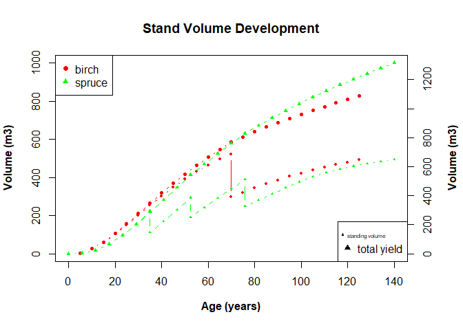

# Sverige LantbruksUniversitet (SLU) Permanent Forest Experiments


# Brief Introduction

This is an analysis done as part of the **Sustainable Forestry in
Southern Sweden** course in the Euroforester program at the SLU campus
at the south of Sweden in
[Alnarp](https://www.slu.se/en/departments/southern-swedish-forest-research-centre/).

The data used for this analysis were provided mainly by the research
centre at Tonnersjoheden and have been [uploaded
here](https://github.com/xrander/SLU-Plantation-Experimentation/tree/master/Data).

I will be taking us through the analysis journey. Terms relating to
forestry will be explained, while syntax of R used won’t be explained. I
will also be taking you through the analysis.

**Data Exploration** The package used is the doBy library doBy, dplyr,
lattice, ggplot, TukeyC and so on To install the package run the command
like this `install.packages('package name')` as an example
`install.packages('dplyr')`.

====NB: For most part of the analysis base r packages will be used====

``` r
library(doBy)
library(dplyr)
library(lattice)
library(ggplot2)
library(data.table)
library(TukeyC)
```

------------------------------------------------------------------------

# Clone Performance Test - EXP I

The first experiment will be a clone performance experiment. The data
used is the ‘popdata’ which is accessible
[here](https://raw.githubusercontent.com/xrander/SLU-Plantation-Experimentation/master/Data/popdata.txt).
This analysis will seek to answer the question: - Is the treatment
having an influence - Which clone is performing best

*Importing the data*

``` r
pop <- read.table('https://raw.githubusercontent.com/xrander/SLU-Plantation-Experimentation/master/Data/Lab1/popdata.txt', header = T)
head(pop)
```

    ##   block cutw height dia clone fert
    ## 1     1  2.4     71 0.6     A    3
    ## 2     1  0.7     67 1.4     A    3
    ## 3     1  6.5    211 3.5     A    3
    ## 4     1  1.1     69 1.0     A    3
    ## 5     2  2.0    116 1.4     A    3
    ## 6     2  4.9    123 3.2     A    3

**Data description**

-   block: experimental block

-   cutw: cultivar weight

-   height: height of the plant

-   dia = diameter

-   clone: clone class

-   fert: Fertilized or not(1 = fertilized and 3 = control)

We can create a column now and assign the names to the different values.

*Creating a column to give name to the values of the fert*

``` r
pop$fert_value <- ifelse(pop$fert==1, 'fertilized', 'control')
head(pop)
```

    ##   block cutw height dia clone fert fert_value
    ## 1     1  2.4     71 0.6     A    3    control
    ## 2     1  0.7     67 1.4     A    3    control
    ## 3     1  6.5    211 3.5     A    3    control
    ## 4     1  1.1     69 1.0     A    3    control
    ## 5     2  2.0    116 1.4     A    3    control
    ## 6     2  4.9    123 3.2     A    3    control

The first step of the analysis is visualize the effect of treatment on
diameter and height

**Height diameter relationship of the control and fertilized seedlings**

``` r
plot(pop$dia, pop$height,
     text(x=01.5,
          y=450,
          labels = "Growth rate of fertilized and unfertilized seedlings",
          col = "red",
          cex = 0.7),
     xlim = c(0,5.5),
     ylim = c(0, 600),
     xlab = 'diameter(mm)',
     ylab = 'Height(mm)',
     main = "Height vs Diameter",
     pch = c(16,17),
     col = c('red', 'blue'))
legend("topleft",
       legend = c("Control","Fertilized"),
       pch= c(16,17),
       col = c('red','blue'))
```

 **Index
of Slenderness** The height diameter ratio or index of slenderness is an
important measure as it can be used to evaluate a tree stability. To
read more on height diameter relationship click
\[here\](<https://www.mdpi.com/1999-4907/10/1/70/htm#>:\~:text=Height%2Dto%2Ddiameter%20ratio%20(,of%20tree%20and%20stand%20stability.).
The formula for HDr is given below

*H**D*<sub>*r*</sub> = *h**e**i**g**h**t*/*d**i**a**m**e**t**e**r*
Where
*H**D*<sub>*r*</sub> = *h**e**i**g**h**t**d**i**a**m**e**t**e**r**r**a**t**i**o*

``` r
pop$hd <- pop$height/pop$dia
```

Given the data we can estimate the average height and diameter for the
clones and treatments

``` r
pop_summary <- summaryBy(height + dia ~ fert + clone, data = pop, FUN=mean)
head(pop_summary)
```

    ##   fert clone height.mean dia.mean
    ## 1    1     A    325.5926 3.281481
    ## 2    1     B    361.3243 3.418919
    ## 3    1     C    364.7941 3.788235
    ## 4    3     A    118.7917 2.070833
    ## 5    3     B    165.8387 2.293548
    ## 6    3     C    124.7222 2.108333

The mean height to diameter of the different treatment as given with the
formula above can be estimated.

``` r
pop_summary$h_d <- pop_summary$height.mean/pop_summary$dia.mean

names(pop_summary)[5] <- 'height_dia_ratio'

barplot(pop_summary$height_dia_ratio,
        names.arg = pop_summary$clone,
        col = pop_summary$fert,
        xlab = substitute(paste(bold('clone'))),
        ylab = substitute(paste(bold('height_diameter_ratio'))),
        main = 'Seedling Clone Performance',
        legend = TRUE)
legend('topright',
       legend = c(substitute(paste(bold('fertilized'))),  substitute(paste(bold('control')))),
       col = c('black', 'green'),
       pch = 18)
```


It is evident that the fertilized are performing than the control, with
the B clone class being the highest performing either fertilized or not.

------------------------------------------------------------------------

# Spacing Experiment of Scotch Pine - Exp II

Numerous experiment have been executed to check the effect of spacing on
the productivity of a stand. Without drawing into conclusion and relying
on facts from already established truths. I’ll explore the to see the
effect of spacing on Scotch pine and determine if there are differences
between the spacing treatments.

This experiment is a long-term experiment to test the effect of four
different spacing treatments 1m, 1.5m, 2m, and 2.5m across eight plots.
The experiment is designed such that two plots are assigned a treatment,
in this case the plots. The plots are also of varying sizes.

*The Design of the experiment using R*

``` r
plot = c(11:14, 21:24)
## plot here denotes the plots number or names

areaha = c(0.04, 0.0324, 0.0288, 0.0288, 0.04, 0.0324, 0.0288, 0.0288)
## areaha is the area per hectare of each plots

treatment = c(2.5, 2, 1.5 ,1)
### **nb**: 2.5 implies 2.5*2.5 and 2 implies 2*2 and so on.

### creating the data frame for the plots with their properties
exp1012 <- data.frame(plot, areaha, treatment)
head(exp1012)
```

    ##   plot areaha treatment
    ## 1   11 0.0400       2.5
    ## 2   12 0.0324       2.0
    ## 3   13 0.0288       1.5
    ## 4   14 0.0288       1.0
    ## 5   21 0.0400       2.5
    ## 6   22 0.0324       2.0

*importing the data*

``` r
### importing data
dbh1012 <- read.table("https://raw.githubusercontent.com/xrander/SLU-Plantation-Experimentation/master/Data/Lab2/dbhlist_exp1012.txt",
           header = T, sep = "\t", na.strings = "NA", dec = ".", strip.white = TRUE)
head(dbh1012)
```

    ##   plot nr  d1  d2
    ## 1   11  2 152 159
    ## 2   11  3 134 126
    ## 3   11  4 156 171
    ## 4   11  6 158 160
    ## 5   11  7  97  90
    ## 6   11  8 154 159

The data used for this analysis can be obtained
[here](https://raw.githubusercontent.com/xrander/SLU-Plantation-Experimentation/master/Data/Lab2/dbhlist_exp1012.txt).

**Data Description**

-   plot: the plot number

-   nr: the tree number

-   d1: cross caliper diameter measurement 1

-   d2: cross caliper diameter measurement 2, 90 degrees to measurement
    1

------------------------------------------------------------------------

## Analyzing the data

The data will be investigated to see if there’s anything strange with
the data

``` r
plot(dbh1012$d1, dbh1012$d2,
     xlab = substitute(paste(bold('d1'))),
     ylab = substitute(paste(bold('d2'))),
     col = c('purple', 'green'),
     pch = c(10,21))
legend('topleft',
       legend = c('d1', 'd2'),
       col = c('purple', 'green'),
       pch = c(10,21))
```


The data seems to be alright, we can now proceed with the analysis

### Basal Area Estimation

Basal area is the average amount of an area occupied by tree stems,
defined as the cross-sectional area of all stems in a stand measured at
breast height (dbh) and express as per unit of land area.The formula of
dbh is
*B**A* = *π*(*D**B**H*/2)<sup>2</sup>
Where: - BA = Basal area

-   DBH = diameter at breast height (1.3m above ground)

``` r
## average of the two diameter
dbh1012$dm <- (dbh1012$d1 + dbh1012$d2)/2

## squared valued to be used for quadratic mean estimation
dbh1012$dd <- dbh1012$dm^2

## basal area estimation
dbh1012$ba <- pi * ((dbh1012$dm/2)^2)
```

-   dm: mean of both diameter

-   dd: dbh squared

-   ba: basal area

The sum of basal area for each plots can be measured now using doBy’s
`summaryBy` function and the result merge with `site1012` to have a more
robust dataset

``` r
plotba <-summaryBy(ba~plot, data = dbh1012, FUN = sum)

site1012 <- merge(exp1012, plotba, all = T)

site1012
```

    ##   plot areaha treatment    ba.sum
    ## 1   11 0.0400       2.5  993838.7
    ## 2   12 0.0324       2.0 1025256.4
    ## 3   13 0.0288       1.5  968972.4
    ## 4   14 0.0288       1.0  963524.9
    ## 5   21 0.0400       2.5 1043748.0
    ## 6   22 0.0324       2.0 1045694.8
    ## 7   23 0.0288       1.5  953649.5
    ## 8   24 0.0288       1.0  903224.4

Now we can estimate the basal area per hectare and basal area of each
treatments.

``` r
## Estimating the basal area per hectare
site1012$baha <- (1/site1012$areaha) * site1012$ba.sum

##converting to basal area per hectare from mm2 to m2
site1012$baham2 <- round((site1012$baha/1000000),2)

## Estimating the basal area per treatment
trtmean1012 <- round(summaryBy(baham2~treatment,
                         data = site1012, FUN = mean), 1)
site1012
```

    ##   plot areaha treatment    ba.sum     baha baham2
    ## 1   11 0.0400       2.5  993838.7 24845968  24.85
    ## 2   12 0.0324       2.0 1025256.4 31643716  31.64
    ## 3   13 0.0288       1.5  968972.4 33644876  33.64
    ## 4   14 0.0288       1.0  963524.9 33455726  33.46
    ## 5   21 0.0400       2.5 1043748.0 26093700  26.09
    ## 6   22 0.0324       2.0 1045694.8 32274532  32.27
    ## 7   23 0.0288       1.5  953649.5 33112830  33.11
    ## 8   24 0.0288       1.0  903224.4 31361958  31.36

``` r
barplot(site1012$baham2,
        names.arg = site1012$plot,
        col = c(2,3,4,5),
        ylab = substitute(paste(bold('Basal Aream2/ha'))),
        xlab = substitute(paste(bold('plot'))),
        main = 'Basal area across sites')
legend('right',
       legend = unique(site1012$treatment),
       pch = 18,
       cex = 1.0,
       col = c(2,3,4,5))
```


### Stand Density Estimation

Stand density is a quantitative measurement of a forest. It describes
the number of individuals (trees) on a unit area in either absolute or
relative terms. To read more on stand density click
[here](https://www.sciencedirect.com/topics/agricultural-and-biological-sciences/stand-density#:~:text=Stand%20density%20is%20a%20quantitative,Avery%20and%20Burkhart%2C%201994).)

**Estimating the stand density** To calculate the density we need some
information. - The size of the forest: This is usually expressed in ha
or m2

-   The size of sample plots: this is important to calculate the total
    number of plots in the stand.

-   The number of trees in a sample plot

Given the figures, we need extra information to be able to estimate the
density of the stand. To do that, we estimate the plot density then
extrapolate to a hectare

``` r
## To derive the plot density
plotdens <- summaryBy(nr~plot, data = dbh1012, FUN = length)


## we merge the plot density to the site information
site1012 <- merge (site1012, plotdens, all = T)


## After this we can get the density per hectare
site1012$dens_ha <- round((site1012$nr.length * (1/site1012$areaha)), 1)

barplot(site1012$dens_ha,
        names.arg = site1012$treatment,
        xlab = "density",
        ylab = "treatment",
        main = "Treatment and Density relationship",
        col = c(2,3,4,5))
```

 There’s
a marked difference

### Deriving Arithmetic Mean Diameter(AMD) and Quadratic Mean Diameter(QMD)

``` r
plotdbh <- summaryBy(dm+dd~plot, data = dbh1012, FUN = c(mean, sum))

## Merging values to site1012
site1012 <- merge(site1012, plotdbh, all = T)

##Converting dm.mean and dm.sum from millimeters to centimeter
site1012$dm.mean_cm <- site1012$dm.mean/10

site1012$dm.sum_cm <- site1012$dm.sum/10

## "site1012$dm.mean_cm" is synonymous to AMD therefore
site1012$amd = site1012$dm.mean_cm

#converting dd.mean and dd.sum from mm^2 to cm ^2
site1012$dd.mean_cm <- site1012$dd.mean/100

site1012$dd.sum_cm <- site1012$dd.sum/100

#TO get QMD
site1012$qmd <- sqrt(site1012$dd.sum/site1012$nr.length)/10
```

### Basal area stand density relationship

``` r
site1012[,c("baham2", "dens_ha")]
```

    ##   baham2 dens_ha
    ## 1  24.85  1600.0
    ## 2  31.64  2222.2
    ## 3  33.64  2847.2
    ## 4  33.46  3750.0
    ## 5  26.09  1550.0
    ## 6  32.27  2469.1
    ## 7  33.11  2604.2
    ## 8  31.36  3784.7

``` r
plot(x = site1012$treatment,
     y = site1012$amd,
     main = 'AMD and QMD comparison',
     ylim = c(8, 16),
     pch = 21,
     col = "darkred",
     xlab = "Treatment",
     ylab = "AMD and QMD(cm)")
points (x = site1012$treatment,
     y = site1012$qmd,
     type = "p",
     ylim = c(8, 16),
     pch = 19,
     col = "darkgreen",
     xlab = "Treatment",
     ylab = "AMD and QMD(cm)")
legend ("topleft",
          legend = c("AMD", "QMD"),
          pch = c(21, 19),
          col = c("darkred", "darkgreen"))
```


# Growth Measures

Stand growth and yield are measured in different ways. There are various
characteristics of a stand that can affect the growth of the stand.
Those characteristics include:

    -   species composition

    -   age

    -   site quality

    -   stand density or stocking

    -   competition

## Meas

Next we try to:

-   evaluate the volume growth for individual trees

    -   estimate the periodic annual increment (PAI),

    -   estimate the annual or yearly increment and

-   estimate the plot and treatment volume growth”

To do this we use the tvol1012 data which consists of a revised data
from 2 separate years, year 1980 and 1987.

Reading the data

``` r
tvol1012 <- read.table('https://raw.githubusercontent.com/xrander/SLU-Plantation-Experimentation/master/Data/Lab3/tvol1012.txt', header = T, sep = '\t', na.strings = 'NA', dec = '.', strip.white = T)

head(tvol1012)
```

    ##   plot nr voldm3.1980 voldm3.1987
    ## 1   11 10      125.96      219.81
    ## 2   11 12      122.08      232.79
    ## 3   11 13       80.61      141.57
    ## 4   11 14       79.99      154.98
    ## 5   11 16       94.26      159.08
    ## 6   11 17      134.58      238.82

### Regression and Correlation

[Back to home page](https://xrander.github.io)
