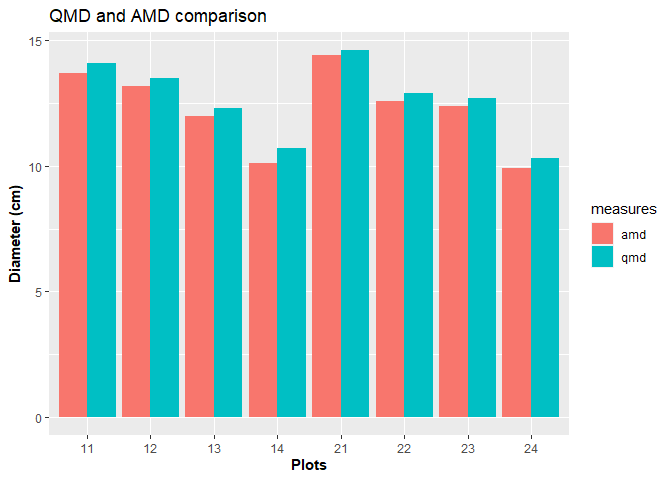
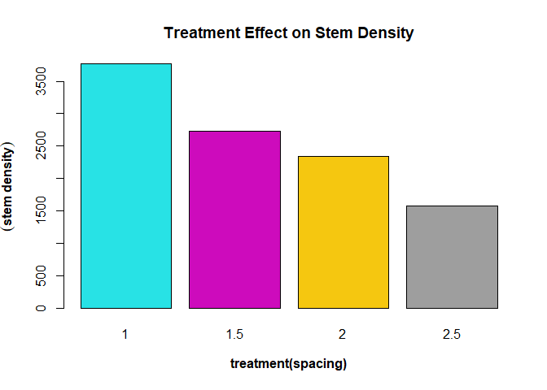

# Sverige LantbruksUniversitet (SLU) Permanent Forest Experiments


# Brief Introduction

This is an analysis done as part of the **Sustainable Forestry in
Southern Sweden** course in the Euroforester program at the SLU campus
at the south of Sweden in
[Alnarp](https://www.slu.se/en/departments/southern-swedish-forest-research-centre/).

The data used for this analysis were provided mainly by the research
centre at Tonnersjoheden and have been [uploaded
here](https://github.com/xrander/SLU-Plantation-Experimentation/tree/master/Data).

I will be taking us through the analysis journey. Terms relating to
forestry will be explained, while syntax of R used won’t be explained. I
will also be taking you through the analysis.

**Data Exploration** The package used is the doBy library doBy, dplyr,
lattice, ggplot, TukeyC and so on To install the package run the command
like this `install.packages('package name')` as an example
`install.packages('dplyr')`.

====NB: For most part of the analysis base r packages will be used====

``` r
library(doBy)
library(dplyr)
library(lattice)
library(ggplot2)
library(data.table)
library(TukeyC)
```

------------------------------------------------------------------------

# Clone Performance Test - EXP I

The first experiment will be a clone performance experiment. The data
used is the ‘popdata’ which is accessible
[here](https://raw.githubusercontent.com/xrander/SLU-Plantation-Experimentation/master/Data/popdata.txt).
This analysis will seek to answer the question: - Is the treatment
having an influence - Which clone is performing best

*Importing the data*

``` r
pop <- read.table('https://raw.githubusercontent.com/xrander/SLU-Plantation-Experimentation/master/Data/Lab1/popdata.txt', header = T)
head(pop)
```

    ##   block cutw height dia clone fert
    ## 1     1  2.4     71 0.6     A    3
    ## 2     1  0.7     67 1.4     A    3
    ## 3     1  6.5    211 3.5     A    3
    ## 4     1  1.1     69 1.0     A    3
    ## 5     2  2.0    116 1.4     A    3
    ## 6     2  4.9    123 3.2     A    3

**Data description**

-   block: experimental block

-   cutw: cultivar weight

-   height: height of the plant

-   dia = diameter

-   clone: clone class

-   fert: Fertilized or not(1 = fertilized and 3 = control)

We can create a column now and assign the names to the different values.

*Creating a column to give name to the values of the fert*

``` r
pop$fert_value <- ifelse(pop$fert==1, 'fertilized', 'control')
head(pop)
```

    ##   block cutw height dia clone fert fert_value
    ## 1     1  2.4     71 0.6     A    3    control
    ## 2     1  0.7     67 1.4     A    3    control
    ## 3     1  6.5    211 3.5     A    3    control
    ## 4     1  1.1     69 1.0     A    3    control
    ## 5     2  2.0    116 1.4     A    3    control
    ## 6     2  4.9    123 3.2     A    3    control

The first step of the analysis is visualize the effect of treatment on
diameter and height

**Height diameter relationship of the control and fertilized seedlings**

``` r
plot(pop$dia, pop$height,
     text(x=01.5,
          y=450,
          labels = "Growth rate of fertilized and unfertilized seedlings",
          col = "red",
          cex = 0.7),
     xlim = c(0,5.5),
     ylim = c(0, 600),
     xlab = 'diameter(mm)',
     ylab = 'Height(mm)',
     main = "Height vs Diameter",
     pch = c(16,17),
     col = c('red', 'blue'))
legend("topleft",
       legend = c("Control","Fertilized"),
       pch= c(16,17),
       col = c('red','blue'))
```

 **Index
of Slenderness** The height diameter ratio or index of slenderness is an
important measure as it can be used to evaluate a tree stability. To
read more on height diameter relationship click
\[here\](<https://www.mdpi.com/1999-4907/10/1/70/htm#>:\~:text=Height%2Dto%2Ddiameter%20ratio%20(,of%20tree%20and%20stand%20stability.).
The formula for HDr is given below

*H**D*<sub>*r*</sub> = *h**e**i**g**h**t*/*d**i**a**m**e**t**e**r*
Where
*H**D*<sub>*r*</sub> = *h**e**i**g**h**t**d**i**a**m**e**t**e**r**r**a**t**i**o*

``` r
pop$hd <- pop$height/pop$dia
```

Given the data we can estimate the average height and diameter for the
clones and treatments

``` r
pop_summary <- summaryBy(height + dia ~ fert + clone, data = pop, FUN=mean)
head(pop_summary)
```

    ##   fert clone height.mean dia.mean
    ## 1    1     A    325.5926 3.281481
    ## 2    1     B    361.3243 3.418919
    ## 3    1     C    364.7941 3.788235
    ## 4    3     A    118.7917 2.070833
    ## 5    3     B    165.8387 2.293548
    ## 6    3     C    124.7222 2.108333

The mean height to diameter of the different treatment as given with the
formula above can be estimated.

``` r
pop_summary$h_d <- pop_summary$height.mean/pop_summary$dia.mean

names(pop_summary)[5] <- 'height_dia_ratio'

barplot(pop_summary$height_dia_ratio,
        names.arg = pop_summary$clone,
        col = pop_summary$fert,
        xlab = substitute(paste(bold('clone'))),
        ylab = substitute(paste(bold('height_diameter_ratio'))),
        main = 'Seedling Clone Performance',
        legend = TRUE)
legend('topright',
       legend = c(substitute(paste(bold('fertilized'))),  substitute(paste(bold('control')))),
       col = c('black', 'green'),
       pch = 18)
```


It is evident that the fertilized are performing than the control, with
the B clone class being the highest performing either fertilized or not.

------------------------------------------------------------------------

# Spacing Experiment of Scotch Pine - Exp II

Numerous experiment have been executed to check the effect of spacing on
the productivity of a stand. Without drawing into conclusion and relying
on facts from already established truths. I’ll explore the to see the
effect of spacing on Scotch pine and determine if there are differences
between the spacing treatments.

This experiment is a long-term experiment to test the effect of four
different spacing treatments 1m, 1.5m, 2m, and 2.5m across eight plots.
The experiment is designed such that two plots are assigned a treatment,
in this case the plots. The plots are also of varying sizes.

*The Design of the experiment using R*

``` r
plot = c(11:14, 21:24)
## plot here denotes the plots number or names

areaha = c(0.04, 0.0324, 0.0288, 0.0288, 0.04, 0.0324, 0.0288, 0.0288)
## areaha is the area per hectare of each plots

treatment = c(2.5, 2, 1.5 ,1)
### **nb**: 2.5 implies 2.5*2.5 and 2 implies 2*2 and so on.

### creating the data frame for the plots with their properties
exp1012 <- data.frame(plot, areaha, treatment)
head(exp1012)
```

    ##   plot areaha treatment
    ## 1   11 0.0400       2.5
    ## 2   12 0.0324       2.0
    ## 3   13 0.0288       1.5
    ## 4   14 0.0288       1.0
    ## 5   21 0.0400       2.5
    ## 6   22 0.0324       2.0

*importing the data*

``` r
### importing data
dbh1012 <- read.table("https://raw.githubusercontent.com/xrander/SLU-Plantation-Experimentation/master/Data/Lab2/dbhlist_exp1012.txt",
           header = T, sep = "\t", na.strings = "NA", dec = ".", strip.white = TRUE)
head(dbh1012)
```

    ##   plot nr  d1  d2
    ## 1   11  2 152 159
    ## 2   11  3 134 126
    ## 3   11  4 156 171
    ## 4   11  6 158 160
    ## 5   11  7  97  90
    ## 6   11  8 154 159

The data used for this analysis can be obtained
[here](https://raw.githubusercontent.com/xrander/SLU-Plantation-Experimentation/master/Data/Lab2/dbhlist_exp1012.txt).

**Data Description**

-   plot: the plot number

-   nr: the tree number

-   d1: cross caliper diameter measurement 1

-   d2: cross caliper diameter measurement 2, 90 degrees to measurement
    1

------------------------------------------------------------------------

## Analyzing the data

The data will be investigated to see if there’s anything strange with
the data

``` r
plot(dbh1012$d1, dbh1012$d2,
     xlab = substitute(paste(bold('d1'))),
     ylab = substitute(paste(bold('d2'))),
     col = c('purple', 'green'),
     pch = c(10,21))
legend('topleft',
       legend = c('d1', 'd2'),
       col = c('purple', 'green'),
       pch = c(10,21))
```


The data seems to be alright, we can now proceed with the analysis

### Basal Area Estimation

Basal area is the average amount of an area occupied by tree stems,
defined as the cross-sectional area of all stems in a stand measured at
breast height (dbh) and express as per unit of land area.The formula of
dbh is
*B**A* = *π*(*D**B**H*/2)<sup>2</sup>
Where: - BA = Basal area

-   DBH = diameter at breast height (1.3m above ground)

``` r
## average of the two diameter
dbh1012$dm <- (dbh1012$d1 + dbh1012$d2)/2

## squared valued to be used for quadratic mean estimation
dbh1012$dd <- dbh1012$dm^2

## basal area estimation
dbh1012$ba <- pi * ((dbh1012$dm/2)^2)
```

-   dm: mean of both diameter

-   dd: dbh squared

-   ba: basal area

The sum of basal area for each plots can be measured now using doBy’s
`summaryBy` function and the result merge with `site1012` to have a more
robust dataset

``` r
plotba <-summaryBy(ba~plot, data = dbh1012, FUN = sum)

site1012 <- merge(exp1012, plotba, all = T)

site1012
```

    ##   plot areaha treatment    ba.sum
    ## 1   11 0.0400       2.5  993838.7
    ## 2   12 0.0324       2.0 1025256.4
    ## 3   13 0.0288       1.5  968972.4
    ## 4   14 0.0288       1.0  963524.9
    ## 5   21 0.0400       2.5 1043748.0
    ## 6   22 0.0324       2.0 1045694.8
    ## 7   23 0.0288       1.5  953649.5
    ## 8   24 0.0288       1.0  903224.4

Now we can estimate the basal area per hectare and basal area of each
treatments.

``` r
## Estimating the basal area per hectare
site1012$baha <- (1/site1012$areaha) * site1012$ba.sum

##converting to basal area per hectare from mm2 to m2
site1012$baham2 <- round((site1012$baha/1000000),2)

## Estimating the basal area per treatment
trtmean1012 <- round(summaryBy(baham2~treatment,
                         data = site1012, FUN = mean), 1)
site1012
```

    ##   plot areaha treatment    ba.sum     baha baham2
    ## 1   11 0.0400       2.5  993838.7 24845968  24.85
    ## 2   12 0.0324       2.0 1025256.4 31643716  31.64
    ## 3   13 0.0288       1.5  968972.4 33644876  33.64
    ## 4   14 0.0288       1.0  963524.9 33455726  33.46
    ## 5   21 0.0400       2.5 1043748.0 26093700  26.09
    ## 6   22 0.0324       2.0 1045694.8 32274532  32.27
    ## 7   23 0.0288       1.5  953649.5 33112830  33.11
    ## 8   24 0.0288       1.0  903224.4 31361958  31.36

``` r
barplot(site1012$baham2,
        names.arg = site1012$plot,
        col = c(2,3,4,5),
        ylab = substitute(paste(bold('Basal Area (m2/ha)'))),
        xlab = substitute(paste(bold('plot'))),
        main = 'Basal area across sites')
legend('right',
       legend = unique(site1012$treatment),
       pch = 18,
       cex = 1.0,
       col = c(2,3,4,5))
```

 \* \* \*
\* \* \* \* \### Stand Density Estimation Stand density is a
quantitative measurement of a forest. It describes the number of
individuals (trees) on a unit area in either absolute or relative terms.
To read more on stand density click
[here](https://www.sciencedirect.com/topics/agricultural-and-biological-sciences/stand-density#:~:text=Stand%20density%20is%20a%20quantitative,Avery%20and%20Burkhart%2C%201994).)

**Estimating the stand density** To calculate the density we need some
information. - The size of the forest: This is usually expressed in ha
or m2

-   The size of sample plots: this is important to calculate the total
    number of plots in the stand.

-   The number of trees in a sample plot or the plot density

``` r
## To derive the plot density
plotdens <- summaryBy(nr~plot, data = dbh1012, FUN = length)


## we merge the plot density to the site information
site1012 <- merge (site1012, plotdens, all = T)


## After this we can get the density per hectare
site1012$dens_ha <- round((site1012$nr.length * (1/site1012$areaha)), 1)

barplot(site1012$dens_ha,
        names.arg = site1012$plot,
        xlab = substitute(paste(bold("plot"))),
        ylab = substitute(paste(bold("density"))),
        main = "Treatment and Density relationship",
        col = c(2,3,4,5))
legend('right',
       legend = unique(site1012$treatment),
       pch = 18,
       cex = 1.0,
       col = c(2,3,4,5))
```

 The
chart shows there’s a marked difference across plots. Plots with the
lowest treatment, i.e., spacing have the higher density

### Deriving Arithmetic Mean Diameter(AMD) and Quadratic Mean Diameter(QMD)

The quadratic mean diameter symbolized as QMD is the square root of the
summation of the dbh squared of trees divided by the number of trees.
$$QMD = \sqrt{(\sum d_i^2)/n}$$
Where d = diameter squared n = number of trees

QMD is considered more appropriate than AMD (Arithmetic Mean Diameter)
for characterizing the group of trees which have been measured. QMD
assigns greater weight to larger trees, read more
[here](https://www.fs.usda.gov/pnw/olympia/silv/publications/opt/436_CurtisMarshall2000.pdf)

``` r
plotdbh <- summaryBy(dm+dd~plot, data = dbh1012, FUN = c(mean, sum))

## Merging values to site1012
site1012 <- merge(site1012, plotdbh, all = T)

##Converting dm.mean and dm.sum from millimeters to centimeter
site1012$dm.mean_cm <- site1012$dm.mean/10

site1012$dm.sum_cm <- site1012$dm.sum/10

## "site1012$dm.mean_cm" is synonymous to AMD therefore
site1012$amd = site1012$dm.mean_cm

#converting dd.mean and dd.sum from mm^2 to cm ^2
site1012$dd.mean_cm <- site1012$dd.mean/100

site1012$dd.sum_cm <- site1012$dd.sum/100

#Estimating the Quadratic Mean DIameter
site1012$qmd <- sqrt(site1012$dd.sum/site1012$nr.length)/10
```

### Basal area stand density relationship

``` r
site1012[,c("baham2", "dens_ha")]
```

    ##   baham2 dens_ha
    ## 1  24.85  1600.0
    ## 2  31.64  2222.2
    ## 3  33.64  2847.2
    ## 4  33.46  3750.0
    ## 5  26.09  1550.0
    ## 6  32.27  2469.1
    ## 7  33.11  2604.2
    ## 8  31.36  3784.7

we create a new table to hold the amd and qmd. We do this to compare the
values using a barplot.

``` r
amd_qmd <- data.frame(plot = rep(site1012$plot, times = 2),
                      treatment = rep(site1012$treatment, times = 2),
                      diameter = round(c(site1012$amd, site1012$qmd), 1),
                      measures = rep(c('amd', 'qmd'),
                                     each = 8))
amd_qmd
```

    ##    plot treatment diameter measures
    ## 1    11       2.5     13.7      amd
    ## 2    12       2.0     13.2      amd
    ## 3    13       1.5     12.0      amd
    ## 4    14       1.0     10.1      amd
    ## 5    21       2.5     14.4      amd
    ## 6    22       2.0     12.6      amd
    ## 7    23       1.5     12.4      amd
    ## 8    24       1.0      9.9      amd
    ## 9    11       2.5     14.1      qmd
    ## 10   12       2.0     13.5      qmd
    ## 11   13       1.5     12.3      qmd
    ## 12   14       1.0     10.7      qmd
    ## 13   21       2.5     14.6      qmd
    ## 14   22       2.0     12.9      qmd
    ## 15   23       1.5     12.7      qmd
    ## 16   24       1.0     10.3      qmd

``` r
ggplot(data = amd_qmd, aes(x = as.character(plot), y = diameter, fill = measures)) + 
  geom_bar (position = "dodge", stat = "identity") +
  labs(title = "QMD and AMD comparison",
       x = substitute(paste(bold('Plots'))),
       y = substitute(paste(bold('Diameter (cm)'))))
```



# Growth Measures

There are various characteristics of a stand that can affect the growth
of the stand. Those characteristics include:

    -   species composition

    -   age

    -   site quality

    -   stand density or stocking

    -   competition

    -   silvicultural treatment

    -   climatic conditions

## Increment

Increment is the increase in growth, diameter, basal area, height,
volume, quality or value of individual tree crops during a given period.
There are some terminologies and measures associated with tree
increment.

    -   Yield: this is the usable wood fiber per unit area at a particular age

    -   Annual increment

*G*<sub>*a*</sub> = *Y*<sub>*a*</sub> − *Y*<sub>*a* − 1</sub>

    -   Periodic Annual Increment: This measures the average productivity of the stand over certain period. Can sometimes be referred to CAI if it's between increment between current year and  previous year.

*P**A**I*<sub>*a*1, *a*2</sub> = *Y*<sub>*a*2</sub> − *Y*<sub>*a*1</sub>/*a*<sub>2</sub> − *a*<sub>1</sub>

    -   Mean Annual Increment: This measures the average productivity of the stand over its lifetime.

*M**A**I*<sub>*a*</sub> = *Y*<sub>*a*</sub>/*a*
G = growth Y = Volume for year a a = year (2 is current and 1 is
previous)

We’ll try to:

    -   evaluate the volume growth for individual trees

    -   estimate the periodic annual increment (PAI),

    -   estimate the annual or yearly increment and

    -   estimate the plot and treatment volume growth"

To do this we use the tvol1012 data which consists of a revised data
from 2 separate years, year 1980 and 1987 will be imported.

*Reading the data*

``` r
tvol1012 <- read.table('https://raw.githubusercontent.com/xrander/SLU-Plantation-Experimentation/master/Data/Lab3/tvol1012.txt', header = T, sep = '\t', na.strings = 'NA', dec = '.', strip.white = T)

head(tvol1012)
```

    ##   plot nr voldm3.1980 voldm3.1987
    ## 1   11 10      125.96      219.81
    ## 2   11 12      122.08      232.79
    ## 3   11 13       80.61      141.57
    ## 4   11 14       79.99      154.98
    ## 5   11 16       94.26      159.08
    ## 6   11 17      134.58      238.82

**Estimating the PAI**

``` r
tvol1012$pai <- (tvol1012$voldm3.1987 - tvol1012$voldm3.1980)/7  # we divide by 7 because that's the difference between 1987 and 1980

#we can estimate the annual increment
tvol1012$ai <- tvol1012$pai/7 #since this is 7 years interval and don't have the value for the immediate previous year, we estimate the average annual increment within that period.
head(tvol1012)
```

    ##   plot nr voldm3.1980 voldm3.1987       pai       ai
    ## 1   11 10      125.96      219.81 13.407143 1.915306
    ## 2   11 12      122.08      232.79 15.815714 2.259388
    ## 3   11 13       80.61      141.57  8.708571 1.244082
    ## 4   11 14       79.99      154.98 10.712857 1.530408
    ## 5   11 16       94.26      159.08  9.260000 1.322857
    ## 6   11 17      134.58      238.82 14.891429 2.127347

Next we sum pai, mean volume for 1980 and 1987 for each plots and merge
it with the site information data (site1012)

``` r
#Estimating plot data for the trees
plotvol <- summaryBy(voldm3.1980 +
            voldm3.1987 +
            pai~plot,
          data = tvol1012, FUN = sum)
a_incrment <- summaryBy(ai~plot, data = tvol1012, FUN = sum)
# Merging data with the data table 'site1012' from RLab2
site1012 <- merge(site1012, plotvol, all = T)
site1012 <- merge(site1012, a_incrment, all = T)

# Evaluating the per hectare values
site1012$volm80ha <- site1012$voldm3.1980.sum/(site1012$areaha*1000)

site1012$volm87ha <- site1012$voldm3.1987.sum/(site1012$areaha*1000)

site1012$paiha <- round(site1012$pai.sum/(areaha*1000), 2)

site1012$ai <- round(site1012$ai.sum/(areaha*1000), 2)
head(site1012)
```

    ##   plot areaha treatment    ba.sum     baha baham2 nr.length dens_ha  dm.mean
    ## 1   11 0.0400       2.5  993838.7 24845968  24.85        64  1600.0 137.3203
    ## 2   12 0.0324       2.0 1025256.4 31643716  31.64        72  2222.2 132.1250
    ## 3   13 0.0288       1.5  968972.4 33644876  33.64        82  2847.2 119.6951
    ## 4   14 0.0288       1.0  963524.9 33455726  33.46       108  3750.0 101.3981
    ## 5   21 0.0400       2.5 1043748.0 26093700  26.09        62  1550.0 143.6048
    ## 6   22 0.0324       2.0 1045694.8 32274532  32.27        80  2469.1 126.1375
    ##    dd.mean  dm.sum  dd.sum dm.mean_cm dm.sum_cm      amd dd.mean_cm dd.sum_cm
    ## 1 19771.79  8788.5 1265395   13.73203    878.85 13.73203   197.7179  12653.95
    ## 2 18130.51  9513.0 1305397   13.21250    951.30 13.21250   181.3051  13053.97
    ## 3 15045.54  9815.0 1233734   11.96951    981.50 11.96951   150.4554  12337.34
    ## 4 11359.24 10951.0 1226798   10.13981   1095.10 10.13981   113.5924  12267.98
    ## 5 21434.54  8903.5 1328941   14.36048    890.35 14.36048   214.3454  13289.41
    ## 6 16642.75 10091.0 1331420   12.61375   1009.10 12.61375   166.4275  13314.20
    ##        qmd voldm3.1980.sum voldm3.1987.sum  pai.sum   ai.sum volm80ha volm87ha
    ## 1 14.06122         4395.40         7709.99 473.5129 67.64469 109.8850 192.7498
    ## 2 13.46496         4442.43         7621.58 454.1643 64.88061 137.1120 235.2340
    ## 3 12.26602         3937.37         7002.56 437.8843 62.55490 136.7142 243.1444
    ## 4 10.65797         3977.63         6878.00 414.3386 59.19122 138.1122 238.8194
    ## 5 14.64054         4576.61         7354.41 396.8286 56.68980 114.4152 183.8603
    ## 6 12.90068         4648.70         8026.96 482.6086 68.94408 143.4784 247.7457
    ##   paiha   ai
    ## 1 11.84 1.69
    ## 2 14.02 2.00
    ## 3 15.20 2.17
    ## 4 14.39 2.06
    ## 5  9.92 1.42
    ## 6 14.90 2.13

``` r
pai <- barplot(site1012$paiha,
        names.arg = c(11:14,21:24), 
        main= "Periodic Annual Increment",
        xlab = substitute(paste(bold("plots"))),
        ylab = substitute(paste(bold("Volume Per Hectare Per Year"))),
        col = c(8,2,3,4))
legend("bottomright",
         legend = c(2.5,2.0,1.5,1.0),
         pch = 16,
         col =c (8,2,3,4))
text(x = pai, y = site1012$paiha, label = site1012$ai, pos = 3, cex = 0.8, col = 'red')
```

 The plot
shows the PAI of each plots for the different spacing treatment while
showing the annual increment of each plots.

``` r
#Visualizing the density per hectare
dens <- barplot(site1012$dens_ha, col = c(3,5,8,6),
        names.arg = c(as.character(site1012$plot)), 
        main= "Density per Hectare",
        sub = "4 treatments (2.5,2,1.5,1)",
        ylim = c(0, 4000),
        xlab = substitute(paste(bold("plots"))),
        ylab = substitute(paste(bold("Stand Density"))),
        )
legend("topleft",
         legend = c(2.5,2.0,1.5,1.0),
         pch = 16,
         col = c(3,5,8,6))
text (x = dens, y = site1012$dens_ha, label = site1012$dens_ha, pos = 3, cex = 0.7, col = 'Red')
```

 \###
Percentage of Thinnings Removed We can estimate the percentage of stand
removed from thinning operation

``` r
##first we estimate the density after thinning which is provided in site1012
density <- summaryBy(dens_ha~treatment,
          data = site1012,
          FUN = mean)
 
## dens_ha.mean is the density after thinning, so we rename to 'after_thinning'
names(density)[2] <- 'after_thinning'

##now we estimate the density before thinning
density$before_thinning <- 10000/(density$treatment^2)

##percentage change in the stand can be estimated now.
## percentage change = (old - new)/old *100
density$percent_removed <- (density$before_thinning-
                              density$after_thinning)/density$before_thinning * 100
head(density)
```

    ##   treatment after_thinning before_thinning percent_removed
    ## 1       1.0        3767.35       10000.000        62.32650
    ## 2       1.5        2725.70        4444.444        38.67175
    ## 3       2.0        2345.65        2500.000         6.17400
    ## 4       2.5        1575.00        1600.000         1.56250

### Effect of treatment on stem density, quadratic mean diameter,and Periodic Annual Increment (PAI)

#### Stem density and treatment(spacing) design effect

``` r
barplot(tapply(site1012$dens_ha,
               site1012$treatment,
               FUN = mean),
        xlab = substitute(paste(bold('treatment(spacing)'))),
        ylab = substitute(paste(bold(('stem density')))),
        main = 'Treatment Effect on Stem Density',
        col = c(5:9))
```

 The
space is having an effect on the diameter, the smaller the spacing, the
greater the stem/stand density

#### Treatment(spacing) effect on QMD

``` r
barplot(tapply (site1012$qmd,
                site1012$treatment,
                FUN = mean),
        xlab = substitute(paste(bold('treatment(spacing)'))),
        ylim = c(0, 20),
        ylab = substitute(paste(bold('mean diameter(qmd)'))),
        main = 'treatment effect on QMD',
        col = c(10:13))
```


Quadratic mean diameter increases with spacing effect according to the
bar plot, the effect might diminish if spacing increases

#### Treatment(spacing) effect on Periodic annual increment(PAI)

``` r
barplot(tapply(site1012$paiha,
               site1012$treatment,
               FUN = mean),
        xlab = substitute(paste(bold("Initial Spacing Treatment"))),
        ylab = substitute(paste(bold("PAI, m3/ha & year"))),
        col = c(2,13,15,20),
        ylim = c(0, 20),
        main = "Effect of Spacing on PAI")
```


``` html
<a href = "https://xrander.github.io">
```

[Back to home page](https://xrander.github.io)
