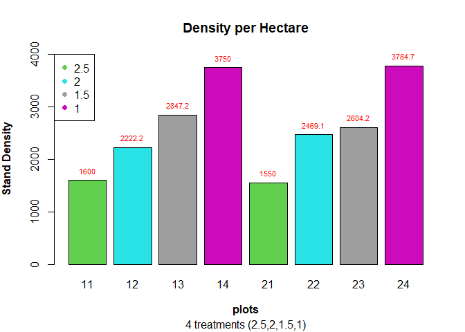
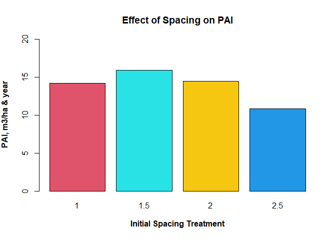
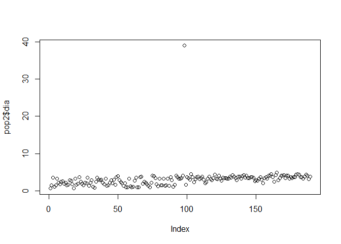
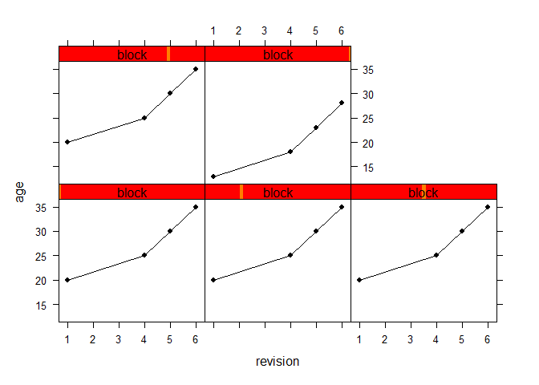
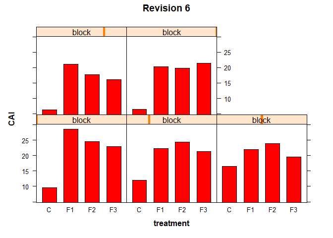
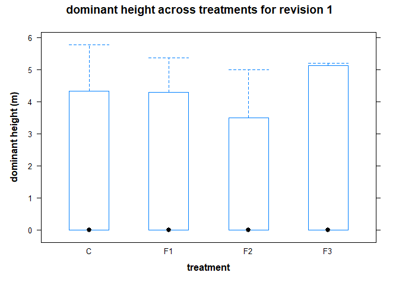
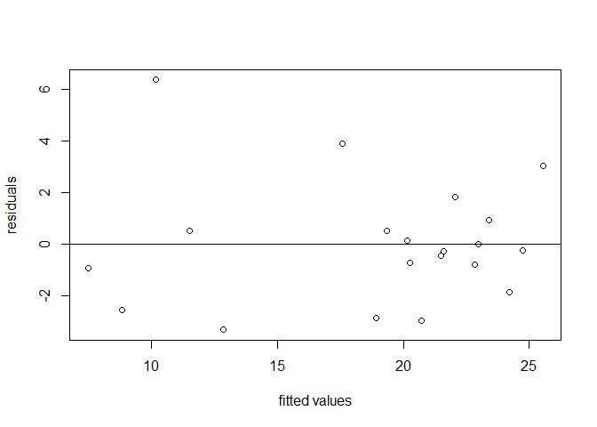
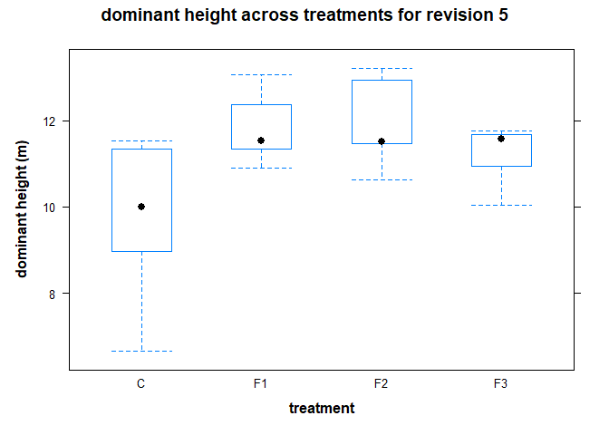
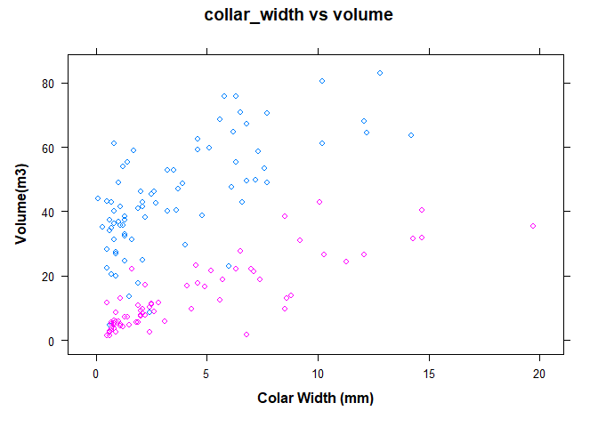

# Sverige LantbruksUniversitet (SLU) Permanent Forest Experiments


# Brief Introduction

This is an analysis done as part of the **Sustainable Forestry in
Southern Sweden** course in the Euroforester program at the SLU campus
at the south of Sweden in
[Alnarp](https://www.slu.se/en/departments/southern-swedish-forest-research-centre/).

The data used for this analysis were provided mainly by the research
centre at Tonnersjoheden and have been [uploaded
here](https://github.com/xrander/SLU-Plantation-Experimentation/tree/master/Data).

I will be taking us through the analysis journey. Terms relating to
forestry will be explained, while syntax of R used won’t be explained. I
will also be taking you through the analysis.

**Data Exploration** The package used is the doBy library doBy, dplyr,
lattice, ggplot, TukeyC and so on To install the package run the command
like this `install.packages('package name')` as an example
`install.packages('dplyr')`.

====NB: For most part of the analysis base r packages will be used====

``` r
library(doBy)
library(dplyr)
library(lattice)
library(ggplot2)
library(car)
library(data.table)
library(TukeyC)
```

------------------------------------------------------------------------

# Clone Performance Test - Exp I

The first experiment will be a clone performance experiment. The data
used is the ‘popdata’ which is accessible
[here](https://raw.githubusercontent.com/xrander/SLU-Plantation-Experimentation/master/Data/popdata.txt).
This analysis will seek to answer the question: - Is the treatment
having an influence - Which clone is performing best

*Importing the data*

``` r
pop <- read.table('https://raw.githubusercontent.com/xrander/SLU-Plantation-Experimentation/master/Data/Lab1/popdata.txt', header = T)
head(pop)
```

    ##   block cutw height dia clone fert
    ## 1     1  2.4     71 0.6     A    3
    ## 2     1  0.7     67 1.4     A    3
    ## 3     1  6.5    211 3.5     A    3
    ## 4     1  1.1     69 1.0     A    3
    ## 5     2  2.0    116 1.4     A    3
    ## 6     2  4.9    123 3.2     A    3

**Data description**

-   block: experimental block

-   cutw: cultivar weight

-   height: height of the plant

-   dia = diameter

-   clone: clone class

-   fert: Fertilized or not(1 = fertilized and 3 = control)

We can create a column now and assign the names to the different values.

*Creating a column to give name to the values of the fert*

``` r
pop$fert_value <- ifelse(pop$fert==1, 'fertilized', 'control')
head(pop)
```

    ##   block cutw height dia clone fert fert_value
    ## 1     1  2.4     71 0.6     A    3    control
    ## 2     1  0.7     67 1.4     A    3    control
    ## 3     1  6.5    211 3.5     A    3    control
    ## 4     1  1.1     69 1.0     A    3    control
    ## 5     2  2.0    116 1.4     A    3    control
    ## 6     2  4.9    123 3.2     A    3    control

## Questions

    -   Plot the height diameter relationship of different treatment of seedlings

    - estimate the index of slenderness of the stand

    -   Plot the performance of the seedlings and state which of the clones performing the best

## Height diameter relationship of the control and fertilized seedlings

The first step of the analysis is visualize the effect of treatment on
diameter and height

``` r
plot(pop$dia, pop$height,
     text(x=01.5,
          y=450,
          labels = "Growth rate of fertilized and unfertilized seedlings",
          col = "red",
          cex = 0.7),
     xlim = c(0,5.5),
     ylim = c(0, 600),
     xlab = 'diameter(mm)',
     ylab = 'Height(mm)',
     main = "Height vs Diameter",
     pch = c(16,17),
     col = c('red', 'blue'))
legend("topleft",
       legend = c("Control","Fertilized"),
       pch= c(16,17),
       col = c('red','blue'))
```


## Index of Slenderness

The height diameter ratio or index of slenderness is an important
measure as it can be used to evaluate a tree stability. To read more on
height diameter relationship click
\[here\](<https://www.mdpi.com/1999-4907/10/1/70/htm#>:\~:text=Height%2Dto%2Ddiameter%20ratio%20(,of%20tree%20and%20stand%20stability.).
The formula for HDr is given below

*H**D*<sub>*r*</sub> = *h**e**i**g**h**t*/*d**i**a**m**e**t**e**r*
Where
*H**D*<sub>*r*</sub> = *h**e**i**g**h**t**d**i**a**m**e**t**e**r**r**a**t**i**o*

``` r
pop$hd <- pop$height/pop$dia
```

Given the data we can estimate the average height and diameter for the
clones and treatments

``` r
pop_summary <- summaryBy(height + dia ~ fert + clone, data = pop, FUN=mean)
head(pop_summary)
```

    ##   fert clone height.mean dia.mean
    ## 1    1     A    325.5926 3.281481
    ## 2    1     B    361.3243 3.418919
    ## 3    1     C    364.7941 3.788235
    ## 4    3     A    118.7917 2.070833
    ## 5    3     B    165.8387 2.293548
    ## 6    3     C    124.7222 2.108333

The mean height to diameter of the different treatment as given with the
formula above can be estimated.

``` r
pop_summary$h_d <- pop_summary$height.mean/pop_summary$dia.mean

names(pop_summary)[5] <- 'height_dia_ratio'

barplot(pop_summary$height_dia_ratio,
        names.arg = pop_summary$clone,
        col = pop_summary$fert,
        xlab = substitute(paste(bold('clone'))),
        ylab = substitute(paste(bold('height_diameter_ratio'))),
        main = 'Seedling Clone Performance',
        legend = TRUE)
legend('topright',
       legend = c(substitute(paste(bold('fertilized'))),  substitute(paste(bold('control')))),
       col = c('black', 'green'),
       pch = 18)
```


It is evident that the fertilized are performing than the control, with
the B clone class being the highest performing either fertilized or not.

------------------------------------------------------------------------

# Spacing Experiment of Scotch Pine - Exp II

Numerous experiment have been executed to check the effect of spacing on
the productivity of a stand. Without drawing into conclusion and relying
on facts from already established truths. I’ll explore the to see the
effect of spacing on Scotch pine and determine if there are differences
between the spacing treatments.

This experiment is a long-term experiment to test the effect of four
different spacing treatments 1m, 1.5m, 2m, and 2.5m across eight plots.
The experiment is designed such that two plots are assigned a treatment,
in this case the plots. The plots are also of varying sizes.

*The Design of the experiment using R*

``` r
plot = c(11:14, 21:24)
## plot here denotes the plots number or names

areaha = c(0.04, 0.0324, 0.0288, 0.0288, 0.04, 0.0324, 0.0288, 0.0288)
## areaha is the area per hectare of each plots

treatment = c(2.5, 2, 1.5 ,1)
### **nb**: 2.5 implies 2.5*2.5 and 2 implies 2*2 and so on.

### creating the data frame for the plots with their properties
exp1012 <- data.frame(plot, areaha, treatment)
head(exp1012)
```

    ##   plot areaha treatment
    ## 1   11 0.0400       2.5
    ## 2   12 0.0324       2.0
    ## 3   13 0.0288       1.5
    ## 4   14 0.0288       1.0
    ## 5   21 0.0400       2.5
    ## 6   22 0.0324       2.0

*importing the data*

``` r
### importing data
dbh1012 <- read.table("https://raw.githubusercontent.com/xrander/SLU-Plantation-Experimentation/master/Data/Lab2/dbhlist_exp1012.txt",
           header = T, sep = "\t", na.strings = "NA", dec = ".", strip.white = TRUE)
head(dbh1012)
```

    ##   plot nr  d1  d2
    ## 1   11  2 152 159
    ## 2   11  3 134 126
    ## 3   11  4 156 171
    ## 4   11  6 158 160
    ## 5   11  7  97  90
    ## 6   11  8 154 159

The data used for this analysis can be obtained
[here](https://raw.githubusercontent.com/xrander/SLU-Plantation-Experimentation/master/Data/Lab2/dbhlist_exp1012.txt).

**Data Description**

-   plot: the plot number

-   nr: the tree number

-   d1: cross caliper diameter measurement 1

-   d2: cross caliper diameter measurement 2, 90 degrees to measurement
    1

------------------------------------------------------------------------

## Quick exploration

The data will be investigated to see if there’s anything strange with
the data

``` r
plot(dbh1012$d1, dbh1012$d2,
     xlab = substitute(paste(bold('d1'))),
     ylab = substitute(paste(bold('d2'))),
     col = c('purple', 'green'),
     pch = c(10,21))
legend('topleft',
       legend = c('d1', 'd2'),
       col = c('purple', 'green'),
       pch = c(10,21))
```


The data seems to be alright, we can now proceed with the analysis

## Questions

We’ll be:

    -   estimating the basal area

    -   evaluating the stand density

    -   evaluating the AMD and QMD

    -   Plot the basal area vs the stand density

### Basal Area Estimation

Basal area is the average amount of an area occupied by tree stems,
defined as the cross-sectional area of all stems in a stand measured at
breast height (dbh) and express as per unit of land area.The formula of
dbh is
*B**A* = *π*(*D**B**H*/2)<sup>2</sup>
Where: - BA = Basal area

-   DBH = diameter at breast height (1.3m above ground)

``` r
## average of the two diameter
dbh1012$dm <- (dbh1012$d1 + dbh1012$d2)/2

## squared valued to be used for quadratic mean estimation
dbh1012$dd <- dbh1012$dm^2

## basal area estimation
dbh1012$ba <- pi * ((dbh1012$dm/2)^2)
```

-   dm: mean of both diameter

-   dd: dbh squared

-   ba: basal area

The sum of basal area for each plots can be measured now using doBy’s
`summaryBy` function and the result merge with `site1012` to have a more
robust data set

``` r
plotba <-summaryBy(ba~plot, data = dbh1012, FUN = sum)

site1012 <- merge(exp1012, plotba, all = T)

site1012
```

    ##   plot areaha treatment    ba.sum
    ## 1   11 0.0400       2.5  993838.7
    ## 2   12 0.0324       2.0 1025256.4
    ## 3   13 0.0288       1.5  968972.4
    ## 4   14 0.0288       1.0  963524.9
    ## 5   21 0.0400       2.5 1043748.0
    ## 6   22 0.0324       2.0 1045694.8
    ## 7   23 0.0288       1.5  953649.5
    ## 8   24 0.0288       1.0  903224.4

Now we can estimate the basal area per hectare and basal area of each
treatments.

``` r
## Estimating the basal area per hectare
site1012$baha <- (1/site1012$areaha) * site1012$ba.sum

##converting to basal area per hectare from mm2 to m2
site1012$baham2 <- round((site1012$baha/1000000),2)

## Estimating the basal area per treatment
trtmean1012 <- round(summaryBy(baham2~treatment,
                         data = site1012, FUN = mean), 1)
site1012
```

    ##   plot areaha treatment    ba.sum     baha baham2
    ## 1   11 0.0400       2.5  993838.7 24845968  24.85
    ## 2   12 0.0324       2.0 1025256.4 31643716  31.64
    ## 3   13 0.0288       1.5  968972.4 33644876  33.64
    ## 4   14 0.0288       1.0  963524.9 33455726  33.46
    ## 5   21 0.0400       2.5 1043748.0 26093700  26.09
    ## 6   22 0.0324       2.0 1045694.8 32274532  32.27
    ## 7   23 0.0288       1.5  953649.5 33112830  33.11
    ## 8   24 0.0288       1.0  903224.4 31361958  31.36

``` r
barplot(site1012$baham2,
        names.arg = site1012$plot,
        col = c(2,3,4,5),
        ylab = substitute(paste(bold('Basal Area (m2/ha)'))),
        xlab = substitute(paste(bold('plot'))),
        main = 'Basal area across sites')
legend('right',
       legend = unique(site1012$treatment),
       pch = 18,
       cex = 1.0,
       col = c(2,3,4,5))
```


------------------------------------------------------------------------

### Stand Density Estimation

Stand density is a quantitative measurement of a forest. It describes
the number of individuals (trees) on a unit area in either absolute or
relative terms. To read more on stand density click
[here](https://www.sciencedirect.com/topics/agricultural-and-biological-sciences/stand-density#:~:text=Stand%20density%20is%20a%20quantitative,Avery%20and%20Burkhart%2C%201994).)

**Estimating the stand density** To calculate the density we need some
information. - The size of the forest: This is usually expressed in ha
or m2

-   The size of sample plots: this is important to calculate the total
    number of plots in the stand.

-   The number of trees in a sample plot or the plot density

``` r
## To derive the plot density
plotdens <- summaryBy(nr~plot, data = dbh1012, FUN = length)


## we merge the plot density to the site information
site1012 <- merge (site1012, plotdens, all = T)


## After this we can get the density per hectare
site1012$dens_ha <- round((site1012$nr.length * (1/site1012$areaha)), 1)

barplot(site1012$dens_ha,
        names.arg = site1012$plot,
        xlab = substitute(paste(bold("plot"))),
        ylab = substitute(paste(bold("density"))),
        main = "Treatment and Density relationship",
        col = c(2,3,4,5))
legend('right',
       legend = unique(site1012$treatment),
       pch = 18,
       cex = 1.0,
       col = c(2,3,4,5))
```


The chart shows there’s a marked difference across plots. Plots with the
lowest treatment, i.e., spacing have the higher density

### Deriving Arithmetic Mean Diameter(AMD) and Quadratic Mean Diameter(QMD)

The quadratic mean diameter symbolized as QMD is the square root of the
summation of the dbh squared of trees divided by the number of trees.
$$QMD = \sqrt{(\sum d_i^2)/n}$$
Where d = diameter squared n = number of trees

QMD is considered more appropriate than AMD (Arithmetic Mean Diameter)
for characterizing the group of trees which have been measured. QMD
assigns greater weight to larger trees, read more
[here](https://www.fs.usda.gov/pnw/olympia/silv/publications/opt/436_CurtisMarshall2000.pdf)

``` r
plotdbh <- summaryBy(dm+dd~plot, data = dbh1012, FUN = c(mean, sum))

## Merging values to site1012
site1012 <- merge(site1012, plotdbh, all = T)

##Converting dm.mean and dm.sum from millimeters to centimeter
site1012$dm.mean_cm <- site1012$dm.mean/10

site1012$dm.sum_cm <- site1012$dm.sum/10

## "site1012$dm.mean_cm" is synonymous to AMD therefore
site1012$amd = site1012$dm.mean_cm

#converting dd.mean and dd.sum from mm^2 to cm ^2
site1012$dd.mean_cm <- site1012$dd.mean/100

site1012$dd.sum_cm <- site1012$dd.sum/100

#Estimating the Quadratic Mean DIameter
site1012$qmd <- sqrt(site1012$dd.sum/site1012$nr.length)/10
```

### Basal area stand density relationship

``` r
site1012[,c("baham2", "dens_ha")]
```

    ##   baham2 dens_ha
    ## 1  24.85  1600.0
    ## 2  31.64  2222.2
    ## 3  33.64  2847.2
    ## 4  33.46  3750.0
    ## 5  26.09  1550.0
    ## 6  32.27  2469.1
    ## 7  33.11  2604.2
    ## 8  31.36  3784.7

we create a new table to hold the amd and qmd. We do this to compare the
values using a barplot.

``` r
amd_qmd <- data.frame(plot = rep(site1012$plot, times = 2),
                      treatment = rep(site1012$treatment, times = 2),
                      diameter = round(c(site1012$amd, site1012$qmd), 1),
                      measures = rep(c('amd', 'qmd'),
                                     each = 8))
amd_qmd
```

    ##    plot treatment diameter measures
    ## 1    11       2.5     13.7      amd
    ## 2    12       2.0     13.2      amd
    ## 3    13       1.5     12.0      amd
    ## 4    14       1.0     10.1      amd
    ## 5    21       2.5     14.4      amd
    ## 6    22       2.0     12.6      amd
    ## 7    23       1.5     12.4      amd
    ## 8    24       1.0      9.9      amd
    ## 9    11       2.5     14.1      qmd
    ## 10   12       2.0     13.5      qmd
    ## 11   13       1.5     12.3      qmd
    ## 12   14       1.0     10.7      qmd
    ## 13   21       2.5     14.6      qmd
    ## 14   22       2.0     12.9      qmd
    ## 15   23       1.5     12.7      qmd
    ## 16   24       1.0     10.3      qmd

``` r
ggplot(data = amd_qmd, aes(x = as.character(plot), y = diameter, fill = measures)) + 
  geom_bar (position = "dodge", stat = "identity") +
  labs(title = "QMD and AMD comparison",
       x = substitute(paste(bold('Plots'))),
       y = substitute(paste(bold('Diameter (cm)'))))
```


------------------------------------------------------------------------

# Growth Measures - Exp III

There are various characteristics of a stand that can affect the growth
of the stand. Those characteristics include:

    -   species composition

    -   age

    -   site quality

    -   stand density or stocking

    -   competition

    -   silvicultural treatment

    -   climatic conditions

## Increment

Increment is the increase in growth, diameter, basal area, height,
volume, quality or value of individual tree crops during a given period.
There are some terminologies and measures associated with tree
increment.

    -   Yield: this is the usable wood fiber per unit area at a particular age

    -   Annual increment

*G*<sub>*a*</sub> = *Y*<sub>*a*</sub> − *Y*<sub>*a* − 1</sub>

    -   Periodic Annual Increment: This measures the average productivity of the stand over certain period. Can sometimes be referred to CAI if it's between increment between current year and  previous year.

*P**A**I*<sub>*a*1, *a*2</sub> = *Y*<sub>*a*2</sub> − *Y*<sub>*a*1</sub>/*a*<sub>2</sub> − *a*<sub>1</sub>

    -   Mean Annual Increment: This measures the average productivity of the stand over its lifetime.

*M**A**I*<sub>*a*</sub> = *Y*<sub>*a*</sub>/*a*
G = growth Y = Volume for year a a = year (2 is current and 1 is
previous)

## Questions

We’ll try to:

    -   evaluate the volume growth for individual trees

    -   estimate the periodic annual increment (PAI),

    -   estimate the annual or yearly increment and

    -   estimate the plot and treatment volume growth"

To do this we use the tvol1012 data which consists of a revised data
from 2 separate years, year 1980 and 1987 will be imported.

*Reading the data*

``` r
tvol1012 <- read.table('https://raw.githubusercontent.com/xrander/SLU-Plantation-Experimentation/master/Data/Lab3/tvol1012.txt', header = T, sep = '\t', na.strings = 'NA', dec = '.', strip.white = T)

head(tvol1012)
```

    ##   plot nr voldm3.1980 voldm3.1987
    ## 1   11 10      125.96      219.81
    ## 2   11 12      122.08      232.79
    ## 3   11 13       80.61      141.57
    ## 4   11 14       79.99      154.98
    ## 5   11 16       94.26      159.08
    ## 6   11 17      134.58      238.82

**Estimating the PAI**

``` r
tvol1012$pai <- (tvol1012$voldm3.1987 - tvol1012$voldm3.1980)/7  # we divide by 7 because that's the difference between 1987 and 1980

#we can estimate the annual increment
tvol1012$ai <- tvol1012$pai/7 #since this is 7 years interval and don't have the value for the immediate previous year, we estimate the average annual increment within that period.
head(tvol1012)
```

    ##   plot nr voldm3.1980 voldm3.1987       pai       ai
    ## 1   11 10      125.96      219.81 13.407143 1.915306
    ## 2   11 12      122.08      232.79 15.815714 2.259388
    ## 3   11 13       80.61      141.57  8.708571 1.244082
    ## 4   11 14       79.99      154.98 10.712857 1.530408
    ## 5   11 16       94.26      159.08  9.260000 1.322857
    ## 6   11 17      134.58      238.82 14.891429 2.127347

Next we sum pai, mean volume for 1980 and 1987 for each plots and merge
it with the site information data (site1012)

``` r
#Estimating plot data for the trees
plotvol <- summaryBy(voldm3.1980 +
            voldm3.1987 +
            pai~plot,
          data = tvol1012, FUN = sum)
a_incrment <- summaryBy(ai~plot, data = tvol1012, FUN = sum)
# Merging data with the data table 'site1012' from RLab2
site1012 <- merge(site1012, plotvol, all = T)
site1012 <- merge(site1012, a_incrment, all = T)

# Evaluating the per hectare values
site1012$volm80ha <- site1012$voldm3.1980.sum/(site1012$areaha*1000)

site1012$volm87ha <- site1012$voldm3.1987.sum/(site1012$areaha*1000)

site1012$paiha <- round(site1012$pai.sum/(areaha*1000), 2)

site1012$ai <- round(site1012$ai.sum/(areaha*1000), 2)
head(site1012)
```

    ##   plot areaha treatment    ba.sum     baha baham2 nr.length dens_ha  dm.mean
    ## 1   11 0.0400       2.5  993838.7 24845968  24.85        64  1600.0 137.3203
    ## 2   12 0.0324       2.0 1025256.4 31643716  31.64        72  2222.2 132.1250
    ## 3   13 0.0288       1.5  968972.4 33644876  33.64        82  2847.2 119.6951
    ## 4   14 0.0288       1.0  963524.9 33455726  33.46       108  3750.0 101.3981
    ## 5   21 0.0400       2.5 1043748.0 26093700  26.09        62  1550.0 143.6048
    ## 6   22 0.0324       2.0 1045694.8 32274532  32.27        80  2469.1 126.1375
    ##    dd.mean  dm.sum  dd.sum dm.mean_cm dm.sum_cm      amd dd.mean_cm dd.sum_cm
    ## 1 19771.79  8788.5 1265395   13.73203    878.85 13.73203   197.7179  12653.95
    ## 2 18130.51  9513.0 1305397   13.21250    951.30 13.21250   181.3051  13053.97
    ## 3 15045.54  9815.0 1233734   11.96951    981.50 11.96951   150.4554  12337.34
    ## 4 11359.24 10951.0 1226798   10.13981   1095.10 10.13981   113.5924  12267.98
    ## 5 21434.54  8903.5 1328941   14.36048    890.35 14.36048   214.3454  13289.41
    ## 6 16642.75 10091.0 1331420   12.61375   1009.10 12.61375   166.4275  13314.20
    ##        qmd voldm3.1980.sum voldm3.1987.sum  pai.sum   ai.sum volm80ha volm87ha
    ## 1 14.06122         4395.40         7709.99 473.5129 67.64469 109.8850 192.7498
    ## 2 13.46496         4442.43         7621.58 454.1643 64.88061 137.1120 235.2340
    ## 3 12.26602         3937.37         7002.56 437.8843 62.55490 136.7142 243.1444
    ## 4 10.65797         3977.63         6878.00 414.3386 59.19122 138.1122 238.8194
    ## 5 14.64054         4576.61         7354.41 396.8286 56.68980 114.4152 183.8603
    ## 6 12.90068         4648.70         8026.96 482.6086 68.94408 143.4784 247.7457
    ##   paiha   ai
    ## 1 11.84 1.69
    ## 2 14.02 2.00
    ## 3 15.20 2.17
    ## 4 14.39 2.06
    ## 5  9.92 1.42
    ## 6 14.90 2.13

``` r
pai <- barplot(site1012$paiha,
        names.arg = c(11:14,21:24), 
        main= "Periodic Annual Increment",
        xlab = substitute(paste(bold("plots"))),
        ylab = substitute(paste(bold("Volume Per Hectare Per Year"))),
        col = c(8,2,3,4))
legend("bottomright",
         legend = c(2.5,2.0,1.5,1.0),
         pch = 16,
         col =c (8,2,3,4))
text(x = pai, y = site1012$paiha, label = site1012$ai, pos = 3, cex = 0.8, col = 'red')
```


The plot shows the PAI of each plots for the different spacing treatment
while showing the annual increment of each plots.

``` r
#Visualizing the density per hectare
dens <- barplot(site1012$dens_ha, col = c(3,5,8,6),
        names.arg = c(as.character(site1012$plot)), 
        main= "Density per Hectare",
        sub = "4 treatments (2.5,2,1.5,1)",
        ylim = c(0, 4000),
        xlab = substitute(paste(bold("plots"))),
        ylab = substitute(paste(bold("Stand Density"))),
        )
legend("topleft",
         legend = c(2.5,2.0,1.5,1.0),
         pch = 16,
         col = c(3,5,8,6))
text (x = dens, y = site1012$dens_ha, label = site1012$dens_ha, pos = 3, cex = 0.7, col = 'Red')
```



### Percentage of Thinnings Removed

We can estimate the percentage of stand removed from thinning operation

``` r
##first we estimate the density after thinning which is provided in site1012
density <- summaryBy(dens_ha~treatment,
          data = site1012,
          FUN = mean)
 
## dens_ha.mean is the density after thinning, so we rename to 'after_thinning'
names(density)[2] <- 'after_thinning'

##now we estimate the density before thinning
density$before_thinning <- 10000/(density$treatment^2)

##percentage change in the stand can be estimated now.
## percentage change = (old - new)/old *100
density$percent_removed <- (density$before_thinning-
                              density$after_thinning)/density$before_thinning * 100
head(density)
```

    ##   treatment after_thinning before_thinning percent_removed
    ## 1       1.0        3767.35       10000.000        62.32650
    ## 2       1.5        2725.70        4444.444        38.67175
    ## 3       2.0        2345.65        2500.000         6.17400
    ## 4       2.5        1575.00        1600.000         1.56250

### Effect of treatment on stem density, quadratic mean diameter,and Periodic Annual Increment (PAI)

#### Stem density and treatment(spacing) design effect

``` r
barplot(tapply(site1012$dens_ha,
               site1012$treatment,
               FUN = mean),
        xlab = substitute(paste(bold('treatment(spacing)'))),
        ylab = substitute(paste(bold(('stem density')))),
        main = 'Treatment Effect on Stem Density',
        col = c(5:9))
```


The space is having an effect on the diameter, the smaller the spacing,
the greater the stem/stand density

#### Treatment(spacing) effect on QMD

``` r
barplot(tapply (site1012$qmd,
                site1012$treatment,
                FUN = mean),
        xlab = substitute(paste(bold('treatment(spacing)'))),
        ylim = c(0, 20),
        ylab = substitute(paste(bold('mean diameter(qmd)'))),
        main = 'treatment effect on QMD',
        col = c(10:13))
```


QMD increases with spacing effect according to the bar plot, the effect
might diminish if spacing increases

#### Treatment(spacing) effect on Periodic annual increment(PAI)

``` r
barplot(tapply(site1012$paiha,
               site1012$treatment,
               FUN = mean),
        xlab = substitute(paste(bold("Initial Spacing Treatment"))),
        ylab = substitute(paste(bold("PAI, m3/ha & year"))),
        col = c(2,13,15,20),
        ylim = c(0, 20),
        main = "Effect of Spacing on PAI")
```



------------------------------------------------------------------------

# Thinning Experiment of Birch and Scotch Pine - Exp IV

Data used in this experiment are from different precommercial thinning
treatments (PCT) which are thereafter simulated in Heureka (Swedish
support decision system). The stand development was simulated with some
thinning operations included. Data provided is from every 5 year period.

**Data Description**

-   age: the age of the stand

-   site: the site number (1 for spruce and 6 birch)

-   stdens: stem density (st/ha)

-   ba: basal area (m^2/ha)

-   spruce_dgv: quadratic mean dbh for spruce in cm

-   birch_dgv: quadratic mean dbh for birch in cm

-   stand_vol: standing volume

-   harv_vol: harvested volume

-   mor_vol: mortality volume in m^3 at the age

**importing data**

``` r
lab4mai <- read.table('https://raw.githubusercontent.com/xrander/SLU-Plantation-Experimentation/master/Data/Lab%204/lab4mai%20(2).txt',
           header = T, sep = '\t',
           na.strings = 'NA', dec = '.',
           strip.white = T)
```

We can inspect the data structure to investigate if the variables are in
the data type we want.

``` r
str(lab4mai)
```

    ## 'data.frame':    50 obs. of  9 variables:
    ##  $ site      : int  1 1 1 1 1 1 1 1 1 1 ...
    ##  $ age       : int  5 10 15 20 25 30 35 40 45 50 ...
    ##  $ stdens    : num  2019 1999 1985 1970 1948 ...
    ##  $ ba        : num  0.0834 1.7468 7.0915 14.9834 22.4206 ...
    ##  $ stand_vol : num  0.6 4.5 22.5 66.8 126.6 ...
    ##  $ harv_vol  : num  0 0 0 0 0 ...
    ##  $ mor_vol   : num  0 0.01 0.03 0.15 0.64 1.44 2.74 4.25 3.77 3.31 ...
    ##  $ spruce_dgv: num  1.35 3.8 7.18 10.32 12.73 ...
    ##  $ birch_dgv : num  0 0 0 0 0 0 0 0 0 0 ...

This is important to do whenever we import data as some integer may be
in character format.

## Questions

For this data we will do some exploration, we then find:

    -   total volume

    -   total yield,

    -   CAI and MAI

    -   correct the figure with thinning age

    -   find how many thinnings were done for both species

    -   decide if thinnings done were heavy or not.

## Total Volume Estimation

Given the data we have, we can get the total volume produce by adding
all the volumes:
*t**o**t*<sub>*v**o**l*</sub> = *s**t**a**n**d*<sub>*v**o**l*</sub> + *h**a**r**v*<sub>*v**o**l*</sub> + *m**o**r*<sub>*v**o**l*</sub>

``` r
lab4mai$tot_vol <-lab4mai$stand_vol + lab4mai$harv_vol + lab4mai$mor_vol
```

We subset the data according to species

``` r
birch <- subset(lab4mai, site==6)
spruce <- subset(lab4mai, site==1)
```

**A little exploration**

``` r
par(mar = c(5, 4, 4, 4) + 0.5)

plot(birch$age, birch$stdens, type = "l",
     ylim = c(0,2500),
     col = 'red',
     xlab = substitute(paste(bold('age'))),
     ylab = substitute(paste(bold('Stand density'))),
     main = 'Stand density and height relationship')
points(birch$age, birch$stdens,
         col = 'blue',
       pch = 19)
par(new = TRUE)
plot(spruce$age, spruce$stdens, type = "l",
     ylim = c(0,2500),
     col = 'black',
     axes = FALSE,
     xlab = "",
     ylab = "")
points(spruce$age, spruce$stdens,
         col = 'purple',
       pch = 16)
axis(side = 4, at = pretty(range(spruce$stdens)))
mtext (substitute(paste(bold('Stand density'))), side = 4, line = 3)
legend('topright', legend = c('birch', 'spruce'),
       pch = c(19,16),
       col = c('blue', 'purple'))
```


The plot above from our little exploration gives us an idea of the
number of thinnings that have occurred for both species. Birch was
thinned once while Spruce was thinned thrice.

## Total Yield Estimation

To estimate the total yield, we evaluate the cumulative of all the
volume removed from the forest then add it to the standing volume.

``` r
# cumulative of birch
birch$sum_harv <- cumsum(birch$harv_vol)
birch$sum_mor <- cumsum(birch$mor_vol)

# total yield or volume for birch
birch$sumvol <- birch$sum_harv + birch$sum_mor + birch$stand_vol

# cumulative ofspruce
spruce$sum_harv <- cumsum(spruce$harv_vol)
spruce$sum_mor <- cumsum(spruce$mor_vol)


# total yield or volume for spruce
spruce$sumvol <- spruce$sum_harv + spruce$sum_mor + spruce$stand_vol
```

\*\*Visualizing the result and comparing the respective standing volume
between the two species)

``` r
par (mar = c(5,4,4,4) + 0.3)
plot(birch$age, birch$stand_vol,
     col = 'red',
     xlab = substitute(paste(bold('Age (years)'))),
     ylab = substitute(paste(bold('Volume (m3)'))),
     main = 'Stand Volume Development',
     pch = 19,
     cex = 0.5,
     type = 'b',
     xlim = c(0,140),
     ylim = c(0,1000))
points (birch$age,birch$sumvol,
          pch = 19,
         col ='red',
        cex = 0.7,
        type = 'b')
par (new = TRUE)
plot(spruce$age, spruce$sumvol,
     col = 'purple',
     type = 'b',
     cex = 0.7,
     pch = 16,
     xlab = "",
     ylab = "",
     axes = FALSE)
points(spruce$age,spruce$stand_vol,
       col ='purple',
       pch = 16,
       cex = 0.5,
       type = 'b')
axis (side = 4,
      at = pretty(range(spruce$sumvol)))
mtext(substitute(paste(bold('Volume (m3)'))),
      side = 4,
      line = 3)
legend("topleft", 
       legend = c('birch', 'spruce'),
       pch = c(19,16),
       col = c('red', 'purple'))
legend ("bottomright",
        legend = c('standing volume', 'total yield'),
        pch = c(19),
        cex = c(0.5, 1))
```


## CAI and MaI

**birch**

``` r
birch$last_vol <- shift(birch$stand_vol) ## this brings the previous measurement forward to the current row

## CAI
birch$cai <- (birch$stand_vol + birch$harv_vol + 
  birch$mor_vol - birch$last_vol)/5

## MAI
birch$mai <- birch$sumvol/birch$age
```

**spruce**

``` r
spruce$last_vol <- shift(spruce$stand_vol) # Last measurement brought to the current row

## CAI
spruce$cai <- (spruce$stand_vol + spruce$harv_vol + 
                spruce$mor_vol - spruce$last_vol)/5

## Spruce MAI
spruce$mai <- spruce$sumvol/spruce$age
```

**Birch CAI and MAI**

``` r
plot(birch$age, birch$mai,
     type = 'b',
     pch = 18,
     col = 'red',
     ylim = c(0,15),
     xlim = c(0, 140),
     main = 'MAI and CAI',
     ylab = substitute(paste(bold('Increment (m3 ha-1 yr-1)'))),
     xlab = substitute(paste(bold('age (years)'))))
points(birch$age, birch$cai,
        type = 'b',
        pch = 20,
        col = 'green')
legend("topleft",
         legend = c("MAI", "CAI"),
         pch = c(18, 20),
         col = c('red', 'green'))
```


**Spruce CAI and MAI**

``` r
plot(spruce$age, spruce$mai,
     type = 'b',
     pch = 18,
     col = 'red',
     ylim = c(0,20),
     xlim = c(0, 140),
     main = 'MAI and CAI',
     ylab = substitute(paste(bold('Increment (m3 ha-1 yr-1)'))),
     xlab = substitute(paste(bold('age (years)'))))
points(spruce$age, spruce$cai,
         type = 'b',
         pch = 20,
         col = 'green')
legend("topleft",
         legend = c("MAI", "CAI"),
         pch = c(18, 20),
         col = c('red', 'green'))
```


## Correcting Thinning Age

Usually the year of harvest or thinning is usually having two volumes
and time. The first is the volume before we harvest and the second is
the volume we harvest. They are usually the same, but time of harvest
differs by days, or months. Since forestry is a business that involves
calculating stand volume on some yearly period. It is usually costly and
unprofitable to carry out inventory every year, thus, we do it between
certain periods, 5 to 10 years, while we still monitor the stand between
such period. Now we adjust the year of thinning and standing volume to
show the age before harvest.

``` r
# Birch
birch_thinned <- subset(birch, harv_vol>0)
birch_thinned$stand_vol <- birch_thinned$stand_vol + birch_thinned$harv_vol
birch_thinned$age <- birch_thinned$age  - 0.01

# Spruce
spruce_thinned <- subset(spruce, harv_vol >0)
spruce_thinned$stand_vol <- spruce_thinned$stand_vol + spruce_thinned$harv_vol
spruce_thinned$age <- spruce_thinned$age  - 0.01

head(birch_thinned)
```

    ##    site   age stdens      ba stand_vol harv_vol mor_vol spruce_dgv birch_dgv
    ## 39    6 69.99 1465.7 40.6077     522.5 225.9165   10.85       7.01     20.72
    ##    tot_vol sum_harv sum_mor sumvol last_vol  cai      mai
    ## 39  533.35 225.9165   62.48 584.98    495.3 7.61 8.356857

``` r
head(spruce_thinned)
```

    ##    site   age stdens      ba stand_vol harv_vol mor_vol spruce_dgv birch_dgv
    ## 7     1 34.99 1890.1 36.9272     286.2 140.2849    2.74      16.77      0.00
    ## 10    1 49.99  816.2 38.4784     386.4 134.5849    3.31      25.87      0.00
    ## 14    1 69.99  565.9 43.2437     509.9 181.8588    6.55      36.13      7.43
    ##    tot_vol sum_harv sum_mor   sumvol last_vol    cai       mai
    ## 7   288.94 140.2849    5.01 291.2100    201.2 17.548  8.320286
    ## 10  389.71 274.8698   16.34 543.0249    302.2 17.502 10.860498
    ## 14  516.45 456.7286   41.74 826.5098    449.3 13.430 11.807283

Since this data is obtained, we can merge the table to the previous to
have the corrected thinning age

``` r
# Birch
birch_new <- merge(birch, birch_thinned, all = T)

# Spruce
spruce_new <- merge(spruce, spruce_thinned, all = T)
```

We can now visualize the new stand development

``` r
par (mar = c(5,4,4,4) + 0.2)

plot(birch_new$age, birch_new$stand_vol,
     col = 'red',
     xlab = substitute(paste(bold('Age (years)'))),
     ylab = substitute(paste(bold('Volume (m3)'))),
     main = 'Stand Volume Development',
     pch = 19,
     type = 'b',
     xlim = c(0,140),
     ylim = c(0,1000),
     cex = 0.5) 
points (birch_new$age,birch_new$sumvol,
          pch = 19,
         col ='red',
        type = 'b',
        cex = 0.7) 
par(new = TRUE)
plot(spruce_new$age, spruce_new$sumvol,
     col = 'green',
     type = 'b',
     axes = FALSE,
     pch = 17,
     xlab = "",
     ylab = "",
     cex = 0.7)
points(spruce_new$age,spruce_new$stand_vol,
       col ='green',
       pch = 17,
       type = 'b',
       cex = 0.5) 
axis (side = 4, 
      at = pretty(range(spruce_new$sumvol)))
mtext(substitute(paste(bold('Volume (m3)'))),
                       side = 4,
                       line = 3)
legend("topleft", 
       legend = c('birch', 'spruce'),
       pch = c(19,17),
       col = c('red', 'green'))
legend ("bottomright",
        legend = c('standing volume', 'total yield'),
        pch = c(17),
        cex = c(0.5, 1))
```


## How many Thinnings

From the figure above we can see that spruce was thinned 3 times while
birch was thinned once.

## Heavy or Light Thinning(s)?

The definition of what is heavy or not is something that varies
depending on the parameter used for thinning viz basal area or stand
density, but for simplicity, stand density will be the parameter used to
determine the thinning intensity. Based on the stand density or number
of trees removed from the stand, thinning ≤ 25% is regarded as light
thinning, 50% regarded as moderate, and \> 50% is regarded as heavy
thinning (Gonçalves, 2021). Using thinning intensity or degree formula
provided by Gonçalves 2021
*R**N* = *N**r**e**m*/*N**t*
Where Nrem = Number of trees removed Nt = Total number of trees

**For spruce**

| Age       | Stand_density | Thinning intensity | Light or Heavy? |
|-----------|---------------|--------------------|-----------------|
| 35 and 40 | 1890.1-842.8  | 55.4%              | Heavy           |
| 50 and 55 | 816.2/517.6   | 36.6%              | Moderate        |
| 70 and 75 | 565.9 - 340.9 | 39.8%              | Moderate        |

Thinning for Spruce

**For Birch**

| Age   | Stand_density  | Thinning intensity | Light or Heavy? |
|-------|----------------|--------------------|-----------------|
| 70-75 | 1465.7 - 785.5 | 46.4%              | Moderate        |

Thinning for Birch

------------------------------------------------------------------------

# Poplar Cutting Experiment - Exp V

## Question:

    -   Investigate if the volume of 12 weeks seedlings is related to the initial cutting weight.

    -   Make a regression of height and dbh,then determine if dbh can be used to predict height if height data is missing.

**Importing data**

``` r
# Importing data
pop2 <- read.table("https://raw.githubusercontent.com/xrander/Slu_experiment/master/Data/Lab%205/pop2.txt",
           header = T, sep = '\t', dec = '.', na.strings = 'NA', strip.white = T)
poplar <- read.table("https://raw.githubusercontent.com/xrander/Slu_experiment/master/Data/Lab%205/poplar.txt",
                     header = T, sep = '\t', dec = '.', na.strings = 'NA', strip.white = T)
spruce2 <- read.table("https://raw.githubusercontent.com/xrander/Slu_experiment/master/Data/Lab%205/spruce.txt",
                      header = T, sep = '\t', dec = '.', na.strings = 'NA', strip.white = T)
```

**Data description** ***pop2 and poplar***

-   block:1-5

-   cutw:total dryweight biomass (g)

-   height:aboveground height (mm)

-   dia:root collar diameter (mm)

-   clone: A,B,C

-   fert: 1=fertilized, 3= control

***Spruce***\* The data is just a short list of sampled saplings of
Norway spruce with dbh (mm) and height (dm). The data is taken from a
short interval of heights and the relation between height and diameter
is still linear (compared to the range that you usually have in a
stand). That is why, we are interested in testing whether we could use a
linear model to fit a regression line of the relationship of height and
dbh.

\*\* Little exploration\*\*

``` r
str(pop2)
```

    ## 'data.frame':    189 obs. of  6 variables:
    ##  $ block : int  1 1 1 1 2 2 2 2 2 2 ...
    ##  $ cutw  : num  2.4 0.7 6.5 1.1 2 4.9 0.8 1.3 8.8 2 ...
    ##  $ height: int  71 67 211 69 116 123 68 79 166 91 ...
    ##  $ dia   : num  0.6 1.4 3.5 1 1.4 3.2 2.2 1.8 2.4 2.5 ...
    ##  $ clone : chr  "A" "A" "A" "A" ...
    ##  $ fert  : int  3 3 3 3 3 3 3 3 3 3 ...

``` r
summary(pop2)
```

    ##      block            cutw           height           dia        
    ##  Min.   :1.000   Min.   : 0.10   Min.   : 22.0   Min.   : 0.600  
    ##  1st Qu.:2.000   1st Qu.: 1.10   1st Qu.:100.5   1st Qu.: 2.000  
    ##  Median :3.000   Median : 2.20   Median :262.5   Median : 3.200  
    ##  Mean   :3.011   Mean   : 3.78   Mean   :248.5   Mean   : 3.046  
    ##  3rd Qu.:4.000   3rd Qu.: 5.80   3rd Qu.:365.2   3rd Qu.: 3.600  
    ##  Max.   :5.000   Max.   :19.70   Max.   :506.0   Max.   :39.000  
    ##                                  NA's   :1                       
    ##     clone                fert      
    ##  Length:189         Min.   :1.000  
    ##  Class :character   1st Qu.:1.000  
    ##  Mode  :character   Median :1.000  
    ##                     Mean   :1.963  
    ##                     3rd Qu.:3.000  
    ##                     Max.   :3.000  
    ## 

``` r
plot (pop2$dia)
```



There is a wrong diameter value that is far from the average mean.Also,
we have missing value in the height variable.

#### Dealing with Missing Data

``` r
pop2[is.na(pop2$height), ]
```

    ##     block cutw height dia clone fert
    ## 109     4  0.5     NA 3.1     A    1

``` r
## This shows we have one Na Value and it is in row 109

pop2[complete.cases(pop2), ] ## can be written as 
```

    ##     block cutw height  dia clone fert
    ## 1       1  2.4     71  0.6     A    3
    ## 2       1  0.7     67  1.4     A    3
    ## 3       1  6.5    211  3.5     A    3
    ## 4       1  1.1     69  1.0     A    3
    ## 5       2  2.0    116  1.4     A    3
    ## 6       2  4.9    123  3.2     A    3
    ## 7       2  0.8     68  2.2     A    3
    ## 8       2  1.3     79  1.8     A    3
    ## 9       2  8.8    166  2.4     A    3
    ## 10      2  2.0     91  2.5     A    3
    ## 11      2  2.5     32  1.9     A    3
    ## 12      3  2.5    127  2.1     A    3
    ## 13      3  1.3     79  1.5     A    3
    ## 14      3  1.0     81  1.6     A    3
    ## 15      3  6.3    186  2.9     A    3
    ## 16      3 12.1    234  2.7     A    3
    ## 17      4  1.6     94  1.7     A    3
    ## 18      4  0.5     43  0.6     A    3
    ## 19      4  8.5    249  3.2     A    3
    ## 20      4  1.1     86  1.6     A    3
    ## 21      5  1.7     92  1.9     A    3
    ## 22      5  7.2    241  3.7     A    3
    ## 23      5  2.7    154  2.4     A    3
    ## 24      5  1.4     92  1.9     A    3
    ## 25      1  1.4     36  1.4     B    3
    ## 26      1  2.6    186  2.2     B    3
    ## 27      1  2.2    197  2.0     B    3
    ## 28      1 14.7    349  3.5     B    3
    ## 29      1  0.7     66  1.3     B    3
    ## 30      1  1.9    233  2.2     B    3
    ## 31      1  4.6    251  2.8     B    3
    ## 32      1  0.8     26  1.0     B    3
    ## 33      2  0.9     32  0.8     B    3
    ## 34      2  2.1     89  2.4     B    3
    ## 35      2  5.2    246  3.5     B    3
    ## 36      2 11.3    238  3.0     B    3
    ## 37      2  5.7    245  2.8     B    3
    ## 38      3  7.0    247  3.0     B    3
    ## 39      3  2.8    161  2.1     B    3
    ## 40      3  2.0    117  1.7     B    3
    ## 41      3  4.3    163  3.2     B    3
    ## 42      3  0.7     51  1.3     B    3
    ## 43      4  0.5     81  1.5     B    3
    ## 44      4  1.9    144  2.1     B    3
    ## 45      4 19.7    324  2.8     B    3
    ## 46      4  3.1    164  2.0     B    3
    ## 47      4  6.8    242  3.0     B    3
    ## 48      4  1.5    101  1.6     B    3
    ## 49      4 14.3    323  3.6     B    3
    ## 50      5 11.8    294  3.9     B    3
    ## 51      5  4.1    144  2.8     B    3
    ## 52      5  3.8    173  2.3     B    3
    ## 53      5  2.3     61  2.0     B    3
    ## 54      5  2.4     58  1.3     B    3
    ## 55      5  1.4     99  2.0     B    3
    ## 56      1  0.6     79  0.9     C    3
    ## 57      1  0.9     24  0.9     C    3
    ## 58      1  4.5    208  3.2     C    3
    ## 59      1  0.8     93  1.2     C    3
    ## 60      1  0.6     93  0.9     C    3
    ## 61      2  0.7    116  1.1     C    3
    ## 62      2  4.1    261  2.7     C    3
    ## 63      2  7.4    282  3.5     C    3
    ## 64      2  1.1     62  0.9     C    3
    ## 65      2  0.6     48  0.9     C    3
    ## 66      2 10.3    281  3.6     C    3
    ## 67      2 14.7    284  3.8     C    3
    ## 68      2  1.8     79  1.9     C    3
    ## 69      3  2.4     42  2.4     C    3
    ## 70      3  2.2     77  2.1     C    3
    ## 71      3  1.2    114  1.7     C    3
    ## 72      3  0.8     81  1.3     C    3
    ## 73      3  0.7     27  0.9     C    3
    ## 74      3  5.6     22  2.1     C    3
    ## 75      3  8.5     73  4.0     C    3
    ## 76      3 10.1    276  3.9     C    3
    ## 77      4  8.6    247  3.4     C    3
    ## 78      4  0.9     93  1.8     C    3
    ## 79      4  0.9     76  1.2     C    3
    ## 80      4  7.1    221  3.3     C    3
    ## 81      4  2.1     49  1.4     C    3
    ## 82      4  0.7     82  1.4     C    3
    ## 83      4  9.2    241  3.2     C    3
    ## 84      5  1.1     48  1.3     C    3
    ## 85      5  2.0     74  1.5     C    3
    ## 86      5  4.7     51  3.2     C    3
    ## 87      5  2.9     31  1.3     C    3
    ## 88      5  8.4    221  3.6     C    3
    ## 89      5  6.1    227  2.8     C    3
    ## 90      5  0.5     79  1.0     C    3
    ## 91      5  0.8    128  1.6     C    3
    ## 92      1  4.6    441  4.0     A    1
    ## 93      1  3.6    316  3.6     A    1
    ## 94      1  2.1    353  3.3     A    1
    ## 95      1  0.3    284  3.2     A    1
    ## 96      2  0.1    366  3.4     A    1
    ## 97      2  0.8    421  4.1     A    1
    ## 98      2  7.3    407 39.0     A    1
    ## 99      2  0.6    182  1.6     A    1
    ## 100     2 14.2    414  3.6     A    1
    ## 101     2  3.2    305  3.4     A    1
    ## 102     3  0.9    306  3.0     A    1
    ## 103     3  7.7    418  4.5     A    1
    ## 104     3  0.6    373  3.7     A    1
    ## 105     3  0.9    188  2.3     A    1
    ## 106     3  2.1    328  3.1     A    1
    ## 107     4  1.3    371  3.6     A    1
    ## 108     4  1.4    377  3.8     A    1
    ## 110     4  2.2    416  3.4     A    1
    ## 111     4  6.0    406  3.8     A    1
    ## 112     5  5.3    261  3.0     A    1
    ## 113     5  0.4     68  2.0     A    1
    ## 114     5  4.1    218  2.3     A    1
    ## 115     5  1.6    334  3.2     A    1
    ## 116     5  5.1    371  3.8     A    1
    ## 117     5  3.1    274  3.1     A    1
    ## 118     5  1.1    262  2.8     A    1
    ## 119     1  2.7    394  3.4     B    1
    ## 120     1 12.2    431  4.3     B    1
    ## 121     1  0.8    386  3.3     B    1
    ## 122     1  1.3    349  3.1     B    1
    ## 123     1  7.6    361  4.0     B    1
    ## 124     1  0.9    343  3.2     B    1
    ## 125     1  0.7    306  2.7     B    1
    ## 126     1  6.1    424  3.5     B    1
    ## 127     2  1.9    406  3.4     B    1
    ## 128     2  2.0    434  3.4     B    1
    ## 129     2  1.2    356  3.3     B    1
    ## 130     2  0.8    404  3.3     B    1
    ## 131     2  6.8    378  3.8     B    1
    ## 132     2  0.5    391  3.5     B    1
    ## 133     2  7.2    364  4.2     B    1
    ## 134     3  1.9    357  3.8     B    1
    ## 135     3  2.4    313  3.4     B    1
    ## 136     3  1.3    236  2.8     B    1
    ## 137     3  3.2    366  3.8     B    1
    ## 138     3  7.7    346  3.8     B    1
    ## 139     3  1.3    348  3.3     B    1
    ## 140     3  6.3    347  3.9     B    1
    ## 141     4  6.5    408  4.2     B    1
    ## 142     4  0.6    371  3.5     B    1
    ## 143     4  5.6    414  4.1     B    1
    ## 144     4  2.6    413  3.4     B    1
    ## 145     4  1.1    459  3.4     B    1
    ## 146     4  2.5    339  3.6     B    1
    ## 147     4  4.0    423  3.7     B    1
    ## 148     5  5.2    342  3.5     B    1
    ## 149     5  4.7    254  2.6     B    1
    ## 150     5  1.2    293  2.8     B    1
    ## 151     5  1.2    323  2.7     B    1
    ## 152     5  1.0    397  3.2     B    1
    ## 153     5  6.9    373  3.6     B    1
    ## 154     5  0.9    334  3.0     B    1
    ## 155     5  1.6    186  2.0     B    1
    ## 156     1  1.6    391  3.4     C    1
    ## 157     1  1.0    382  3.7     C    1
    ## 158     1  0.5    336  3.3     C    1
    ## 159     1  5.1    411  4.0     C    1
    ## 160     1  6.6    316  4.0     C    1
    ## 161     1 12.8    401  4.5     C    1
    ## 162     1  1.3    366  3.7     C    1
    ## 163     1  4.6    353  2.4     C    1
    ## 164     2  5.8    506  4.2     C    1
    ## 165     2 10.2    499  4.9     C    1
    ## 166     2  1.5    213  2.9     C    1
    ## 167     2  0.7    414  3.4     C    1
    ## 168     2  6.8    431  4.1     C    1
    ## 169     2  3.9    365  4.1     C    1
    ## 170     3 12.1    340  4.2     C    1
    ## 171     3  0.7    341  3.4     C    1
    ## 172     3  6.3    307  4.1     C    1
    ## 173     3  3.7    349  4.0     C    1
    ## 174     3  1.1    259  3.2     C    1
    ## 175     3  2.1    302  3.6     C    1
    ## 176     3  1.0    267  3.4     C    1
    ## 177     4  1.7    393  3.7     C    1
    ## 178     4  0.8    394  3.6     C    1
    ## 179     4  6.2    403  4.4     C    1
    ## 180     4 10.2    437  4.5     C    1
    ## 181     4  3.5    454  4.4     C    1
    ## 182     4  4.8    307  3.6     C    1
    ## 183     4  1.2    418  3.6     C    1
    ## 184     5  1.3    263  3.3     C    1
    ## 185     5  5.1    323  3.8     C    1
    ## 186     5 11.6    394  4.4     C    1
    ## 187     5  6.8    336  4.1     C    1
    ## 188     5  1.3    393  3.1     C    1
    ## 189     5  6.0    339  3.8     C    1

``` r
pop2[complete.cases(pop2$height), ]## still the same.
```

    ##     block cutw height  dia clone fert
    ## 1       1  2.4     71  0.6     A    3
    ## 2       1  0.7     67  1.4     A    3
    ## 3       1  6.5    211  3.5     A    3
    ## 4       1  1.1     69  1.0     A    3
    ## 5       2  2.0    116  1.4     A    3
    ## 6       2  4.9    123  3.2     A    3
    ## 7       2  0.8     68  2.2     A    3
    ## 8       2  1.3     79  1.8     A    3
    ## 9       2  8.8    166  2.4     A    3
    ## 10      2  2.0     91  2.5     A    3
    ## 11      2  2.5     32  1.9     A    3
    ## 12      3  2.5    127  2.1     A    3
    ## 13      3  1.3     79  1.5     A    3
    ## 14      3  1.0     81  1.6     A    3
    ## 15      3  6.3    186  2.9     A    3
    ## 16      3 12.1    234  2.7     A    3
    ## 17      4  1.6     94  1.7     A    3
    ## 18      4  0.5     43  0.6     A    3
    ## 19      4  8.5    249  3.2     A    3
    ## 20      4  1.1     86  1.6     A    3
    ## 21      5  1.7     92  1.9     A    3
    ## 22      5  7.2    241  3.7     A    3
    ## 23      5  2.7    154  2.4     A    3
    ## 24      5  1.4     92  1.9     A    3
    ## 25      1  1.4     36  1.4     B    3
    ## 26      1  2.6    186  2.2     B    3
    ## 27      1  2.2    197  2.0     B    3
    ## 28      1 14.7    349  3.5     B    3
    ## 29      1  0.7     66  1.3     B    3
    ## 30      1  1.9    233  2.2     B    3
    ## 31      1  4.6    251  2.8     B    3
    ## 32      1  0.8     26  1.0     B    3
    ## 33      2  0.9     32  0.8     B    3
    ## 34      2  2.1     89  2.4     B    3
    ## 35      2  5.2    246  3.5     B    3
    ## 36      2 11.3    238  3.0     B    3
    ## 37      2  5.7    245  2.8     B    3
    ## 38      3  7.0    247  3.0     B    3
    ## 39      3  2.8    161  2.1     B    3
    ## 40      3  2.0    117  1.7     B    3
    ## 41      3  4.3    163  3.2     B    3
    ## 42      3  0.7     51  1.3     B    3
    ## 43      4  0.5     81  1.5     B    3
    ## 44      4  1.9    144  2.1     B    3
    ## 45      4 19.7    324  2.8     B    3
    ## 46      4  3.1    164  2.0     B    3
    ## 47      4  6.8    242  3.0     B    3
    ## 48      4  1.5    101  1.6     B    3
    ## 49      4 14.3    323  3.6     B    3
    ## 50      5 11.8    294  3.9     B    3
    ## 51      5  4.1    144  2.8     B    3
    ## 52      5  3.8    173  2.3     B    3
    ## 53      5  2.3     61  2.0     B    3
    ## 54      5  2.4     58  1.3     B    3
    ## 55      5  1.4     99  2.0     B    3
    ## 56      1  0.6     79  0.9     C    3
    ## 57      1  0.9     24  0.9     C    3
    ## 58      1  4.5    208  3.2     C    3
    ## 59      1  0.8     93  1.2     C    3
    ## 60      1  0.6     93  0.9     C    3
    ## 61      2  0.7    116  1.1     C    3
    ## 62      2  4.1    261  2.7     C    3
    ## 63      2  7.4    282  3.5     C    3
    ## 64      2  1.1     62  0.9     C    3
    ## 65      2  0.6     48  0.9     C    3
    ## 66      2 10.3    281  3.6     C    3
    ## 67      2 14.7    284  3.8     C    3
    ## 68      2  1.8     79  1.9     C    3
    ## 69      3  2.4     42  2.4     C    3
    ## 70      3  2.2     77  2.1     C    3
    ## 71      3  1.2    114  1.7     C    3
    ## 72      3  0.8     81  1.3     C    3
    ## 73      3  0.7     27  0.9     C    3
    ## 74      3  5.6     22  2.1     C    3
    ## 75      3  8.5     73  4.0     C    3
    ## 76      3 10.1    276  3.9     C    3
    ## 77      4  8.6    247  3.4     C    3
    ## 78      4  0.9     93  1.8     C    3
    ## 79      4  0.9     76  1.2     C    3
    ## 80      4  7.1    221  3.3     C    3
    ## 81      4  2.1     49  1.4     C    3
    ## 82      4  0.7     82  1.4     C    3
    ## 83      4  9.2    241  3.2     C    3
    ## 84      5  1.1     48  1.3     C    3
    ## 85      5  2.0     74  1.5     C    3
    ## 86      5  4.7     51  3.2     C    3
    ## 87      5  2.9     31  1.3     C    3
    ## 88      5  8.4    221  3.6     C    3
    ## 89      5  6.1    227  2.8     C    3
    ## 90      5  0.5     79  1.0     C    3
    ## 91      5  0.8    128  1.6     C    3
    ## 92      1  4.6    441  4.0     A    1
    ## 93      1  3.6    316  3.6     A    1
    ## 94      1  2.1    353  3.3     A    1
    ## 95      1  0.3    284  3.2     A    1
    ## 96      2  0.1    366  3.4     A    1
    ## 97      2  0.8    421  4.1     A    1
    ## 98      2  7.3    407 39.0     A    1
    ## 99      2  0.6    182  1.6     A    1
    ## 100     2 14.2    414  3.6     A    1
    ## 101     2  3.2    305  3.4     A    1
    ## 102     3  0.9    306  3.0     A    1
    ## 103     3  7.7    418  4.5     A    1
    ## 104     3  0.6    373  3.7     A    1
    ## 105     3  0.9    188  2.3     A    1
    ## 106     3  2.1    328  3.1     A    1
    ## 107     4  1.3    371  3.6     A    1
    ## 108     4  1.4    377  3.8     A    1
    ## 110     4  2.2    416  3.4     A    1
    ## 111     4  6.0    406  3.8     A    1
    ## 112     5  5.3    261  3.0     A    1
    ## 113     5  0.4     68  2.0     A    1
    ## 114     5  4.1    218  2.3     A    1
    ## 115     5  1.6    334  3.2     A    1
    ## 116     5  5.1    371  3.8     A    1
    ## 117     5  3.1    274  3.1     A    1
    ## 118     5  1.1    262  2.8     A    1
    ## 119     1  2.7    394  3.4     B    1
    ## 120     1 12.2    431  4.3     B    1
    ## 121     1  0.8    386  3.3     B    1
    ## 122     1  1.3    349  3.1     B    1
    ## 123     1  7.6    361  4.0     B    1
    ## 124     1  0.9    343  3.2     B    1
    ## 125     1  0.7    306  2.7     B    1
    ## 126     1  6.1    424  3.5     B    1
    ## 127     2  1.9    406  3.4     B    1
    ## 128     2  2.0    434  3.4     B    1
    ## 129     2  1.2    356  3.3     B    1
    ## 130     2  0.8    404  3.3     B    1
    ## 131     2  6.8    378  3.8     B    1
    ## 132     2  0.5    391  3.5     B    1
    ## 133     2  7.2    364  4.2     B    1
    ## 134     3  1.9    357  3.8     B    1
    ## 135     3  2.4    313  3.4     B    1
    ## 136     3  1.3    236  2.8     B    1
    ## 137     3  3.2    366  3.8     B    1
    ## 138     3  7.7    346  3.8     B    1
    ## 139     3  1.3    348  3.3     B    1
    ## 140     3  6.3    347  3.9     B    1
    ## 141     4  6.5    408  4.2     B    1
    ## 142     4  0.6    371  3.5     B    1
    ## 143     4  5.6    414  4.1     B    1
    ## 144     4  2.6    413  3.4     B    1
    ## 145     4  1.1    459  3.4     B    1
    ## 146     4  2.5    339  3.6     B    1
    ## 147     4  4.0    423  3.7     B    1
    ## 148     5  5.2    342  3.5     B    1
    ## 149     5  4.7    254  2.6     B    1
    ## 150     5  1.2    293  2.8     B    1
    ## 151     5  1.2    323  2.7     B    1
    ## 152     5  1.0    397  3.2     B    1
    ## 153     5  6.9    373  3.6     B    1
    ## 154     5  0.9    334  3.0     B    1
    ## 155     5  1.6    186  2.0     B    1
    ## 156     1  1.6    391  3.4     C    1
    ## 157     1  1.0    382  3.7     C    1
    ## 158     1  0.5    336  3.3     C    1
    ## 159     1  5.1    411  4.0     C    1
    ## 160     1  6.6    316  4.0     C    1
    ## 161     1 12.8    401  4.5     C    1
    ## 162     1  1.3    366  3.7     C    1
    ## 163     1  4.6    353  2.4     C    1
    ## 164     2  5.8    506  4.2     C    1
    ## 165     2 10.2    499  4.9     C    1
    ## 166     2  1.5    213  2.9     C    1
    ## 167     2  0.7    414  3.4     C    1
    ## 168     2  6.8    431  4.1     C    1
    ## 169     2  3.9    365  4.1     C    1
    ## 170     3 12.1    340  4.2     C    1
    ## 171     3  0.7    341  3.4     C    1
    ## 172     3  6.3    307  4.1     C    1
    ## 173     3  3.7    349  4.0     C    1
    ## 174     3  1.1    259  3.2     C    1
    ## 175     3  2.1    302  3.6     C    1
    ## 176     3  1.0    267  3.4     C    1
    ## 177     4  1.7    393  3.7     C    1
    ## 178     4  0.8    394  3.6     C    1
    ## 179     4  6.2    403  4.4     C    1
    ## 180     4 10.2    437  4.5     C    1
    ## 181     4  3.5    454  4.4     C    1
    ## 182     4  4.8    307  3.6     C    1
    ## 183     4  1.2    418  3.6     C    1
    ## 184     5  1.3    263  3.3     C    1
    ## 185     5  5.1    323  3.8     C    1
    ## 186     5 11.6    394  4.4     C    1
    ## 187     5  6.8    336  4.1     C    1
    ## 188     5  1.3    393  3.1     C    1
    ## 189     5  6.0    339  3.8     C    1

``` r
## This shows only the complete cases or rows without missing values
```

Let’s say we found the value where we recorded the data we can simply
replace it using the chunk below

``` r
pop2[is.na(pop$height), ] <- 331
```

Now we run the summary again to see if there’s a missing data

``` r
is.na(pop2)
```

The result is false all through

#### Dealing with Outliers

With outliers we need to careful as they can sometime be true and not
errors.

**Identifying the outlier**

``` r
summary(pop2)
```

    ##      block            cutw           height           dia        
    ##  Min.   :1.000   Min.   : 0.10   Min.   : 22.0   Min.   : 0.600  
    ##  1st Qu.:2.000   1st Qu.: 1.10   1st Qu.:100.5   1st Qu.: 2.000  
    ##  Median :3.000   Median : 2.20   Median :262.5   Median : 3.200  
    ##  Mean   :3.011   Mean   : 3.78   Mean   :248.5   Mean   : 3.046  
    ##  3rd Qu.:4.000   3rd Qu.: 5.80   3rd Qu.:365.2   3rd Qu.: 3.600  
    ##  Max.   :5.000   Max.   :19.70   Max.   :506.0   Max.   :39.000  
    ##                                  NA's   :1                       
    ##     clone                fert      
    ##  Length:189         Min.   :1.000  
    ##  Class :character   1st Qu.:1.000  
    ##  Mode  :character   Median :1.000  
    ##                     Mean   :1.963  
    ##                     3rd Qu.:3.000  
    ##                     Max.   :3.000  
    ## 

We check the mean, quantiles, min, and max value to see where the
outlier exist. dia is having an outlier

``` r
pop2[(pop2$dia> 5),]
```

    ##    block cutw height dia clone fert
    ## 98     2  7.3    407  39     A    1

row 98 is having the data with an outlier. On checking the original data
written from the field, the result was 38

``` r
## changing data
pop2$dia <- ifelse(pop2$dia > 38, 3.9, pop2$dia)
```

### Fitting the Linear Model

``` r
plot(poplar$cutw, poplar$vol)
```


``` r
# Linear model
lmpop <-lm(vol~cutw, data = poplar)

anova (lmpop)
```

    ## Analysis of Variance Table
    ## 
    ## Response: vol
    ##            Df Sum Sq Mean Sq F value    Pr(>F)    
    ## cutw        1  33029   33029  233.48 < 2.2e-16 ***
    ## Residuals 279  39470     141                      
    ## ---
    ## Signif. codes:  0 '***' 0.001 '**' 0.01 '*' 0.05 '.' 0.1 ' ' 1

**checking the distribution of the data.**

``` r
hist(lmpop$residuals)
```


Checking for homoscedactisity, i.e, the assumption for similar variance
for a group being compared.

``` r
plot(lmpop$fitted.values, lmpop$residuals,
     xlab = 'Fitted Values',
     ylab = 'Residuals')
abline(c(0,0), col = 2)
```


Making a **qqplot** (quantile-quantile plot) to check for normal
distribution

``` r
qqnorm(lmpop$residuals)
qqline(lmpop$residuals, col = 'red')
```


Now we can use the predicted values of the linear model as a function to
estimat4e a value when we have the cutting weight available. Let’s use
the function which we have To get the value for the function, we extract
the intercept and slope

``` r
##intercept
intcpt <- coef(lmpop)[1]

## slope
slp <- coef(lmpop)[2]
```

##### Creating a simulated value for cutting weights

``` r
simul.cutw <- c(0.1, 2, 4,5,6, 9, 10, 14, 16)

### Applying the model
simul.vol <- intcpt + (slp * simul.cutw)

###
simul <- data.frame(simul.cutw, simul.vol)
```

Plotting the data the relationship

``` r
plot(simul$simul.cutw, simul$simul.vol,
     pch = 16,
     col = 'red',
     xlab = 'cutting width',
     ylab = 'volume',
     main = 'Cutting width vs volume relationship in Poplar')
lines(simul$simul.cutw, simul$simul.vol,
      lwd = 1.1,
      col = 'blue')
points(poplar$cutw, poplar$vol,
       pch = 2,
       cex = 0.6,
       col = 'black')
```

 \##
SPruce Stand **Data exploration**

``` r
summary(spruce2)
```

    ##      height           dbh       
    ##  Min.   :13.00   Min.   : 4.00  
    ##  1st Qu.:20.00   1st Qu.:13.00  
    ##  Median :25.00   Median :20.00  
    ##  Mean   :25.56   Mean   :19.89  
    ##  3rd Qu.:32.00   3rd Qu.:27.00  
    ##  Max.   :41.00   Max.   :39.00

``` r
## quick visualization
plot(spruce2$height, spruce2$dbh)
```

 Fittiing
linear model

``` r
lmspruce <- lm(spruce2$height~spruce2$dbh)

anova(lmspruce)
```

    ## Analysis of Variance Table
    ## 
    ## Response: spruce2$height
    ##             Df Sum Sq Mean Sq F value    Pr(>F)    
    ## spruce2$dbh  1 3541.3  3541.3  1341.4 < 2.2e-16 ***
    ## Residuals   69  182.2     2.6                      
    ## ---
    ## Signif. codes:  0 '***' 0.001 '**' 0.01 '*' 0.05 '.' 0.1 ' ' 1

Checking the distribution of the residuals

``` r
hist(lmspruce$residuals)
```


Checking for homoscedactisity,i.e the assumption for similar variance
for a group being compared.

``` r
plot(lmspruce$fitted.values, lmspruce$residuals,
     xlab = 'fitted values',
     ylab = 'residuals')
abline(c(0,0), col = 'red')
```


**QQplot**

``` r
qqnorm(lmspruce$residuals)
qqline(lmspruce$residuals, col = 'green')
```

 \#####
Testing the model

``` r
int_spr <-coef(lmspruce)[1]
slp_spr <- coef(lmspruce)[2]

### Generating random numbers
sprce_dbh = sample(5:50, replace = TRUE)
sprce_height = int_spr + (slp_spr * sprce_dbh)
sprce <- data.frame(sprce_height, sprce_dbh)
```

``` r
plot(sprce$sprce_height, sprce_dbh,
     col = 'red')
lines(sprce$sprce_height, sprce_dbh,
      col = 'black')
points(spruce2$height, spruce2$dbh)
```


-   -   -   -   -   -   -   -   -   -   ’

# Fertilizer Regime Experiment - Exp VI

In this experiment, a young Norway Spruce stands was established with 5
blocks with randomly distributed treatments in 0.1 ha plots. The
treatments are with 3 different intensities in fertilization

-   F1: Fertilized every year

-   F2: Fertilized every second year

-   F3: Fertilized every third year

-   C: Control without Fertilzation.

The amount of nutrients over time was calculated to be more or less the
same in F1 F2 and F3.

The experiment was measured initially in revision 1 (1972) and there
after in several revisions, but the important revisions are the focus
here which is an interval of 5 years period (rev 1, 4, 5, and 6).

The volume (m3/ha) and CAI (m3 ha-1yr-1) were calculated for every
treatment plot in all blocks.

##Questions

    -   is there a significant effect of treatment compared to control?

    -   Do you find a significant difference in between the different treatments, meaning fertilization intensity

    -   Do you find any different effect of treatment early on in the experiment compared to later revisions

**Importing the data**

``` r
expfert <- read.table('https://raw.githubusercontent.com/xrander/SLU-Plantation-Experimentation/master/Data/Lab6/expfert.txt',
           header = T,
           sep = '\t',
           na.strings = 'NA',
           dec = '.',
           strip.white = T)
```

**A Little Data Exploration**

``` r
str(expfert)
summary(expfert)
```

**To check the numbe rof replications we have in this experiment**

``` r
ftable(expfert$block, expfert$treatment, expfert$revision)
```

    ##          1 4 5 6
    ##                 
    ## 1523 C   1 1 1 1
    ##      F1  1 1 1 1
    ##      F2  1 1 1 1
    ##      F3  1 1 1 1
    ## 1524 C   1 1 1 1
    ##      F1  1 1 1 1
    ##      F2  1 1 1 1
    ##      F3  1 1 1 1
    ## 1525 C   1 1 1 1
    ##      F1  1 1 1 1
    ##      F2  1 1 1 1
    ##      F3  1 1 1 1
    ## 1526 C   1 1 1 1
    ##      F1  1 1 1 1
    ##      F2  1 1 1 1
    ##      F3  1 1 1 1
    ## 1527 C   1 1 1 1
    ##      F1  1 1 1 1
    ##      F2  1 1 1 1
    ##      F3  1 1 1 1

We have 4 revisions and 5 replicates

We can check a quick visual on how the experiment have been measured
repeatedly overtime (revisions)

``` r
xyplot(age~revision|block, data = expfert,
       col = 1,
       pch = 16,
       type= c('p','l'), # to change the plot type, an alternative is using type = 'b'
       strip = strip.custom(bg = 'red'))
```



**Visualizing CAI changes over the revisions**

``` r
xyplot(CAI~factor(revision)|block,
       groups=treatment,data=expfert,
       par.settings=simpleTheme(col=c(1,2,3,4),pch=c(16,1,2,3)), #adding settings for symbology
       auto.key=list(corner = c(0.02, 0.94),border="black",cex=0.5,points=T))
```


``` r
xyplot(volume~domheight | treatment,
       group = block,
       data = expfert,
       type = 'b',
       xlab = 'Dominant Height',
       auto.key = list(corner = c(0.02,0.8), border = 'blue', cex = 0.7))
```

 \##
Volume and CAI at the different blocks for the different treatments \###
Volume

``` r
barchart(volume~treatment|block, data = expfert,
         subset = revision == 1,
         main = 'Revision 1',
         ylab = substitute(paste(bold('Volume'))),
         xlab = substitute(paste(bold('Treatment'))))
```


``` r
barchart(volume~treatment|block, data = expfert,
         subset = revision == 4,
         main = 'Revision 4',
         col = 'purple',
         ylab = substitute(paste(bold('Volume'))),
         xlab = substitute(paste(bold('Treatment'))))
```


``` r
barchart(volume~treatment|block, data = expfert,
         subset = revision == 5,
         main = 'Revision 5',
         col = 'blue',
         ylab = substitute(paste(bold('Volume'))),
         xlab = substitute(paste(bold('Treatment'))))
```


``` r
barchart(volume~treatment|block, data = expfert,
         subset = revision == 6,
         main = 'Revision 6',
         col = 'red',
         ylab = substitute(paste(bold('Volume'))),
         xlab = substitute(paste(bold('Treatment'))))
```


### CAI

``` r
barchart(CAI~treatment | block, data = expfert,
         subset = revision == 4,
         col = 'purple',
         main = 'Revision 4',
         xlab = substitute(paste(bold('treatment'))),
         ylab = substitute(paste(bold('CAI'))))
```


``` r
barchart(CAI~treatment|block, data = expfert,
         subset = revision == 5,
         col = 'blue',
         main = 'Revision 5',
         xlab = substitute(paste(bold('treatment'))),
         ylab = substitute(paste(bold('CAI'))))
```


``` r
barchart(CAI~treatment|block, data = expfert,
         subset = revision == 6,
         col = 'red',
         main = 'Revision 6',
         xlab = substitute(paste(bold('treatment'))),
         ylab = substitute(paste(bold('CAI'))))
```

 \##
Dominant Height across treatments

``` r
bwplot(domheight~treatment, subset=revision==1, data = expfert,
       xlab = substitute(paste(bold('treatment'))),
       ylab = substitute(paste(bold('dominant height (m)'))),
       main = 'dominant height across treatments for revision 1')
```



``` r
bwplot(domheight~treatment, subset=revision==4, data = expfert,
       xlab = substitute(paste(bold('treatment'))),
       ylab = substitute(paste(bold('dominant height (m)'))),
       main = 'dominant height across treatments for revision 4')
```



``` r
bwplot(domheight~treatment, subset=revision==5, data = expfert,
       xlab = substitute(paste(bold('treatment'))),
       ylab = substitute(paste(bold('dominant height (m)'))),
       main = 'dominant height across treatments for revision 5')
```



``` r
bwplot(domheight~treatment, subset=revision==6, data = expfert,
       xlab = substitute(paste(bold('treatment'))),
       ylab = substitute(paste(bold('dominant height (m)'))),
       main = 'dominant height across treatments for revision 6')
```

 \##
Analysis of Variance to see the effect of the treatments on the volume
produced \### Revision of 4

``` r
M.vol <- lm(volume~block+treatment, 
            data = expfert[expfert$revision==4,])
M.vol
```

    ## 
    ## Call:
    ## lm(formula = volume ~ block + treatment, data = expfert[expfert$revision == 
    ##     4, ])
    ## 
    ## Coefficients:
    ## (Intercept)        block  treatmentF1  treatmentF2  treatmentF3  
    ##    4847.563       -3.163       19.740       22.287       10.807

``` r
anova(M.vol)
```

    ## Analysis of Variance Table
    ## 
    ## Response: volume
    ##           Df  Sum Sq Mean Sq F value   Pr(>F)   
    ## block      1  400.27  400.27  6.2491 0.024515 * 
    ## treatment  3 1526.53  508.84  7.9442 0.002098 **
    ## Residuals 15  960.78   64.05                    
    ## ---
    ## Signif. codes:  0 '***' 0.001 '**' 0.01 '*' 0.05 '.' 0.1 ' ' 1

#### Posthoc test using Tukeyhsd

``` r
T.vol <- TukeyC(x = M.vol, which = 'treatment')
summary(T.vol)
```

    ## Goups of means at sig.level = 0.05 
    ##    Means G1 G2
    ## F2 45.77  a   
    ## F1 43.22  a   
    ## F3 34.29  a  b
    ## C  23.48     b
    ## 
    ## Matrix of the difference of means above diagonal and
    ## respective p-values of the Tukey test below diagonal values
    ##       F2    F1     F3      C
    ## F2 0.000 2.547 11.480 22.287
    ## F1 0.957 0.000  8.933 19.740
    ## F3 0.150 0.327  0.000 10.807
    ## C  0.003 0.007  0.187  0.000

**Checking for patterns in the residuals with a residual plot**

``` r
plot(M.vol$fitted.values, M.vol$residuals,
     xlab = 'Fitted Values',
     ylab = 'Residuals')
abline (c(0,0), col = 2)
```


**Getting more information using base r plot function**

``` r
plot(M.vol)
```


### Revision 5

``` r
M.vol5 <- lm(volume~block+treatment,
             data = expfert[expfert$revision == 5,])
anova(M.vol5)
```

    ## Analysis of Variance Table
    ## 
    ## Response: volume
    ##           Df  Sum Sq Mean Sq F value    Pr(>F)    
    ## block      1   376.2   376.2  0.7221 0.4088005    
    ## treatment  3 18234.6  6078.2 11.6683 0.0003327 ***
    ## Residuals 15  7813.8   520.9                      
    ## ---
    ## Signif. codes:  0 '***' 0.001 '**' 0.01 '*' 0.05 '.' 0.1 ' ' 1

The anova test shows a significant in the treatment effect on volume
production. \#### Post hoc test using Tukeys HSD

``` r
T.vol5 <- TukeyC(x = M.vol5, which = 'treatment')

summary(T.vol5)
```

    ## Goups of means at sig.level = 0.05 
    ##     Means G1 G2
    ## F1 133.36  a   
    ## F2 131.78  a   
    ## F3 102.30  a   
    ## C   58.87     b
    ## 
    ## Matrix of the difference of means above diagonal and
    ## respective p-values of the Tukey test below diagonal values
    ##       F1    F2     F3      C
    ## F1 0.000 1.583 31.060 74.493
    ## F2 1.000 0.000 29.477 72.910
    ## F3 0.182 0.217  0.000 43.433
    ## C  0.001 0.001  0.039  0.000

**Checking for patterns in the residuals with a residual plot**

``` r
plot(M.vol5$fitted.values, M.vol5$residuals,
     xlab ='fitted values',
     ylab = 'residuals')
abline(c(0,0), col = 'black')
```


### Revision 6

``` r
M.vol6 <- lm(volume~block+treatment,
             data = expfert[expfert$revision == 6,])
anova(M.vol6)
```

    ## Analysis of Variance Table
    ## 
    ## Response: volume
    ##           Df Sum Sq Mean Sq F value    Pr(>F)    
    ## block      1   3597  3597.3  3.4533   0.08286 .  
    ## treatment  3  57590 19196.8 18.4283 2.721e-05 ***
    ## Residuals 15  15626  1041.7                      
    ## ---
    ## Signif. codes:  0 '***' 0.001 '**' 0.01 '*' 0.05 '.' 0.1 ' ' 1

#### Posthoc test (Tukey HSD)

``` r
T.vol6 <- TukeyC(x = M.vol6, which = 'treatment')

summary(T.vol6)
```

    ## Goups of means at sig.level = 0.05 
    ##     Means G1 G2
    ## F1 241.38  a   
    ## F2 239.30  a   
    ## F3 202.05  a   
    ## C  109.04     b
    ## 
    ## Matrix of the difference of means above diagonal and
    ## respective p-values of the Tukey test below diagonal values
    ##       F1    F2     F3       C
    ## F1 0.000 2.077 39.327 132.340
    ## F2 1.000 0.000 37.250 130.263
    ## F3 0.259 0.300  0.000  93.013
    ## C  0.000 0.000  0.002   0.000

**Checking for patterns in the residuals with a residual plot**

``` r
plot(M.vol6$fitted.values, M.vol6$residuals,
     xlab ='fitted values',
     ylab = 'residuals')
abline(c(0,0), col = 'black')
```


## Analysis of Variance to see the effect of the treatments on the current annual increment

### Revision 4

``` r
m.cai4 <- lm(CAI~block+treatment,
             data = expfert[expfert$revision == 4,])
anova(m.cai4)
```

    ## Analysis of Variance Table
    ## 
    ## Response: CAI
    ##           Df  Sum Sq Mean Sq F value    Pr(>F)    
    ## block      1  22.952  22.952  3.4420 0.0833172 .  
    ## treatment  3 192.571  64.190  9.6263 0.0008639 ***
    ## Residuals 15 100.024   6.668                      
    ## ---
    ## Signif. codes:  0 '***' 0.001 '**' 0.01 '*' 0.05 '.' 0.1 ' ' 1

#### Posthoc test for ranking

``` r
t.cai4 <- TukeyC(x = m.cai4, which = 'treatment')

summary(t.cai4)
```

    ## Goups of means at sig.level = 0.05 
    ##    Means G1 G2
    ## F2 12.81  a   
    ## F1 12.53  a   
    ## F3  9.97  a   
    ## C   5.07     b
    ## 
    ## Matrix of the difference of means above diagonal and
    ## respective p-values of the Tukey test below diagonal values
    ##       F2    F1    F3     C
    ## F2 0.000 0.277 2.833 7.733
    ## F1 0.998 0.000 2.557 7.457
    ## F3 0.341 0.426 0.000 4.900
    ## C  0.001 0.002 0.040 0.000

**Checking for patterns in the residuals with a residual plot**

``` r
plot(m.cai4$fitted.values, m.cai4$residuals,
     xlab ='fitted values',
     ylab = 'residuals')
abline(c(0,0), col = 'black')
```


### Revision 5

``` r
m.cai5 <- lm(CAI~block+treatment,
            data = expfert[expfert$revision == 5,])
anova(m.cai5)
```

    ## Analysis of Variance Table
    ## 
    ## Response: CAI
    ##           Df Sum Sq Mean Sq F value    Pr(>F)    
    ## block      1   0.06   0.059  0.0058 0.9403289    
    ## treatment  3 383.49 127.830 12.6017 0.0002232 ***
    ## Residuals 15 152.16  10.144                      
    ## ---
    ## Signif. codes:  0 '***' 0.001 '**' 0.01 '*' 0.05 '.' 0.1 ' ' 1

#### Posthoc test

``` r
t.cai5 <- TukeyC(x = m.cai4, which = 'treatment')

summary(t.cai5)
```

    ## Goups of means at sig.level = 0.05 
    ##    Means G1 G2
    ## F2 12.81  a   
    ## F1 12.53  a   
    ## F3  9.97  a   
    ## C   5.07     b
    ## 
    ## Matrix of the difference of means above diagonal and
    ## respective p-values of the Tukey test below diagonal values
    ##       F2    F1    F3     C
    ## F2 0.000 0.277 2.833 7.733
    ## F1 0.998 0.000 2.557 7.457
    ## F3 0.341 0.426 0.000 4.900
    ## C  0.001 0.002 0.040 0.000

**Checking for patterns in the residuals with a residual plot**

``` r
plot(m.cai5$fitted.values, m.cai5$residuals,
     xlab ='fitted values',
     ylab = 'residuals')
abline(c(0,0), col = 'black')
```


### Revision 6

``` r
m.cai6 <- lm(CAI~block+treatment,
            data = expfert[expfert$revision == 6,])
anova(m.cai6)
```

    ## Analysis of Variance Table
    ## 
    ## Response: CAI
    ##           Df Sum Sq Mean Sq F value    Pr(>F)    
    ## block      1  72.27  72.271  9.8601  0.006742 ** 
    ## treatment  3 517.17 172.390 23.5195 6.353e-06 ***
    ## Residuals 15 109.95   7.330                      
    ## ---
    ## Signif. codes:  0 '***' 0.001 '**' 0.01 '*' 0.05 '.' 0.1 ' ' 1

#### Post hoc test

``` r
t.cai6 <- TukeyC(x = m.cai4, which = 'treatment')

summary(t.cai6)
```

    ## Goups of means at sig.level = 0.05 
    ##    Means G1 G2
    ## F2 12.81  a   
    ## F1 12.53  a   
    ## F3  9.97  a   
    ## C   5.07     b
    ## 
    ## Matrix of the difference of means above diagonal and
    ## respective p-values of the Tukey test below diagonal values
    ##       F2    F1    F3     C
    ## F2 0.000 0.277 2.833 7.733
    ## F1 0.998 0.000 2.557 7.457
    ## F3 0.341 0.426 0.000 4.900
    ## C  0.001 0.002 0.040 0.000

**Checking for patterns in the residuals with a residual plot**

``` r
plot(m.cai6$fitted.values, m.cai6$residuals,
     xlab ='fitted values',
     ylab = 'residuals')
abline(c(0,0), col = 'black')
```


# Fertilization Experiment with Poplar - VI (2)

**Importing the data**

``` r
poptr<- read.table('https://raw.githubusercontent.com/xrander/Slu_experiment/master/Data/Lab6/poplartreatment.txt',
           header = T, sep = '\t',
           dec = '.', na.strings = 'NA',
           strip.white = T)
```

This is an extract from the seedling experiment earlier. We’ll try to
see if there’s a significant difference between fertilized and
unfertilized seedlings. **Data Exploration**

``` r
str(poptr)
```

    ## 'data.frame':    150 obs. of  3 variables:
    ##  $ treatment: chr  "unfert" "unfert" "unfert" "unfert" ...
    ##  $ cutw     : num  2.4 0.7 6.5 1.1 2 4.9 0.8 1.3 8.8 2 ...
    ##  $ volume   : num  2.65 5.15 27.75 5.05 7.85 ...

``` r
bwplot(volume~treatment, data = poptr,
       xlab = substitute(paste(bold('treatment'))),
       ylab = substitute(paste(bold('volume (m3)'))),
       main = 'Volume distribution for the different treatments')
```


``` r
bwplot(cutw ~treatment,
       data = poptr,
       xlab = substitute(paste(bold('treatment'))),
       ylab = substitute(paste(bold('colar width (mm)'))),
       main = 'collar width of the different treatments')
```


``` r
xyplot(volume~cutw, data = poptr,
       group = treatment,
       xlab = substitute(paste(bold('Colar Width (mm)'))),
       ylab = substitute(paste(bold('Volume(m3)'))),
       main = 'collar_width vs volume')
```


## Analysis of Variance

Now we test to see if there are no effect of the treatment on the volume

``` r
lm(volume~treatment, data = poptr)
```

    ## 
    ## Call:
    ## lm(formula = volume ~ treatment, data = poptr)
    ## 
    ## Coefficients:
    ##     (Intercept)  treatmentunfert  
    ##           44.65           -31.86

# Mean Test of Regeneration - Exp (VII) (1)

The stem density inventory of regeneration is made from clear cuts
labeled A,B,C, and D. Two species were regenerated, Norway Spruce and
Birch were the species measured. Norway spruce was planted and Birch was
naturally regenerated. The same plots were sed for the clearcuts but the
number of plots varied between sites. The regenerations are already 6
years of age.


## Question

The aim of this session is to compare two means, individual species stem
density mean vs mean value of all inventory plots from all sites.

``` r
regen <- read.table('https://raw.githubusercontent.com/xrander/Slu_experiment/master/Data/Lab%207/regenerationsprucebirch.txt',
           header = T, dec = '.',
           strip.white = T,
           sep = '\t',
           na.strings = 'NA')
```

**Data Description** site = site_id A, B, C or D plot = plot id 1 - 7
species = spruce or birch density = stems per ha

**Data Exploration**

``` r
str(regen)
```

    ## 'data.frame':    38 obs. of  4 variables:
    ##  $ site   : chr  "A" "A" "A" "B" ...
    ##  $ plot   : int  1 2 3 1 2 3 4 1 2 3 ...
    ##  $ species: chr  "spruce" "spruce" "spruce" "spruce" ...
    ##  $ density: int  2100 2200 2200 1900 2200 2300 2000 1900 1900 2200 ...

changing plot to factor data type

``` r
regen$plot <- as.factor(regen$plot)
```

``` r
str(regen)
```

    ## 'data.frame':    38 obs. of  4 variables:
    ##  $ site   : chr  "A" "A" "A" "B" ...
    ##  $ plot   : Factor w/ 7 levels "1","2","3","4",..: 1 2 3 1 2 3 4 1 2 3 ...
    ##  $ species: chr  "spruce" "spruce" "spruce" "spruce" ...
    ##  $ density: int  2100 2200 2200 1900 2200 2300 2000 1900 1900 2200 ...

``` r
summary(regen)
```

    ##      site           plot    species             density     
    ##  Length:38          1:8   Length:38          Min.   :  459  
    ##  Class :character   2:8   Class :character   1st Qu.: 1900  
    ##  Mode  :character   3:8   Mode  :character   Median : 2150  
    ##                     4:6                      Mean   : 4922  
    ##                     5:4                      3rd Qu.: 8361  
    ##                     6:2                      Max.   :22793  
    ##                     7:2

From the summary we can notice that we have unequal replications of the
plots in the sites

``` r
xyplot(density~plot, data = regen,
       group = species,
       main = 'Distribution of regeneration across the plots',
       ylab = substitute(paste(bold('No of Stems'))),
       xlab = substitute(paste(bold('plot'))),
       auto.key = list(corner = c(0.9,0.9), border = 'blue', cex = 0.7))
```


**getting a view of the experiment design**

``` r
table(regen$site, regen$plot)
```

    ##    
    ##     1 2 3 4 5 6 7
    ##   A 2 2 2 0 0 0 0
    ##   B 2 2 2 2 0 0 0
    ##   C 2 2 2 2 2 0 0
    ##   D 2 2 2 2 2 2 2

**Comparing mean**

``` r
mean_1 <- summaryBy(density~species, data = regen, FUN = c(mean,sd, length))
mean_1
```

    ##   species density.mean density.sd density.length
    ## 1   birch     7728.789  7345.5638             19
    ## 2  spruce     2115.789   146.2994             19

This is the general mean without regards for the differences in the site
replications.

``` r
sitemean <- summaryBy(density~species + site, data = regen, na.rm = T, keep.names = T, FUN = mean)

sitemean
```

    ##   species site   density
    ## 1   birch    A 19665.333
    ## 2   birch    B   864.000
    ## 3   birch    C 11793.200
    ## 4   birch    D  3632.714
    ## 5  spruce    A  2166.667
    ## 6  spruce    B  2100.000
    ## 7  spruce    C  2080.000
    ## 8  spruce    D  2128.571

``` r
mean_2 <- summaryBy(density~species, data = sitemean,
        FUN = c(mean, sd, length))
mean_2
```

    ##   species density.mean density.sd density.length
    ## 1   birch     8988.812 8496.13741              4
    ## 2  spruce     2118.810   37.61905              4

**Estimating the standard error**

``` r
mean_1$st_err <- mean_1$density.sd/sqrt(mean_1$density.length)
mean_2$str_err <- mean_2$density.sd/sqrt(mean_2$density.length)
```

# LodgePole Pine Experiment (VII) (2)

This experiment is a soil scarification experiment with Lodegepole Pine
in Västerbotten, Sweden. The treatments were either planting after soil
scarification using deep plowing (deep), or planting without any site
preparation (control). The size of the treatment plots were 30\*30 m and
the experiment was replicated in 4 blokcs. The plantation was made in
1988 and the experiment was remeasured after several years, to 2012,
when all trees in the treatment plots were cross calipered at dbh (mm).

## Questions

For this data, I’ll be exploring the data and then calculating the basal
area/ha and stem density/ha for every block and treatment. I seek to
answer the following:

    - What effect have a radical soil scarification method such as deep plowing on:
        -- survival and
        
        -- growth of lodgepole pine on the site

In other words: Is there a significant effect of treatment if we test
for:

-   stem density and

-   basal area.

**Importing the data**

``` r
L_pine <- read.table('https://raw.githubusercontent.com/xrander/Slu_experiment/master/Data/Lab%207/deepcult_lodgepolepine.txt',
           header = T,
           sep = '\t',
           na.strings = 'NA',
           dec = '.',
           strip.white = T)
```

# Mixed Forest Experiment

This an experiment on the site 8556.Is there a significant difference in
net and gross production between the monoculture and mixtures? Does the
Norway spruce trees in the treatments differ in mean diameter? This is
one of the common questions in Southern Sweden. Many forests in southern
Sweden is managed as mixtures of Norway spruce and birch. This is a 38-
year old stand where an experiment has been established in the
precommercial thinning stage. The purpose of the experiment has been,
and is, to evaluate this different forest types over time, where one of
the species (birch) is fast growing in the establishment phase and the
other tree species (Norway spruce) is expected to catch up in growth in
the more mature phase. One of the questions for forest owners that want
to use the mixture of Norway spruce and birch is how to manage the
difference in growth rhythm and how to keep both species during the full
rotation of the stand.

**Experimental design** The experiment is organized in three blocks and
the treatments were randomly assigned to plots of about 0.1 ha each, one
treatment plot in each block.

-   Monoculture: 100 % Norway spruce (NS)

-   Admixture: 80 % Norway spruce and 20 % birch (NS80)

-   Mixed: 50 % Norway spruce and 50 % birch (NS50)

The experiment has been revised 5 times (including thinning 3 times)
after the beginning of the experiment. In every thinning the mixture
percentage in basal area, has been retained. In the data-set that I will
be working with, I have a sample plot data at the time of second
revision, which is the first remeasurement after the first thinning. The
initial age at revision 1 and treatments, varies for the sites (between
32 and 48 years) and so do the time between revision 1 and 2 (7-15
years).

**Importing the data**

``` r
mix <- read.table('https://raw.githubusercontent.com/xrander/Slu_experiment/master/Data/Last%20straw/TaskE_mix.txt',
           header = T,sep = '\t',
           na.strings = 'NA',
           strip.white = T,
           dec = '.')
mix
```

    ##   plotno block treatment   N    G standingvol paiha harvestvol  dbh
    ## 1      1     1      NS50 699 19.6       181.1  11.4      181.9 18.5
    ## 2      2     1     NS100 573 22.0       222.7  18.7      200.8 22.1
    ## 3      3     3      NS80 526 22.1       216.6  14.9      217.2 22.6
    ## 4      4     2      NS80 584 21.8       214.9  16.8      201.7 21.9
    ## 5      5     2      NS50 634 19.6       173.7  10.8      170.6 20.7
    ## 6      6     3      NS50 541 20.3       187.3  11.3      193.9 22.5
    ## 7      7     3     NS100 512 22.0       222.2  15.8      227.2 23.4
    ## 8      8     1      NS80 619 19.4       175.9  11.8      177.2 19.7
    ## 9      9     2     NS100 462 21.7       216.8  19.5      243.0 24.7

**Data Description** The data-set includes data from revision 2:

-   Block: block

-   Plotno: plot number

-   Treatment: treatment code (same as listed above)

-   Standingvol: standing volume per hectare (m3 ha-1 )

-   Harvestvol: harvested volume in thinnings and measured dead volume
    (m3 ha-1 )

-   Paiha: Measured periodic annual increment at latest revision (m3
    ha-1 year-1)

-   Dbh: Mean dbh of Norway spruce at latest revision, age 38 (cm)

**Questions** - What is total volume production at the last revision?

-   Can you find any statistical differences between the selected
    treatments at this time, in terms of total volume production, PAI,
    dbh?

-   Show with some figures that you understand the data and your
    results.The data-set includes data from revision 2:

**A Little Exploration**

``` r
str(mix)
```

    ## 'data.frame':    9 obs. of  9 variables:
    ##  $ plotno     : int  1 2 3 4 5 6 7 8 9
    ##  $ block      : int  1 1 3 2 2 3 3 1 2
    ##  $ treatment  : chr  "NS50" "NS100" "NS80" "NS80" ...
    ##  $ N          : int  699 573 526 584 634 541 512 619 462
    ##  $ G          : num  19.6 22 22.1 21.8 19.6 20.3 22 19.4 21.7
    ##  $ standingvol: num  181 223 217 215 174 ...
    ##  $ paiha      : num  11.4 18.7 14.9 16.8 10.8 11.3 15.8 11.8 19.5
    ##  $ harvestvol : num  182 201 217 202 171 ...
    ##  $ dbh        : num  18.5 22.1 22.6 21.9 20.7 22.5 23.4 19.7 24.7

``` r
summary(mix)
```

    ##      plotno      block    treatment               N               G        
    ##  Min.   :1   Min.   :1   Length:9           Min.   :462.0   Min.   :19.40  
    ##  1st Qu.:3   1st Qu.:1   Class :character   1st Qu.:526.0   1st Qu.:19.60  
    ##  Median :5   Median :2   Mode  :character   Median :573.0   Median :21.70  
    ##  Mean   :5   Mean   :2                      Mean   :572.2   Mean   :20.94  
    ##  3rd Qu.:7   3rd Qu.:3                      3rd Qu.:619.0   3rd Qu.:22.00  
    ##  Max.   :9   Max.   :3                      Max.   :699.0   Max.   :22.10  
    ##   standingvol        paiha         harvestvol         dbh       
    ##  Min.   :173.7   Min.   :10.80   Min.   :170.6   Min.   :18.50  
    ##  1st Qu.:181.1   1st Qu.:11.40   1st Qu.:181.9   1st Qu.:20.70  
    ##  Median :214.9   Median :14.90   Median :200.8   Median :22.10  
    ##  Mean   :201.2   Mean   :14.56   Mean   :201.5   Mean   :21.79  
    ##  3rd Qu.:216.8   3rd Qu.:16.80   3rd Qu.:217.2   3rd Qu.:22.60  
    ##  Max.   :222.7   Max.   :19.50   Max.   :243.0   Max.   :24.70

Changing the data type of plot no, block and treatment

``` r
mix$plotno <- as.factor(mix$plotno)
mix$block <- as.factor(mix$block)
mix$treatment <- as.factor(mix$treatment)
```

## Total Volume Produced

``` r
mix$total_vol <- mix$standingvol + mix$harvestvol + mix$dbh
```

**VOlume Produced according to the treatments**

``` r
Total_vol_mix <- summaryBy(total_vol~treatment, data = mix, FUN = sum)
Total_vol_mix
```

    ##   treatment total_vol.sum
    ## 1     NS100        1402.9
    ## 2      NS50        1150.2
    ## 3      NS80        1267.7

**Visualizing the result**

``` r
mixb <- barplot(total_vol.sum~treatment,
         data = Total_vol_mix,
         ylab = substitute(paste(bold('Total Volume (m3)'))),
         col = c(3:5),
         xlab = substitute(paste(bold('Treatments'))),
         main = 'Total Volume produced by each treatments',
         ylim = c(0, 1600))
text (x = mixb, y = Total_vol_mix$total_vol.sum, label = Total_vol_mix$total_vol.sum, pos = 3, cex = 0.45)
```


``` r
barchart(total_vol~treatment | block,
         data = mix,
         ylab = substitute(paste(bold('Total Volume (m3)'))),
         group = block,
         xlab = substitute(paste(bold('Treatments'))),
         main = 'Total Volume produced by each treatments at the different Blocks',
         box.ratio = 2,)
```


``` r
#Experiment design
ftable(mix$block, mix$treatment)
```

    ##    NS100 NS50 NS80
    ##                   
    ## 1      1    1    1
    ## 2      1    1    1
    ## 3      1    1    1

## Analysis of Variance

``` r
## pai
mix_paiha <- lm(paiha ~ block+treatment , data = mix)

##tot_vol
mix_tvol <- lm(total_vol ~ block+treatment , data = mix)

##dbh
mix_dbh <- lm(dbh~block+treatment, data = mix)
```

``` r
## tot_vol
anova(mix_tvol)
```

    ## Analysis of Variance Table
    ## 
    ## Response: total_vol
    ##           Df  Sum Sq Mean Sq F value  Pr(>F)  
    ## block      2  3051.8  1525.9  2.5707 0.19147  
    ## treatment  2 10660.3  5330.1  8.9796 0.03318 *
    ## Residuals  4  2374.3   593.6                  
    ## ---
    ## Signif. codes:  0 '***' 0.001 '**' 0.01 '*' 0.05 '.' 0.1 ' ' 1

``` r
##dbh
anova(mix_dbh)
```

    ## Analysis of Variance Table
    ## 
    ## Response: dbh
    ##           Df  Sum Sq Mean Sq F value  Pr(>F)  
    ## block      2 13.0756  6.5378  8.9832 0.03316 *
    ## treatment  2 12.7222  6.3611  8.7405 0.03467 *
    ## Residuals  4  2.9111  0.7278                  
    ## ---
    ## Signif. codes:  0 '***' 0.001 '**' 0.01 '*' 0.05 '.' 0.1 ' ' 1

``` r
##pai
anova(mix_paiha)
```

    ## Analysis of Variance Table
    ## 
    ## Response: paiha
    ##           Df Sum Sq Mean Sq F value  Pr(>F)  
    ## block      2  5.896   2.948  0.8059 0.50806  
    ## treatment  2 70.056  35.028  9.5762 0.02985 *
    ## Residuals  4 14.631   3.658                  
    ## ---
    ## Signif. codes:  0 '***' 0.001 '**' 0.01 '*' 0.05 '.' 0.1 ' ' 1

### Post Hoc Test

``` r
summary(TukeyC(mix_paiha, which = 'treatment'))
```

    ## Goups of means at sig.level = 0.05 
    ##       Means G1 G2
    ## NS100 18.00  a   
    ## NS80  14.50  a  b
    ## NS50  11.17     b
    ## 
    ## Matrix of the difference of means above diagonal and
    ## respective p-values of the Tukey test below diagonal values
    ##       NS100  NS80  NS50
    ## NS100 0.000 3.500 6.833
    ## NS80  0.177 0.000 3.333
    ## NS50  0.026 0.198 0.000

``` r
summary(TukeyC(mix_dbh, which = 'treatment'))
```

    ## Goups of means at sig.level = 0.05 
    ##       Means G1 G2
    ## NS100 23.40  a   
    ## NS80  21.40  a  b
    ## NS50  20.57     b
    ## 
    ## Matrix of the difference of means above diagonal and
    ## respective p-values of the Tukey test below diagonal values
    ##       NS100  NS80  NS50
    ## NS100 0.000 2.000 2.833
    ## NS80  0.094 0.000 0.833
    ## NS50  0.033 0.515 0.000

[Next Page](Slu_experiment/Thinning_Experiment/Thinning_Experiment.md)

[Back to home page](https://xrander.github.io)
