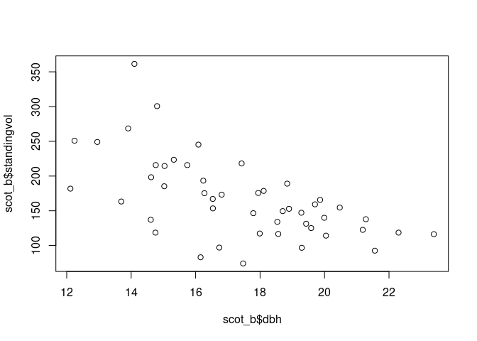
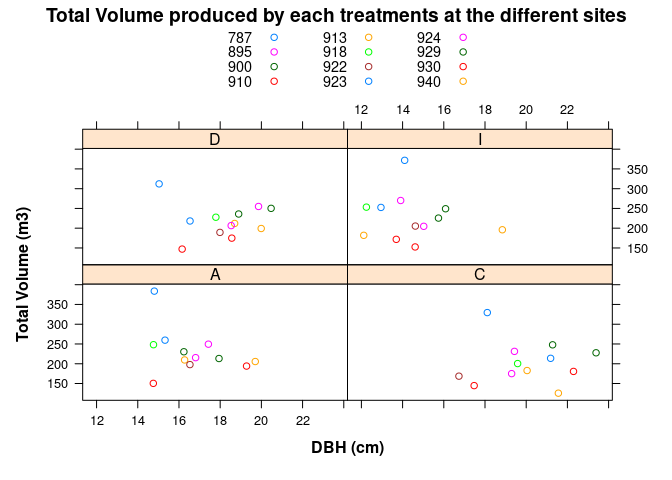
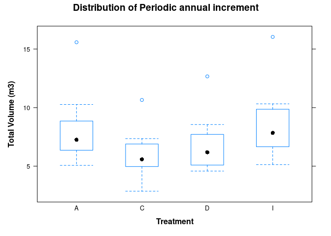
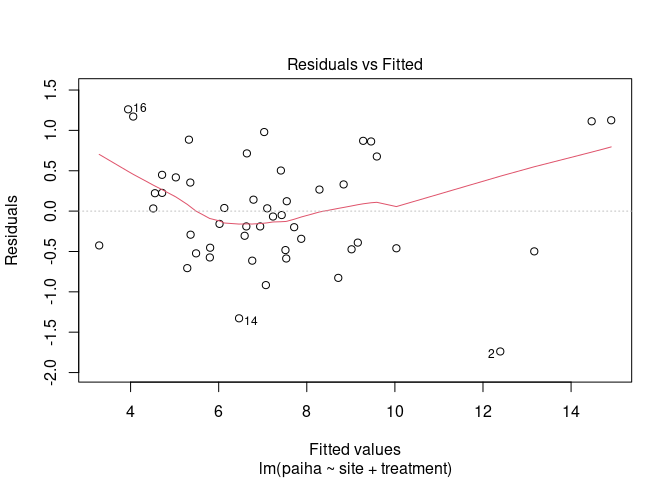
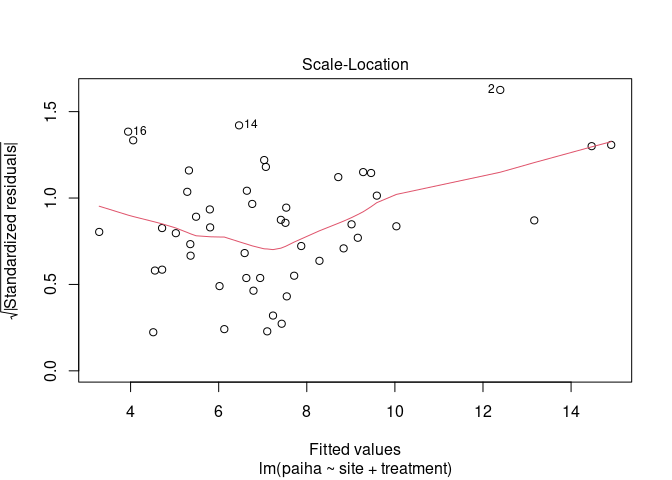
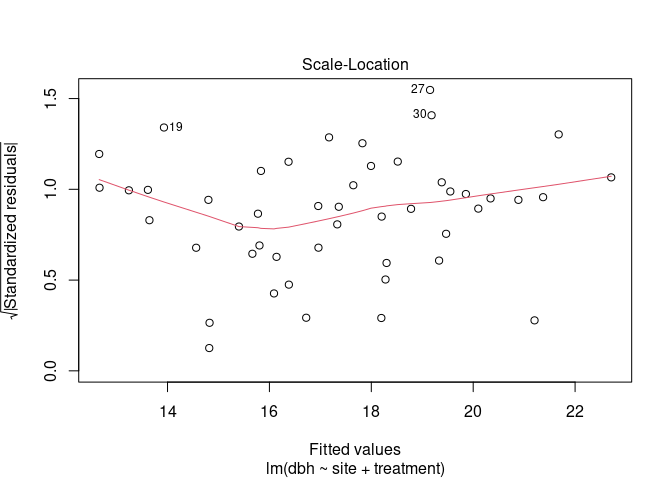
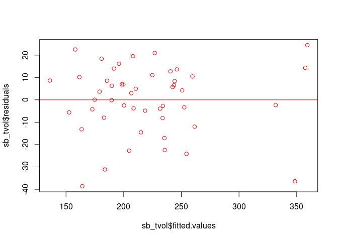

# Thinning Experiment in Scot Pine

<br> Thinning is one of the important silvicultural tools used to
achieve management objectives. Swedish forestry has used this tool to
produce trees of desired qualities. Various thinning experiments have
been conducted relating to different tree species in Sweden. An example
is Nilsson et al., (2010), which is a robust thinning experiment of
Norway Spruce and Scots Pine. There are various experiments spread
across the country in Sweden, each treatment with different treatments
and site conditions. This experiment is one of such. <br>


<br> *Image by Bruce A. Blackwell* <br> This is an experiment to
determine how thinning grade, intensity and thinning form affects stem
volume, production and tree dimensions. The thinning program is a
compromise between several factors but the most important are e.g., stem
volume production, economy and risk. In this experiment established in
the 1960s, 1970s and 1980s, the effect of various thinning programs on
stem volume production and mortality was test. The experiment includes
in total 46 sites in Scots Pine but to make it a little easier, 15 sites
have been chosen for this assignment. Also, the original experiment
includes up to 14 different treatments but the data for this analysis
include only four main treatments. The thinning treatments are A, C, D
and I. The overall thinning treatments in this assignment were:

-   A. **Normal thinning program**: Three thinnings from below. Average
    basal area after first thinning in these six sites was 16.7 m2 ha-1

-   B. **Reduced number of thinnings**: Two thinnings from below. The
    second thinning was not done in this treatment but the average basal
    area after thinnings were lower compared to A and the idea was that
    average basal area over the whole period should be about the same as
    in A. Average basal area after the first thinning was in these 15
    sites 12.8 m2 ha-1.

-   C. **One Thinning**: In this treatment, a one-time thinning from
    below was tested and it was done at the same time as first thinning
    in A-treatment. Average basal area after the one.timing.thinning was
    9.4 m2 ha-1

-   D. **High thinning grade**: Three thinings from below with high
    thinning grade. Basal area was on average 11.9 m2 ha-1 after the
    first thinning and two more hard thinnings were done at the same
    time as thinning was done in treatment A.

-   E. **Late first thinning**

-   F. **Thinning from above**: The same thinning grade as in treatment
    A but thinning was done from above with removal of the largest
    trees.

-   G. **Fertilization with N**

-   H. **Fertilization with N + P**

-   I. **Unthinned**: An unthinned control for reference.

Treatments were typically done on 0.1 ha net-plots with a bordering
buffer-zone of 5-10 m that was thinned in the same way as the net-plot.
However, plot area varies for some sites and the area is included in the
data. Measurements were done at each thinning written as revisions, but
just the second revisions measurement is given in the data, which is the
first remeasurement after the first thinning. The initial age at
revision 1 and treatments, varies for the sites (between 32 and 48
years) and so does the time between revision 1 and 2 (7-15 years).

``` r
library(doBy)
library(dplyr)
library(lattice)
library(ggplot2)
library(car)
library(data.table)
library(TukeyC)
```

**Importing data**

``` r
scot_a <- read.table('https://raw.githubusercontent.com/xrander/Slu_experiment/master/Data/Last%20straw/TaskA_GG.txt',
                    sep = '\t',
                    strip.white = T,
                    header = T,
                    na.strings = 'NA',
                    dec = '.')
```

``` r
scot_b <- read.table('https://raw.githubusercontent.com/xrander/Slu_experiment/master/Data/Last%20straw/TaskB_GG.txt',
           sep = '\t', strip.white = T,
           header = T,
           na.strings = 'NA',
           dec = '.')
```

**Data Description** - Site: site number, also referred to as block.

-   plot: the plot number within the site

-   Treatment: given as the code above for the different thinning grade.

-   Area: area of the plot in ha

-   Standingvol: standing volume at time of first thinning (m3 ha-1)

-   Harvestvol: harvested volume at time of first thinning (m3 ha-1)

-   Mortvol: measured mortality until second revision (m3 ha-1)

-   Paiha: Measured periodic annual increment between revision 1 and 2
    (m3 ha-1 yr-1)

-   Dbh: Mean dbh at revision 2 (cm)

## Questions

-   What is the total volume production

-   is there any statistical differences between the selected treatments
    at the time of measurement in terms of total volume production, PAI
    and dbh?

**Data Exploration**

``` r
str(scot_a)

summary(scot_a)
```

``` r
str(scot_b)
```

    ## 'data.frame':    48 obs. of  9 variables:
    ##  $ site       : int  787 787 787 787 895 895 895 895 900 900 ...
    ##  $ plotno     : int  2 3 5 7 10 12 2 7 4 5 ...
    ##  $ treatment  : chr  "D" "C" "A" "I" ...
    ##  $ area       : num  0.1 0.1 0.1 0.1 0.1 ...
    ##  $ standingvol: num  214 179 301 361 166 ...
    ##  $ harvestvol : num  97.7 150.9 77.2 0 89.3 ...
    ##  $ mortvol    : num  0 0 5.93 10.35 0 ...
    ##  $ paiha      : num  12.67 10.65 15.58 16.04 7.51 ...
    ##  $ dbh        : num  15 18.1 14.8 14.1 19.9 ...

``` r
summary(scot_b)
```

    ##       site           plotno        treatment              area        
    ##  Min.   :787.0   Min.   : 1.000   Length:48          Min.   :0.09999  
    ##  1st Qu.:907.5   1st Qu.: 3.000   Class :character   1st Qu.:0.10000  
    ##  Median :920.0   Median : 5.000   Mode  :character   Median :0.10000  
    ##  Mean   :907.6   Mean   : 5.292                      Mean   :0.10562  
    ##  3rd Qu.:925.2   3rd Qu.: 7.250                      3rd Qu.:0.10064  
    ##  Max.   :940.0   Max.   :12.000                      Max.   :0.16000  
    ##   standingvol       harvestvol        mortvol           paiha       
    ##  Min.   : 74.18   Min.   :  0.00   Min.   : 0.000   Min.   : 2.862  
    ##  1st Qu.:124.47   1st Qu.: 19.89   1st Qu.: 0.000   1st Qu.: 5.322  
    ##  Median :156.95   Median : 47.71   Median : 2.870   Median : 6.939  
    ##  Mean   :167.64   Mean   : 47.87   Mean   : 4.251   Mean   : 7.312  
    ##  3rd Qu.:194.58   3rd Qu.: 72.51   3rd Qu.: 6.795   3rd Qu.: 8.145  
    ##  Max.   :361.40   Max.   :150.85   Max.   :19.469   Max.   :16.036  
    ##       dbh       
    ##  Min.   :12.12  
    ##  1st Qu.:15.03  
    ##  Median :17.45  
    ##  Mean   :17.35  
    ##  3rd Qu.:19.33  
    ##  Max.   :23.39

*variable names*

``` r
names(scot_a)
```

    ## [1] "site"        "plotno"      "treatment"   "area"        "standingvol"
    ## [6] "harvestvol"  "mortvol"     "paiha"       "dbh"

``` r
names(scot_b)
```

    ## [1] "site"        "plotno"      "treatment"   "area"        "standingvol"
    ## [6] "harvestvol"  "mortvol"     "paiha"       "dbh"

*number of rows*

``` r
nrow(scot_a)
```

    ## [1] 48

``` r
nrow(scot_b)
```

    ## [1] 48

After a quick view, some data type will be changed.

``` r
scot_a$site <- as.factor(scot_a$site)
scot_a$treatment <- as.factor(scot_a$treatment)
scot_a$plotno <- as.factor(scot_a$plotno)
```

``` r
scot_b$site <- as.factor(scot_b$site)
scot_b$treatment <- as.factor(scot_b$treatment)
scot_b$plotno <- as.factor(scot_b$plotno)
```

``` r
barplot(scot_b$dbh, names.arg = scot_b$site,
        ylab = 'dbh (cm)',
        xlab = 'sites',
        main = 'DBH distribution across sites',
        ylim = c(0, 30))
```


``` r
plot(scot_b$dbh,scot_b$standingvol)
```



**Experimental design** A quick preview of the experimental design

``` r
table(scot_a$site, scot_a$treatment)
```

    ##      
    ##       A B F I
    ##   787 1 1 1 1
    ##   895 1 1 1 1
    ##   900 1 1 1 1
    ##   910 1 1 1 1
    ##   913 1 1 1 1
    ##   918 1 1 1 1
    ##   922 1 1 1 1
    ##   923 1 1 1 1
    ##   924 1 1 1 1
    ##   929 1 1 1 1
    ##   930 1 1 1 1
    ##   940 1 1 1 1

``` r
table(scot_b$site, scot_b$treatment)
```

    ##      
    ##       A C D I
    ##   787 1 1 1 1
    ##   895 1 1 1 1
    ##   900 1 1 1 1
    ##   910 1 1 1 1
    ##   913 1 1 1 1
    ##   918 1 1 1 1
    ##   922 1 1 1 1
    ##   923 1 1 1 1
    ##   924 1 1 1 1
    ##   929 1 1 1 1
    ##   930 1 1 1 1
    ##   940 1 1 1 1

The design is a randomized blocked design

### Total Volume Produced

``` r
scot_a$tot_vol <- scot_a$standingvol + scot_a$harvestvol + scot_a$mortvol
```

``` r
scot_b$tot_vol <- scot_b$standingvol + scot_b$harvestvol + scot_b$mortvol
```

**Volume produced by each treatments**

``` r
summaryBy(tot_vol~treatment, data = scot_a, FUN = sum)
```

    ##   treatment tot_vol.sum
    ## 1         A    2757.481
    ## 2         B    2593.389
    ## 3         F    2607.507
    ## 4         I    2734.862

``` r
summaryBy(tot_vol~treatment, data = scot_b, FUN = sum)
```

    ##   treatment tot_vol.sum
    ## 1         A    2757.481
    ## 2         C    2427.520
    ## 3         D    2628.397
    ## 4         I    2734.862

**Visualizing similar result**

``` r
barchart(tot_vol~treatment,
         data = scot_a,
         group = site,
         ylab = substitute(paste(bold('Total Volume (m3)'))),
         xlab = substitute(paste(bold('Treatments'))),
         main = 'Total Volume produced by each treatments at the different sites',
         auto.key = list(column = 4))
```


``` r
barchart(tot_vol~treatment,
         data = scot_b,
         group = site,
         ylab = substitute(paste(bold('Total Volume (m3)'))),
         xlab = substitute(paste(bold('Treatments'))),
         main = 'Total Volume produced by each treatments at the different sites',
         auto.key = list(corner = c(0.4, 0.95), columns = 3, cex = 0.9),
         box.ratio = 2,)
```


``` r
xyplot(tot_vol~dbh | treatment,
         data = scot_b,
         group = site,
         ylab = substitute(paste(bold('Total Volume (m3)'))),
         xlab = substitute(paste(bold('DBH (cm)'))),
         main = 'Total Volume produced by each treatments at the different sites',
         auto.key = list(columns = 3, cex = 0.9))
```



``` r
barchart(tot_vol~treatment|site, data = scot_b)
```


``` r
bwplot(tot_vol~treatment, data = scot_b,
       xlab = substitute(paste(bold('Treatment'))),
       ylab = substitute(paste(bold('Total Volume (m3)'))),
       main = 'Distribution of Treatment')
```


``` r
bwplot(dbh~treatment, data = scot_b,
       xlab = substitute(paste(bold('Treatment'))),
       ylab = substitute(paste(bold('Total Volume (m3)'))),
       main = 'Distribution of DBH')
```


``` r
bwplot(paiha~treatment, data = scot_b,
       xlab = substitute(paste(bold('Treatment'))),
       ylab = substitute(paste(bold('Total Volume (m3)'))),
       main = 'Distribution of Periodic annual increment')
```



``` r
summaryBy(tot_vol + paiha + dbh ~ treatment,
          FUM = mean,
          data = scot_a)
```

    ##   treatment tot_vol.mean paiha.mean dbh.mean
    ## 1         A     229.7901   8.045398 16.65431
    ## 2         B     216.1158   7.067756 17.51680
    ## 3         F     217.2922   7.605466 13.91031
    ## 4         I     227.9052   8.489020 14.49433

``` r
summaryBy(tot_vol + paiha + dbh ~ treatment,
          FUM = mean,
          data = scot_b)
```

    ##   treatment tot_vol.mean paiha.mean dbh.mean
    ## 1         A     229.7901   8.045398 16.65431
    ## 2         C     202.2933   5.970695 20.03243
    ## 3         D     219.0331   6.742520 18.21101
    ## 4         I     227.9052   8.489020 14.49433

### Analysis of Variance (ANOVA)

``` r
## pai
sa_paiha <- lm(paiha ~ site+treatment , data = scot_a)

##tot_vol
sa_tvol <- lm(tot_vol ~ site+treatment , data = scot_a)

##tot_dbh
sa_dbh <- lm(dbh~site+treatment, data = scot_a)
```

``` r
plot(sa_tvol)
```


``` r
## pai
sb_paiha <- lm(paiha ~ site+treatment , data = scot_b)
```

``` r
##tot_vol
sb_tvol <- lm(tot_vol ~ site+treatment , data = scot_b)

##tot_dbh
sb_dbh <- lm(dbh~site+treatment, data = scot_b)
```

``` r
plot(sb_paiha)
```



``` r
plot(sb_dbh)
```



``` r
plot(sb_tvol$fitted.values, sb_tvol$residuals,
     col = 'red')

abline(c(0,0), col='red')
```



``` r
## tot_vol
anova(sa_tvol)
```

    ## Analysis of Variance Table
    ## 
    ## Response: tot_vol
    ##           Df Sum Sq Mean Sq F value  Pr(>F)    
    ## site      11 147104 13373.1 70.7531 < 2e-16 ***
    ## treatment  3   1799   599.7  3.1731 0.03696 *  
    ## Residuals 33   6237   189.0                    
    ## ---
    ## Signif. codes:  0 '***' 0.001 '**' 0.01 '*' 0.05 '.' 0.1 ' ' 1

``` r
##dbh
anova(sa_dbh)
```

    ## Analysis of Variance Table
    ## 
    ## Response: dbh
    ##           Df  Sum Sq Mean Sq F value    Pr(>F)    
    ## site      11 115.263  10.478  10.657 5.534e-08 ***
    ## treatment  3 106.266  35.422  36.027 1.607e-10 ***
    ## Residuals 33  32.446   0.983                      
    ## ---
    ## Signif. codes:  0 '***' 0.001 '**' 0.01 '*' 0.05 '.' 0.1 ' ' 1

``` r
##pai
anova(sa_paiha)
```

    ## Analysis of Variance Table
    ## 
    ## Response: paiha
    ##           Df Sum Sq Mean Sq F value    Pr(>F)    
    ## site      11 360.62  32.784 61.9563 < 2.2e-16 ***
    ## treatment  3  13.31   4.436  8.3833 0.0002785 ***
    ## Residuals 33  17.46   0.529                      
    ## ---
    ## Signif. codes:  0 '***' 0.001 '**' 0.01 '*' 0.05 '.' 0.1 ' ' 1

In this analysis the effect of treatment and not block is the interest.
There is a significant effect of treatment on total volume, dbh and
periodic and annual increment.

``` r
## tot_vol
anova(sb_tvol)
```

    ## Analysis of Variance Table
    ## 
    ## Response: tot_vol
    ##           Df Sum Sq Mean Sq F value    Pr(>F)    
    ## site      11 113743 10340.2 32.2852 1.702e-14 ***
    ## treatment  3   5671  1890.2  5.9019  0.002432 ** 
    ## Residuals 33  10569   320.3                      
    ## ---
    ## Signif. codes:  0 '***' 0.001 '**' 0.01 '*' 0.05 '.' 0.1 ' ' 1

``` r
##dbh
anova(sb_dbh)
```

    ## Analysis of Variance Table
    ## 
    ## Response: dbh
    ##           Df  Sum Sq Mean Sq F value    Pr(>F)    
    ## site      11  92.933   8.448  5.6924 4.644e-05 ***
    ## treatment  3 198.907  66.302 44.6733 1.014e-11 ***
    ## Residuals 33  48.977   1.484                      
    ## ---
    ## Signif. codes:  0 '***' 0.001 '**' 0.01 '*' 0.05 '.' 0.1 ' ' 1

``` r
##pai
anova(sb_paiha)
```

    ## Analysis of Variance Table
    ## 
    ## Response: paiha
    ##           Df  Sum Sq Mean Sq F value    Pr(>F)    
    ## site      11 255.696 23.2451  36.910 2.332e-15 ***
    ## treatment  3  48.560 16.1866  25.703 9.209e-09 ***
    ## Residuals 33  20.782  0.6298                      
    ## ---
    ## Signif. codes:  0 '***' 0.001 '**' 0.01 '*' 0.05 '.' 0.1 ' ' 1

In this analysis the effect of treatment and not block is the interest.
There is a significant effect of treatment on total volume, dbh and
periodic and annual increment.

### Post hoc test

**Total Volume**

``` r
## Post hoc test
summary(TukeyC(sa_tvol, which = 'treatment'))
```

    ## Goups of means at sig.level = 0.05 
    ##    Means G1
    ## A 229.79  a
    ## I 227.91  a
    ## F 217.29  a
    ## B 216.12  a
    ## 
    ## Matrix of the difference of means above diagonal and
    ## respective p-values of the Tukey test below diagonal values
    ##       A     I      F      B
    ## A 0.000 1.885 12.498 13.674
    ## I 0.987 0.000 10.613 11.789
    ## F 0.137 0.251  0.000  1.176
    ## B 0.090 0.174  0.997  0.000

Post hoc test shows no differnce in the effect of treatment on volume
production

``` r
## Post hoc test
summary(TukeyC(sb_tvol, which = 'treatment'))
```

    ## Goups of means at sig.level = 0.05 
    ##    Means G1 G2
    ## A 229.79  a   
    ## I 227.91  a   
    ## D 219.03  a  b
    ## C 202.29     b
    ## 
    ## Matrix of the difference of means above diagonal and
    ## respective p-values of the Tukey test below diagonal values
    ##       A     I      D      C
    ## A 0.000 1.885 10.757 27.497
    ## I 0.994 0.000  8.872 25.612
    ## D 0.465 0.622  0.000 16.740
    ## C 0.003 0.007  0.121  0.000

There is a difference in the effect of the treatment on total volume
here. Here treatment A, and I are having similar effect on volume,
producing almost similar volumes, while treatment D is having more or
less similar effect on total volume produced as treatments A, I and C
**Periodic Annual Increment Per hectare**

``` r
## Post hoc test
summary(TukeyC(sa_paiha, which = 'treatment'))
```

    ## Goups of means at sig.level = 0.05 
    ##   Means G1 G2 G3
    ## I  8.49  a      
    ## A  8.05  a  b   
    ## F  7.61     b  c
    ## B  7.07        c
    ## 
    ## Matrix of the difference of means above diagonal and
    ## respective p-values of the Tukey test below diagonal values
    ##       I     A     F     B
    ## I 0.000 0.444 0.884 1.421
    ## A 0.453 0.000 0.440 0.978
    ## F 0.027 0.460 0.000 0.538
    ## B 0.000 0.012 0.287 0.000

Treatment I shows the highest in the periodic annual increment

``` r
## Post hoc test
summary(TukeyC(sb_paiha, which = 'treatment'))
```

    ## Goups of means at sig.level = 0.05 
    ##   Means G1 G2
    ## I  8.49  a   
    ## A  8.05  a   
    ## D  6.74     b
    ## C  5.97     b
    ## 
    ## Matrix of the difference of means above diagonal and
    ## respective p-values of the Tukey test below diagonal values
    ##       I     A     D     C
    ## I 0.000 0.444 1.746 2.518
    ## A 0.527 0.000 1.303 2.075
    ## D 0.000 0.002 0.000 0.772
    ## C 0.000 0.000 0.100 0.000

**Diameter at breast height**

``` r
## Post hoc test
summary(TukeyC(sa_dbh, which = 'treatment'))
```

    ## Goups of means at sig.level = 0.05 
    ##   Means G1 G2
    ## B 17.52  a   
    ## A 16.65  a   
    ## I 14.49     b
    ## F 13.91     b
    ## 
    ## Matrix of the difference of means above diagonal and
    ## respective p-values of the Tukey test below diagonal values
    ##       B     A     I     F
    ## B 0.000 0.862 3.022 3.606
    ## A 0.165 0.000 2.160 2.744
    ## I 0.000 0.000 0.000 0.584
    ## F 0.000 0.000 0.483 0.000

## Post hoc test

``` r
T_dbh <- summary(TukeyC(sb_dbh, which = 'treatment'))
```

    ## Goups of means at sig.level = 0.05 
    ##   Means G1 G2 G3 G4
    ## C 20.03  a         
    ## D 18.21     b      
    ## A 16.65        c   
    ## I 14.49           d
    ## 
    ## Matrix of the difference of means above diagonal and
    ## respective p-values of the Tukey test below diagonal values
    ##       C     D     A     I
    ## C 0.000 1.821 3.378 5.538
    ## D 0.005 0.000 1.557 3.717
    ## A 0.000 0.018 0.000 2.160
    ## I 0.000 0.000 0.001 0.000

[Spacing Experiment](spacing_experiment.md) <br>

[Homepage](Readme.md) <br>

[Mixed Forest Experiment](mixed_forest.md) <br>

[Back to portfolio](https://xrander.github.io)
