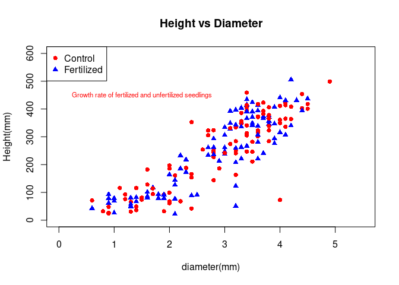
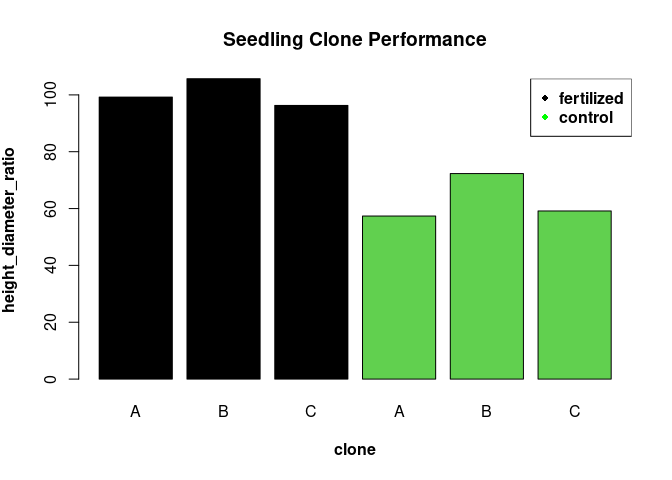

# Clone Performance Test - Exp I


The first experiment will be a clone performance experiment. The data
used is the ‘popdata’ which is accessible
[here](https://raw.githubusercontent.com/xrander/SLU-Plantation-Experimentation/master/Data/popdata.txt).
This analysis will seek to answer the question: - Is the treatment
having an influence - Which clone is performing best

``` r
library(doBy)
library(dplyr)
library(lattice)
library(ggplot2)
library(car)
library(data.table)
library(TukeyC)
```

*Importing the data*

``` r
pop <- read.table('https://raw.githubusercontent.com/xrander/SLU-Plantation-Experimentation/master/Data/Lab1/popdata.txt', header = T)

head(pop)
```

    ##   block cutw height dia clone fert
    ## 1     1  2.4     71 0.6     A    3
    ## 2     1  0.7     67 1.4     A    3
    ## 3     1  6.5    211 3.5     A    3
    ## 4     1  1.1     69 1.0     A    3
    ## 5     2  2.0    116 1.4     A    3
    ## 6     2  4.9    123 3.2     A    3

**Data description**

-   block: experimental block

-   cutw: cultivar weight

-   height: height of the plant

-   dia = diameter

-   clone: clone class

-   fert: Fertilized or not(1 = fertilized and 3 = control)

We can create a column now and assign the names to the different values.

*Creating a column to give name to the values of the fert*

``` r
pop$fert_value <- ifelse(pop$fert==1, 'fertilized', 'control')
head(pop)
```

    ##   block cutw height dia clone fert fert_value
    ## 1     1  2.4     71 0.6     A    3    control
    ## 2     1  0.7     67 1.4     A    3    control
    ## 3     1  6.5    211 3.5     A    3    control
    ## 4     1  1.1     69 1.0     A    3    control
    ## 5     2  2.0    116 1.4     A    3    control
    ## 6     2  4.9    123 3.2     A    3    control

## Questions

    -   Plot the height diameter relationship of different treatment of seedlings

    - estimate the index of slenderness of the stand

    -   Plot the performance of the seedlings and state which of the clones performing the best

## Height diameter relationship of the control and fertilized seedlings

The first step of the analysis is visualize the effect of treatment on
diameter and height

``` r
plot(pop$dia, pop$height,
     text(x=01.5,
          y=450,
          labels = "Growth rate of fertilized and unfertilized seedlings",
          col = "red",
          cex = 0.7),
     xlim = c(0,5.5),
     ylim = c(0, 600),
     xlab = 'diameter(mm)',
     ylab = 'Height(mm)',
     main = "Height vs Diameter",
     pch = c(16,17),
     col = c('red', 'blue'))
legend("topleft",
       legend = c("Control","Fertilized"),
       pch= c(16,17),
       col = c('red','blue'))
```



## Index of Slenderness

The height diameter ratio or index of slenderness is an important
measure as it can be used to evaluate a tree stability. To read more on
height diameter relationship click
\[here\](<https://www.mdpi.com/1999-4907/10/1/70/htm#>:\~:text=Height%2Dto%2Ddiameter%20ratio%20(,of%20tree%20and%20stand%20stability.).
The formula for HDr is given below

*H**D*<sub>*r*</sub> = *h**e**i**g**h**t*/*d**i**a**m**e**t**e**r*
Where
*H**D*<sub>*r*</sub> = *h**e**i**g**h**t**d**i**a**m**e**t**e**r**r**a**t**i**o*

``` r
pop$hd <- pop$height/pop$dia
```

Given the data we can estimate the average height and diameter for the
clones and treatments

``` r
pop_summary <- summaryBy(height + dia ~ fert + clone, data = pop, FUN=mean)
head(pop_summary)
```

    ##   fert clone height.mean dia.mean
    ## 1    1     A    325.5926 3.281481
    ## 2    1     B    361.3243 3.418919
    ## 3    1     C    364.7941 3.788235
    ## 4    3     A    118.7917 2.070833
    ## 5    3     B    165.8387 2.293548
    ## 6    3     C    124.7222 2.108333

The mean height to diameter of the different treatment as given with the
formula above can be estimated.

``` r
pop_summary$h_d <- pop_summary$height.mean/pop_summary$dia.mean

names(pop_summary)[5] <- 'height_dia_ratio'

barplot(pop_summary$height_dia_ratio,
        names.arg = pop_summary$clone,
        col = pop_summary$fert,
        xlab = substitute(paste(bold('clone'))),
        ylab = substitute(paste(bold('height_diameter_ratio'))),
        main = 'Seedling Clone Performance',
        legend = TRUE)
legend('topright',
       legend = c(substitute(paste(bold('fertilized'))),  substitute(paste(bold('control')))),
       col = c('black', 'green'),
       pch = 18)
```



It is evident that the fertilized are performing than the control, with
the B clone class being the highest performing either fertilized or not.
