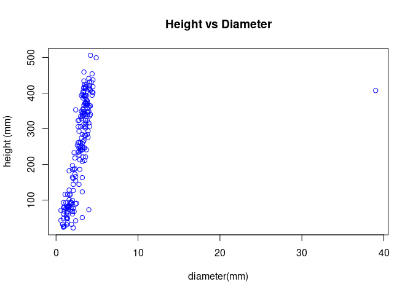

# Poplar Cutting Experiment - Exp V


## Question:

    -   Investigate if the volume of 12 weeks seedlings is related to the initial cutting weight.

    -   Make a regression of height and dbh,then determine if dbh can be used to predict height if height data is missing.

``` r
library(doBy)
library(dplyr)
library(lattice)
library(ggplot2)
library(car)
library(data.table)
library(TukeyC)
```

**Importing data**

``` r
# Importing data
pop2 <- read.table("https://raw.githubusercontent.com/xrander/Slu_experiment/master/Data/Lab%205/pop2.txt",
                   header = T,
                   sep = '\t',
                   dec = '.',
                   na.strings = 'NA',
                   strip.white = T)

poplar <- read.table("https://raw.githubusercontent.com/xrander/Slu_experiment/master/Data/Lab%205/poplar.txt",
                     header = T,
                     sep = '\t',
                     dec = '.',
                     na.strings = 'NA',
                     strip.white = T)

spruce2 <- read.table("https://raw.githubusercontent.com/xrander/Slu_experiment/master/Data/Lab%205/spruce.txt",
                      header = T,
                      sep = '\t',
                      dec = '.',
                      na.strings = 'NA',
                      strip.white = T)
```

**Data description**

***pop2 and poplar***

-   block:1-5

-   cutw:total dryweight biomass (g)

-   height:aboveground height (mm)

-   dia:root collar diameter (mm)

-   clone: A,B,C

-   fert: 1=fertilized, 3= control

***Spruce***

The data is just a short list of sampled saplings of Norway spruce with
dbh (mm) and height (dm). The data is taken from a short interval of
heights and the relation between height and diameter is still linear
(compared to the range that you usually have in a stand). That is why,
we are interested in testing whether we could use a linear model to fit
a regression line of the relationship of height and dbh.

\*\* Little exploration\*\*

``` r
str(pop2)
```

    ## 'data.frame':    189 obs. of  6 variables:
    ##  $ block : int  1 1 1 1 2 2 2 2 2 2 ...
    ##  $ cutw  : num  2.4 0.7 6.5 1.1 2 4.9 0.8 1.3 8.8 2 ...
    ##  $ height: int  71 67 211 69 116 123 68 79 166 91 ...
    ##  $ dia   : num  0.6 1.4 3.5 1 1.4 3.2 2.2 1.8 2.4 2.5 ...
    ##  $ clone : chr  "A" "A" "A" "A" ...
    ##  $ fert  : int  3 3 3 3 3 3 3 3 3 3 ...

``` r
summary(pop2)
```

    ##      block            cutw           height           dia        
    ##  Min.   :1.000   Min.   : 0.10   Min.   : 22.0   Min.   : 0.600  
    ##  1st Qu.:2.000   1st Qu.: 1.10   1st Qu.:100.5   1st Qu.: 2.000  
    ##  Median :3.000   Median : 2.20   Median :262.5   Median : 3.200  
    ##  Mean   :3.011   Mean   : 3.78   Mean   :248.5   Mean   : 3.046  
    ##  3rd Qu.:4.000   3rd Qu.: 5.80   3rd Qu.:365.2   3rd Qu.: 3.600  
    ##  Max.   :5.000   Max.   :19.70   Max.   :506.0   Max.   :39.000  
    ##                                  NA's   :1                       
    ##     clone                fert      
    ##  Length:189         Min.   :1.000  
    ##  Class :character   1st Qu.:1.000  
    ##  Mode  :character   Median :1.000  
    ##                     Mean   :1.963  
    ##                     3rd Qu.:3.000  
    ##                     Max.   :3.000  
    ## 

``` r
plot (pop2$dia)
```



There is a wrong diameter value that is far from the average mean.Also,
we have missing value in the height variable.

#### Dealing with Missing Data

``` r
pop2[is.na(pop2$height), ]
```

    ##     block cutw height dia clone fert
    ## 109     4  0.5     NA 3.1     A    1

``` r
## This shows we have one Na Value and it is in row 109

pop2[complete.cases(pop2), ] ## can be written as 
```

    ##     block cutw height  dia clone fert
    ## 1       1  2.4     71  0.6     A    3
    ## 2       1  0.7     67  1.4     A    3
    ## 3       1  6.5    211  3.5     A    3
    ## 4       1  1.1     69  1.0     A    3
    ## 5       2  2.0    116  1.4     A    3
    ## 6       2  4.9    123  3.2     A    3
    ## 7       2  0.8     68  2.2     A    3
    ## 8       2  1.3     79  1.8     A    3
    ## 9       2  8.8    166  2.4     A    3
    ## 10      2  2.0     91  2.5     A    3
    ## 11      2  2.5     32  1.9     A    3
    ## 12      3  2.5    127  2.1     A    3
    ## 13      3  1.3     79  1.5     A    3
    ## 14      3  1.0     81  1.6     A    3
    ## 15      3  6.3    186  2.9     A    3
    ## 16      3 12.1    234  2.7     A    3
    ## 17      4  1.6     94  1.7     A    3
    ## 18      4  0.5     43  0.6     A    3
    ## 19      4  8.5    249  3.2     A    3
    ## 20      4  1.1     86  1.6     A    3
    ## 21      5  1.7     92  1.9     A    3
    ## 22      5  7.2    241  3.7     A    3
    ## 23      5  2.7    154  2.4     A    3
    ## 24      5  1.4     92  1.9     A    3
    ## 25      1  1.4     36  1.4     B    3
    ## 26      1  2.6    186  2.2     B    3
    ## 27      1  2.2    197  2.0     B    3
    ## 28      1 14.7    349  3.5     B    3
    ## 29      1  0.7     66  1.3     B    3
    ## 30      1  1.9    233  2.2     B    3
    ## 31      1  4.6    251  2.8     B    3
    ## 32      1  0.8     26  1.0     B    3
    ## 33      2  0.9     32  0.8     B    3
    ## 34      2  2.1     89  2.4     B    3
    ## 35      2  5.2    246  3.5     B    3
    ## 36      2 11.3    238  3.0     B    3
    ## 37      2  5.7    245  2.8     B    3
    ## 38      3  7.0    247  3.0     B    3
    ## 39      3  2.8    161  2.1     B    3
    ## 40      3  2.0    117  1.7     B    3
    ## 41      3  4.3    163  3.2     B    3
    ## 42      3  0.7     51  1.3     B    3
    ## 43      4  0.5     81  1.5     B    3
    ## 44      4  1.9    144  2.1     B    3
    ## 45      4 19.7    324  2.8     B    3
    ## 46      4  3.1    164  2.0     B    3
    ## 47      4  6.8    242  3.0     B    3
    ## 48      4  1.5    101  1.6     B    3
    ## 49      4 14.3    323  3.6     B    3
    ## 50      5 11.8    294  3.9     B    3
    ## 51      5  4.1    144  2.8     B    3
    ## 52      5  3.8    173  2.3     B    3
    ## 53      5  2.3     61  2.0     B    3
    ## 54      5  2.4     58  1.3     B    3
    ## 55      5  1.4     99  2.0     B    3
    ## 56      1  0.6     79  0.9     C    3
    ## 57      1  0.9     24  0.9     C    3
    ## 58      1  4.5    208  3.2     C    3
    ## 59      1  0.8     93  1.2     C    3
    ## 60      1  0.6     93  0.9     C    3
    ## 61      2  0.7    116  1.1     C    3
    ## 62      2  4.1    261  2.7     C    3
    ## 63      2  7.4    282  3.5     C    3
    ## 64      2  1.1     62  0.9     C    3
    ## 65      2  0.6     48  0.9     C    3
    ## 66      2 10.3    281  3.6     C    3
    ## 67      2 14.7    284  3.8     C    3
    ## 68      2  1.8     79  1.9     C    3
    ## 69      3  2.4     42  2.4     C    3
    ## 70      3  2.2     77  2.1     C    3
    ## 71      3  1.2    114  1.7     C    3
    ## 72      3  0.8     81  1.3     C    3
    ## 73      3  0.7     27  0.9     C    3
    ## 74      3  5.6     22  2.1     C    3
    ## 75      3  8.5     73  4.0     C    3
    ## 76      3 10.1    276  3.9     C    3
    ## 77      4  8.6    247  3.4     C    3
    ## 78      4  0.9     93  1.8     C    3
    ## 79      4  0.9     76  1.2     C    3
    ## 80      4  7.1    221  3.3     C    3
    ## 81      4  2.1     49  1.4     C    3
    ## 82      4  0.7     82  1.4     C    3
    ## 83      4  9.2    241  3.2     C    3
    ## 84      5  1.1     48  1.3     C    3
    ## 85      5  2.0     74  1.5     C    3
    ## 86      5  4.7     51  3.2     C    3
    ## 87      5  2.9     31  1.3     C    3
    ## 88      5  8.4    221  3.6     C    3
    ## 89      5  6.1    227  2.8     C    3
    ## 90      5  0.5     79  1.0     C    3
    ## 91      5  0.8    128  1.6     C    3
    ## 92      1  4.6    441  4.0     A    1
    ## 93      1  3.6    316  3.6     A    1
    ## 94      1  2.1    353  3.3     A    1
    ## 95      1  0.3    284  3.2     A    1
    ## 96      2  0.1    366  3.4     A    1
    ## 97      2  0.8    421  4.1     A    1
    ## 98      2  7.3    407 39.0     A    1
    ## 99      2  0.6    182  1.6     A    1
    ## 100     2 14.2    414  3.6     A    1
    ## 101     2  3.2    305  3.4     A    1
    ## 102     3  0.9    306  3.0     A    1
    ## 103     3  7.7    418  4.5     A    1
    ## 104     3  0.6    373  3.7     A    1
    ## 105     3  0.9    188  2.3     A    1
    ## 106     3  2.1    328  3.1     A    1
    ## 107     4  1.3    371  3.6     A    1
    ## 108     4  1.4    377  3.8     A    1
    ## 110     4  2.2    416  3.4     A    1
    ## 111     4  6.0    406  3.8     A    1
    ## 112     5  5.3    261  3.0     A    1
    ## 113     5  0.4     68  2.0     A    1
    ## 114     5  4.1    218  2.3     A    1
    ## 115     5  1.6    334  3.2     A    1
    ## 116     5  5.1    371  3.8     A    1
    ## 117     5  3.1    274  3.1     A    1
    ## 118     5  1.1    262  2.8     A    1
    ## 119     1  2.7    394  3.4     B    1
    ## 120     1 12.2    431  4.3     B    1
    ## 121     1  0.8    386  3.3     B    1
    ## 122     1  1.3    349  3.1     B    1
    ## 123     1  7.6    361  4.0     B    1
    ## 124     1  0.9    343  3.2     B    1
    ## 125     1  0.7    306  2.7     B    1
    ## 126     1  6.1    424  3.5     B    1
    ## 127     2  1.9    406  3.4     B    1
    ## 128     2  2.0    434  3.4     B    1
    ## 129     2  1.2    356  3.3     B    1
    ## 130     2  0.8    404  3.3     B    1
    ## 131     2  6.8    378  3.8     B    1
    ## 132     2  0.5    391  3.5     B    1
    ## 133     2  7.2    364  4.2     B    1
    ## 134     3  1.9    357  3.8     B    1
    ## 135     3  2.4    313  3.4     B    1
    ## 136     3  1.3    236  2.8     B    1
    ## 137     3  3.2    366  3.8     B    1
    ## 138     3  7.7    346  3.8     B    1
    ## 139     3  1.3    348  3.3     B    1
    ## 140     3  6.3    347  3.9     B    1
    ## 141     4  6.5    408  4.2     B    1
    ## 142     4  0.6    371  3.5     B    1
    ## 143     4  5.6    414  4.1     B    1
    ## 144     4  2.6    413  3.4     B    1
    ## 145     4  1.1    459  3.4     B    1
    ## 146     4  2.5    339  3.6     B    1
    ## 147     4  4.0    423  3.7     B    1
    ## 148     5  5.2    342  3.5     B    1
    ## 149     5  4.7    254  2.6     B    1
    ## 150     5  1.2    293  2.8     B    1
    ## 151     5  1.2    323  2.7     B    1
    ## 152     5  1.0    397  3.2     B    1
    ## 153     5  6.9    373  3.6     B    1
    ## 154     5  0.9    334  3.0     B    1
    ## 155     5  1.6    186  2.0     B    1
    ## 156     1  1.6    391  3.4     C    1
    ## 157     1  1.0    382  3.7     C    1
    ## 158     1  0.5    336  3.3     C    1
    ## 159     1  5.1    411  4.0     C    1
    ## 160     1  6.6    316  4.0     C    1
    ## 161     1 12.8    401  4.5     C    1
    ## 162     1  1.3    366  3.7     C    1
    ## 163     1  4.6    353  2.4     C    1
    ## 164     2  5.8    506  4.2     C    1
    ## 165     2 10.2    499  4.9     C    1
    ## 166     2  1.5    213  2.9     C    1
    ## 167     2  0.7    414  3.4     C    1
    ## 168     2  6.8    431  4.1     C    1
    ## 169     2  3.9    365  4.1     C    1
    ## 170     3 12.1    340  4.2     C    1
    ## 171     3  0.7    341  3.4     C    1
    ## 172     3  6.3    307  4.1     C    1
    ## 173     3  3.7    349  4.0     C    1
    ## 174     3  1.1    259  3.2     C    1
    ## 175     3  2.1    302  3.6     C    1
    ## 176     3  1.0    267  3.4     C    1
    ## 177     4  1.7    393  3.7     C    1
    ## 178     4  0.8    394  3.6     C    1
    ## 179     4  6.2    403  4.4     C    1
    ## 180     4 10.2    437  4.5     C    1
    ## 181     4  3.5    454  4.4     C    1
    ## 182     4  4.8    307  3.6     C    1
    ## 183     4  1.2    418  3.6     C    1
    ## 184     5  1.3    263  3.3     C    1
    ## 185     5  5.1    323  3.8     C    1
    ## 186     5 11.6    394  4.4     C    1
    ## 187     5  6.8    336  4.1     C    1
    ## 188     5  1.3    393  3.1     C    1
    ## 189     5  6.0    339  3.8     C    1

``` r
pop2[complete.cases(pop2$height), ]## still the same.
```

    ##     block cutw height  dia clone fert
    ## 1       1  2.4     71  0.6     A    3
    ## 2       1  0.7     67  1.4     A    3
    ## 3       1  6.5    211  3.5     A    3
    ## 4       1  1.1     69  1.0     A    3
    ## 5       2  2.0    116  1.4     A    3
    ## 6       2  4.9    123  3.2     A    3
    ## 7       2  0.8     68  2.2     A    3
    ## 8       2  1.3     79  1.8     A    3
    ## 9       2  8.8    166  2.4     A    3
    ## 10      2  2.0     91  2.5     A    3
    ## 11      2  2.5     32  1.9     A    3
    ## 12      3  2.5    127  2.1     A    3
    ## 13      3  1.3     79  1.5     A    3
    ## 14      3  1.0     81  1.6     A    3
    ## 15      3  6.3    186  2.9     A    3
    ## 16      3 12.1    234  2.7     A    3
    ## 17      4  1.6     94  1.7     A    3
    ## 18      4  0.5     43  0.6     A    3
    ## 19      4  8.5    249  3.2     A    3
    ## 20      4  1.1     86  1.6     A    3
    ## 21      5  1.7     92  1.9     A    3
    ## 22      5  7.2    241  3.7     A    3
    ## 23      5  2.7    154  2.4     A    3
    ## 24      5  1.4     92  1.9     A    3
    ## 25      1  1.4     36  1.4     B    3
    ## 26      1  2.6    186  2.2     B    3
    ## 27      1  2.2    197  2.0     B    3
    ## 28      1 14.7    349  3.5     B    3
    ## 29      1  0.7     66  1.3     B    3
    ## 30      1  1.9    233  2.2     B    3
    ## 31      1  4.6    251  2.8     B    3
    ## 32      1  0.8     26  1.0     B    3
    ## 33      2  0.9     32  0.8     B    3
    ## 34      2  2.1     89  2.4     B    3
    ## 35      2  5.2    246  3.5     B    3
    ## 36      2 11.3    238  3.0     B    3
    ## 37      2  5.7    245  2.8     B    3
    ## 38      3  7.0    247  3.0     B    3
    ## 39      3  2.8    161  2.1     B    3
    ## 40      3  2.0    117  1.7     B    3
    ## 41      3  4.3    163  3.2     B    3
    ## 42      3  0.7     51  1.3     B    3
    ## 43      4  0.5     81  1.5     B    3
    ## 44      4  1.9    144  2.1     B    3
    ## 45      4 19.7    324  2.8     B    3
    ## 46      4  3.1    164  2.0     B    3
    ## 47      4  6.8    242  3.0     B    3
    ## 48      4  1.5    101  1.6     B    3
    ## 49      4 14.3    323  3.6     B    3
    ## 50      5 11.8    294  3.9     B    3
    ## 51      5  4.1    144  2.8     B    3
    ## 52      5  3.8    173  2.3     B    3
    ## 53      5  2.3     61  2.0     B    3
    ## 54      5  2.4     58  1.3     B    3
    ## 55      5  1.4     99  2.0     B    3
    ## 56      1  0.6     79  0.9     C    3
    ## 57      1  0.9     24  0.9     C    3
    ## 58      1  4.5    208  3.2     C    3
    ## 59      1  0.8     93  1.2     C    3
    ## 60      1  0.6     93  0.9     C    3
    ## 61      2  0.7    116  1.1     C    3
    ## 62      2  4.1    261  2.7     C    3
    ## 63      2  7.4    282  3.5     C    3
    ## 64      2  1.1     62  0.9     C    3
    ## 65      2  0.6     48  0.9     C    3
    ## 66      2 10.3    281  3.6     C    3
    ## 67      2 14.7    284  3.8     C    3
    ## 68      2  1.8     79  1.9     C    3
    ## 69      3  2.4     42  2.4     C    3
    ## 70      3  2.2     77  2.1     C    3
    ## 71      3  1.2    114  1.7     C    3
    ## 72      3  0.8     81  1.3     C    3
    ## 73      3  0.7     27  0.9     C    3
    ## 74      3  5.6     22  2.1     C    3
    ## 75      3  8.5     73  4.0     C    3
    ## 76      3 10.1    276  3.9     C    3
    ## 77      4  8.6    247  3.4     C    3
    ## 78      4  0.9     93  1.8     C    3
    ## 79      4  0.9     76  1.2     C    3
    ## 80      4  7.1    221  3.3     C    3
    ## 81      4  2.1     49  1.4     C    3
    ## 82      4  0.7     82  1.4     C    3
    ## 83      4  9.2    241  3.2     C    3
    ## 84      5  1.1     48  1.3     C    3
    ## 85      5  2.0     74  1.5     C    3
    ## 86      5  4.7     51  3.2     C    3
    ## 87      5  2.9     31  1.3     C    3
    ## 88      5  8.4    221  3.6     C    3
    ## 89      5  6.1    227  2.8     C    3
    ## 90      5  0.5     79  1.0     C    3
    ## 91      5  0.8    128  1.6     C    3
    ## 92      1  4.6    441  4.0     A    1
    ## 93      1  3.6    316  3.6     A    1
    ## 94      1  2.1    353  3.3     A    1
    ## 95      1  0.3    284  3.2     A    1
    ## 96      2  0.1    366  3.4     A    1
    ## 97      2  0.8    421  4.1     A    1
    ## 98      2  7.3    407 39.0     A    1
    ## 99      2  0.6    182  1.6     A    1
    ## 100     2 14.2    414  3.6     A    1
    ## 101     2  3.2    305  3.4     A    1
    ## 102     3  0.9    306  3.0     A    1
    ## 103     3  7.7    418  4.5     A    1
    ## 104     3  0.6    373  3.7     A    1
    ## 105     3  0.9    188  2.3     A    1
    ## 106     3  2.1    328  3.1     A    1
    ## 107     4  1.3    371  3.6     A    1
    ## 108     4  1.4    377  3.8     A    1
    ## 110     4  2.2    416  3.4     A    1
    ## 111     4  6.0    406  3.8     A    1
    ## 112     5  5.3    261  3.0     A    1
    ## 113     5  0.4     68  2.0     A    1
    ## 114     5  4.1    218  2.3     A    1
    ## 115     5  1.6    334  3.2     A    1
    ## 116     5  5.1    371  3.8     A    1
    ## 117     5  3.1    274  3.1     A    1
    ## 118     5  1.1    262  2.8     A    1
    ## 119     1  2.7    394  3.4     B    1
    ## 120     1 12.2    431  4.3     B    1
    ## 121     1  0.8    386  3.3     B    1
    ## 122     1  1.3    349  3.1     B    1
    ## 123     1  7.6    361  4.0     B    1
    ## 124     1  0.9    343  3.2     B    1
    ## 125     1  0.7    306  2.7     B    1
    ## 126     1  6.1    424  3.5     B    1
    ## 127     2  1.9    406  3.4     B    1
    ## 128     2  2.0    434  3.4     B    1
    ## 129     2  1.2    356  3.3     B    1
    ## 130     2  0.8    404  3.3     B    1
    ## 131     2  6.8    378  3.8     B    1
    ## 132     2  0.5    391  3.5     B    1
    ## 133     2  7.2    364  4.2     B    1
    ## 134     3  1.9    357  3.8     B    1
    ## 135     3  2.4    313  3.4     B    1
    ## 136     3  1.3    236  2.8     B    1
    ## 137     3  3.2    366  3.8     B    1
    ## 138     3  7.7    346  3.8     B    1
    ## 139     3  1.3    348  3.3     B    1
    ## 140     3  6.3    347  3.9     B    1
    ## 141     4  6.5    408  4.2     B    1
    ## 142     4  0.6    371  3.5     B    1
    ## 143     4  5.6    414  4.1     B    1
    ## 144     4  2.6    413  3.4     B    1
    ## 145     4  1.1    459  3.4     B    1
    ## 146     4  2.5    339  3.6     B    1
    ## 147     4  4.0    423  3.7     B    1
    ## 148     5  5.2    342  3.5     B    1
    ## 149     5  4.7    254  2.6     B    1
    ## 150     5  1.2    293  2.8     B    1
    ## 151     5  1.2    323  2.7     B    1
    ## 152     5  1.0    397  3.2     B    1
    ## 153     5  6.9    373  3.6     B    1
    ## 154     5  0.9    334  3.0     B    1
    ## 155     5  1.6    186  2.0     B    1
    ## 156     1  1.6    391  3.4     C    1
    ## 157     1  1.0    382  3.7     C    1
    ## 158     1  0.5    336  3.3     C    1
    ## 159     1  5.1    411  4.0     C    1
    ## 160     1  6.6    316  4.0     C    1
    ## 161     1 12.8    401  4.5     C    1
    ## 162     1  1.3    366  3.7     C    1
    ## 163     1  4.6    353  2.4     C    1
    ## 164     2  5.8    506  4.2     C    1
    ## 165     2 10.2    499  4.9     C    1
    ## 166     2  1.5    213  2.9     C    1
    ## 167     2  0.7    414  3.4     C    1
    ## 168     2  6.8    431  4.1     C    1
    ## 169     2  3.9    365  4.1     C    1
    ## 170     3 12.1    340  4.2     C    1
    ## 171     3  0.7    341  3.4     C    1
    ## 172     3  6.3    307  4.1     C    1
    ## 173     3  3.7    349  4.0     C    1
    ## 174     3  1.1    259  3.2     C    1
    ## 175     3  2.1    302  3.6     C    1
    ## 176     3  1.0    267  3.4     C    1
    ## 177     4  1.7    393  3.7     C    1
    ## 178     4  0.8    394  3.6     C    1
    ## 179     4  6.2    403  4.4     C    1
    ## 180     4 10.2    437  4.5     C    1
    ## 181     4  3.5    454  4.4     C    1
    ## 182     4  4.8    307  3.6     C    1
    ## 183     4  1.2    418  3.6     C    1
    ## 184     5  1.3    263  3.3     C    1
    ## 185     5  5.1    323  3.8     C    1
    ## 186     5 11.6    394  4.4     C    1
    ## 187     5  6.8    336  4.1     C    1
    ## 188     5  1.3    393  3.1     C    1
    ## 189     5  6.0    339  3.8     C    1

``` r
## This shows only the complete cases or rows without missing values
```

Let’s say we found the value where we recorded the data we can simply
replace it using the chunk below

``` r
pop2[is.na(pop2$height), ] <- 331
```

Now we run the summary again to see if there’s a missing data

``` r
is.na(pop2)
```

The result is false all through

#### Dealing with Outliers

With outliers we need to careful as they can sometime be true and not
errors.

**Identifying the outlier**

``` r
summary(pop2)
```

    ##      block              cutw             height           dia         
    ##  Min.   :  1.000   Min.   :  0.100   Min.   : 22.0   Min.   :  0.600  
    ##  1st Qu.:  2.000   1st Qu.:  1.100   1st Qu.:101.0   1st Qu.:  2.000  
    ##  Median :  3.000   Median :  2.200   Median :263.0   Median :  3.200  
    ##  Mean   :  4.741   Mean   :  5.529   Mean   :248.9   Mean   :  4.781  
    ##  3rd Qu.:  4.000   3rd Qu.:  6.000   3rd Qu.:365.0   3rd Qu.:  3.600  
    ##  Max.   :331.000   Max.   :331.000   Max.   :506.0   Max.   :331.000  
    ##     clone                fert        
    ##  Length:189         Min.   :  1.000  
    ##  Class :character   1st Qu.:  1.000  
    ##  Mode  :character   Median :  1.000  
    ##                     Mean   :  3.709  
    ##                     3rd Qu.:  3.000  
    ##                     Max.   :331.000

We check the mean, quantiles, min, and max value to see where the
outlier exist. dia is having an outlier

``` r
pop2[(pop2$dia> 5),]
```

    ##     block  cutw height dia clone fert
    ## 98      2   7.3    407  39     A    1
    ## 109   331 331.0    331 331   331  331

row 98 is having the data with an outlier. On checking the original data
written from the field, the result was 38

``` r
## changing data
pop2$dia <- ifelse(pop2$dia > 38, 3.9, pop2$dia)
```

### Fitting the Linear Model

``` r
plot(poplar$cutw, poplar$vol)
```


``` r
# Linear model
lmpop <-lm(vol~cutw, data = poplar)

anova (lmpop)
```

    ## Analysis of Variance Table
    ## 
    ## Response: vol
    ##            Df Sum Sq Mean Sq F value    Pr(>F)    
    ## cutw        1  33029   33029  233.48 < 2.2e-16 ***
    ## Residuals 279  39470     141                      
    ## ---
    ## Signif. codes:  0 '***' 0.001 '**' 0.01 '*' 0.05 '.' 0.1 ' ' 1

**checking the distribution of the data.**

``` r
hist(lmpop$residuals)
```


Checking for homoscedactisity, i.e, the assumption for similar variance
for a group being compared.

``` r
plot(lmpop$fitted.values, lmpop$residuals,
     xlab = 'Fitted Values',
     ylab = 'Residuals')
abline(c(0,0), col = 2)
```


Making a **qqplot** (quantile-quantile plot) to check for normal
distribution

``` r
qqnorm(lmpop$residuals)
qqline(lmpop$residuals, col = 'red')
```


Now we can use the predicted values of the linear model as a function to
estimat4e a value when we have the cutting weight available. Let’s use
the function which we have To get the value for the function, we extract
the intercept and slope

``` r
##intercept
intcpt <- coef(lmpop)[1]

## slope
slp <- coef(lmpop)[2]
```

##### Creating a simulated value for cutting weights

``` r
simul.cutw <- c(0.1, 2, 4,5,6, 9, 10, 14, 16)

### Applying the model
simul.vol <- intcpt + (slp * simul.cutw)

###
simul <- data.frame(simul.cutw, simul.vol)
```

**Plotting the data the relationship**

``` r
plot(simul$simul.cutw, simul$simul.vol,
     pch = 16,
     col = 'red',
     xlab = 'cutting width',
     ylab = 'volume',
     main = 'Cutting width vs volume relationship in Poplar')
lines(simul$simul.cutw, simul$simul.vol,
      lwd = 1.1,
      col = 'blue')
points(poplar$cutw, poplar$vol,
       pch = 2,
       cex = 0.6,
       col = 'black')
```


## SPruce Stand

**Data exploration**

``` r
summary(spruce2)
```

    ##      height           dbh       
    ##  Min.   :13.00   Min.   : 4.00  
    ##  1st Qu.:20.00   1st Qu.:13.00  
    ##  Median :25.00   Median :20.00  
    ##  Mean   :25.56   Mean   :19.89  
    ##  3rd Qu.:32.00   3rd Qu.:27.00  
    ##  Max.   :41.00   Max.   :39.00

``` r
## quick visualization
plot(spruce2$height, spruce2$dbh)
```


Fitting linear model

``` r
lmspruce <- lm(spruce2$height~spruce2$dbh)

anova(lmspruce)
```

    ## Analysis of Variance Table
    ## 
    ## Response: spruce2$height
    ##             Df Sum Sq Mean Sq F value    Pr(>F)    
    ## spruce2$dbh  1 3541.3  3541.3  1341.4 < 2.2e-16 ***
    ## Residuals   69  182.2     2.6                      
    ## ---
    ## Signif. codes:  0 '***' 0.001 '**' 0.01 '*' 0.05 '.' 0.1 ' ' 1

Checking the distribution of the residuals

``` r
hist(lmspruce$residuals)
```


Checking for homoscedactisity,i.e the assumption for similar variance
for a group being compared.

``` r
plot(lmspruce$fitted.values, lmspruce$residuals,
     xlab = 'fitted values',
     ylab = 'residuals')
abline(c(0,0), col = 'red')
```


**QQplot**

``` r
qqnorm(lmspruce$residuals)
qqline(lmspruce$residuals, col = 'green')
```

 \#####
Testing the model

``` r
int_spr <-coef(lmspruce)[1]
slp_spr <- coef(lmspruce)[2]

### Generating random numbers
sprce_dbh = sample(5:50, replace = TRUE)
sprce_height = int_spr + (slp_spr * sprce_dbh)
sprce <- data.frame(sprce_height, sprce_dbh)
```

``` r
plot(sprce$sprce_height, sprce_dbh,
     col = 'red')
lines(sprce$sprce_height, sprce_dbh,
      col = 'black')
points(spruce2$height, spruce2$dbh)
```


