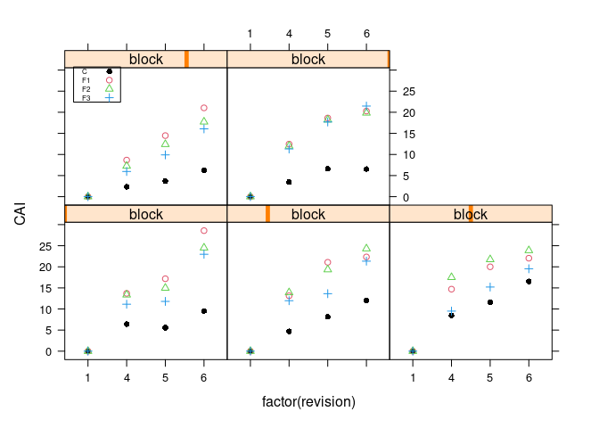
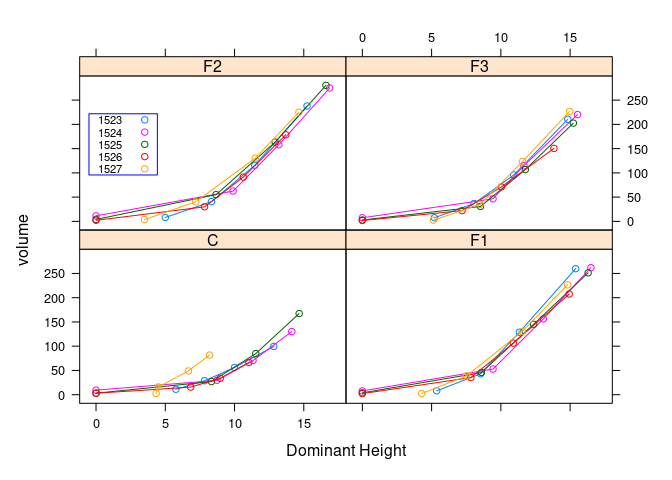
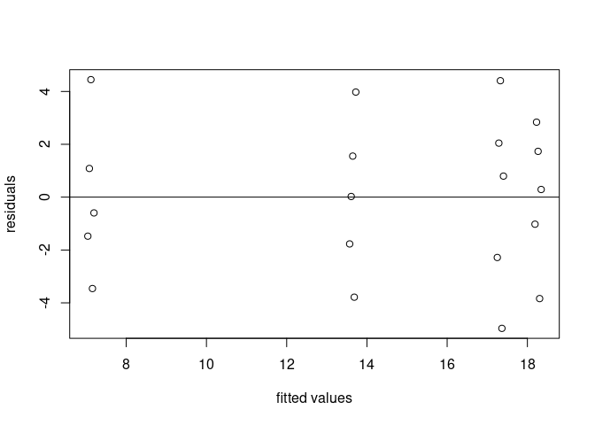

# Fertilizer Regime Experiment - Exp VI


<br> *source: Pique Newsmagazine* <br> Fertilization of plantations in
Sweden is region specific. In the Northern part of Sweden the use of
fertilizer is common, while in the Southern region its use is
prohibited. The Southern part is having rich soil and have no need to
fertilize the soil. Swedish forest fertilization mainly involves the
application of Nitrogen which is normally the limiting nutrient for high
stand growth. Different fertilization experiments have been set to
either see the effect of different fertilizers on stand development or
see the effect of fertilization application frequency on the stand
development.

This experiment is set to see the effect of fertilization frequency on
the growth of a stand. The experiment is a young Norway Spruce stands
which was established with 5 blocks having randomly distributed
treatments in 0.1 ha plots. The treatments are with 3 different
intensities in fertilization

-   F1: Fertilized every year

-   F2: Fertilized every second year

-   F3: Fertilized every third year

-   C: Control without Fertilzation.

The amount of nutrients over time was calculated to be more or less the
same in F1 F2 and F3.

The experiment was measured initially in year 1972, first measurement
revision (revision 1) and there after there were several revisions, but
the important revisions are the focus here which is an interval of 5
years period (rev 1, 4, 5, and 6). This means that the difference
between revision 1 and 4 is 15 years, then the addition of the usual 5
years interval.

The volume (m3/ha) and CAI (m3 ha-1yr-1) were calculated for every
treatment plot in all blocks.

##Questions

    -   is there a significant effect of treatment compared to control?

    -   Do you find a significant difference in between the different treatments, meaning fertilization intensity

    -   Do you find any different effect of treatment early on in the experiment compared to later revisions

``` r
library(doBy)
library(dplyr)
library(lattice)
library(ggplot2)
library(car)
library(data.table)
library(TukeyC)
```

**Importing the data**

``` r
expfert <- read.table('https://raw.githubusercontent.com/xrander/SLU-Plantation-Experimentation/master/Data/Lab6/expfert.txt',
           header = T,
           sep = '\t',
           na.strings = 'NA',
           dec = '.',
           strip.white = T)
```

**A Little Data Exploration**

``` r
str(expfert)
summary(expfert)
```

**To check the number of replications we have in this experiment**

``` r
ftable(expfert$block, expfert$treatment, expfert$revision)
```

    ##          1 4 5 6
    ##                 
    ## 1523 C   1 1 1 1
    ##      F1  1 1 1 1
    ##      F2  1 1 1 1
    ##      F3  1 1 1 1
    ## 1524 C   1 1 1 1
    ##      F1  1 1 1 1
    ##      F2  1 1 1 1
    ##      F3  1 1 1 1
    ## 1525 C   1 1 1 1
    ##      F1  1 1 1 1
    ##      F2  1 1 1 1
    ##      F3  1 1 1 1
    ## 1526 C   1 1 1 1
    ##      F1  1 1 1 1
    ##      F2  1 1 1 1
    ##      F3  1 1 1 1
    ## 1527 C   1 1 1 1
    ##      F1  1 1 1 1
    ##      F2  1 1 1 1
    ##      F3  1 1 1 1

We have 4 revisions and 5 replicates

We can check a quick visual on how the experiment have been measured
repeatedly overtime (revisions)

``` r
xyplot(age~revision|block, data = expfert,
       col = 1,
       pch = 16,
       type= c('p','l'), # to change the plot type, an alternative is using type = 'b'
       strip = strip.custom(bg = 'red'))
```


**Visualizing CAI changes over the revisions**

``` r
xyplot(CAI~factor(revision)|block,
       groups=treatment,data=expfert,
       par.settings=simpleTheme(col=c(1,2,3,4),pch=c(16,1,2,3)), #adding settings for symbology
       auto.key=list(corner = c(0.02, 0.94),border="black",cex=0.5,points=T))
```



``` r
xyplot(volume~domheight | treatment,
       group = block,
       data = expfert,
       type = 'b',
       xlab = 'Dominant Height',
       auto.key = list(corner = c(0.02,0.8), border = 'blue', cex = 0.7))
```

 \##
Volume and CAI at the different blocks for the different treatments \###
Volume

``` r
barchart(volume~treatment|block, data = expfert,
         subset = revision == 1,
         main = 'Revision 1',
         ylab = substitute(paste(bold('Volume'))),
         xlab = substitute(paste(bold('Treatment'))))
```


``` r
barchart(volume~treatment|block, data = expfert,
         subset = revision == 4,
         main = 'Revision 4',
         col = 'purple',
         ylab = substitute(paste(bold('Volume'))),
         xlab = substitute(paste(bold('Treatment'))))
```


``` r
barchart(volume~treatment|block, data = expfert,
         subset = revision == 5,
         main = 'Revision 5',
         col = 'blue',
         ylab = substitute(paste(bold('Volume'))),
         xlab = substitute(paste(bold('Treatment'))))
```


``` r
barchart(volume~treatment|block, data = expfert,
         subset = revision == 6,
         main = 'Revision 6',
         col = 'red',
         ylab = substitute(paste(bold('Volume'))),
         xlab = substitute(paste(bold('Treatment'))))
```


### CAI

``` r
barchart(CAI~treatment | block, data = expfert,
         subset = revision == 4,
         col = 'purple',
         main = 'Revision 4',
         xlab = substitute(paste(bold('treatment'))),
         ylab = substitute(paste(bold('CAI'))))
```


``` r
barchart(CAI~treatment|block, data = expfert,
         subset = revision == 5,
         col = 'blue',
         main = 'Revision 5',
         xlab = substitute(paste(bold('treatment'))),
         ylab = substitute(paste(bold('CAI'))))
```


``` r
barchart(CAI~treatment|block, data = expfert,
         subset = revision == 6,
         col = 'red',
         main = 'Revision 6',
         xlab = substitute(paste(bold('treatment'))),
         ylab = substitute(paste(bold('CAI'))))
```

 \##
Dominant Height across treatments

``` r
bwplot(domheight~treatment, subset=revision==1, data = expfert,
       xlab = substitute(paste(bold('treatment'))),
       ylab = substitute(paste(bold('dominant height (m)'))),
       main = 'dominant height across treatments for revision 1')
```


``` r
bwplot(domheight~treatment, subset=revision==4, data = expfert,
       xlab = substitute(paste(bold('treatment'))),
       ylab = substitute(paste(bold('dominant height (m)'))),
       main = 'dominant height across treatments for revision 4')
```


``` r
bwplot(domheight~treatment, subset=revision==5, data = expfert,
       xlab = substitute(paste(bold('treatment'))),
       ylab = substitute(paste(bold('dominant height (m)'))),
       main = 'dominant height across treatments for revision 5')
```


``` r
bwplot(domheight~treatment, subset=revision==6, data = expfert,
       xlab = substitute(paste(bold('treatment'))),
       ylab = substitute(paste(bold('dominant height (m)'))),
       main = 'dominant height across treatments for revision 6')
```

 \##
Analysis of Variance to see the effect of the treatments on the volume
produced \### Revision of 4

``` r
M.vol <- lm(volume~block+treatment, 
            data = expfert[expfert$revision==4,])
M.vol
```

    ## 
    ## Call:
    ## lm(formula = volume ~ block + treatment, data = expfert[expfert$revision == 
    ##     4, ])
    ## 
    ## Coefficients:
    ## (Intercept)        block  treatmentF1  treatmentF2  treatmentF3  
    ##    4847.563       -3.163       19.740       22.287       10.807

``` r
anova(M.vol)
```

    ## Analysis of Variance Table
    ## 
    ## Response: volume
    ##           Df  Sum Sq Mean Sq F value   Pr(>F)   
    ## block      1  400.27  400.27  6.2491 0.024515 * 
    ## treatment  3 1526.53  508.84  7.9442 0.002098 **
    ## Residuals 15  960.78   64.05                    
    ## ---
    ## Signif. codes:  0 '***' 0.001 '**' 0.01 '*' 0.05 '.' 0.1 ' ' 1

#### Posthoc test using Tukeyhsd

``` r
T.vol <- TukeyC(x = M.vol, which = 'treatment')
summary(T.vol)
```

    ## Goups of means at sig.level = 0.05 
    ##    Means G1 G2
    ## F2 45.77  a   
    ## F1 43.22  a   
    ## F3 34.29  a  b
    ## C  23.48     b
    ## 
    ## Matrix of the difference of means above diagonal and
    ## respective p-values of the Tukey test below diagonal values
    ##       F2    F1     F3      C
    ## F2 0.000 2.547 11.480 22.287
    ## F1 0.957 0.000  8.933 19.740
    ## F3 0.150 0.327  0.000 10.807
    ## C  0.003 0.007  0.187  0.000

**Checking for patterns in the residuals with a residual plot**

``` r
plot(M.vol$fitted.values, M.vol$residuals,
     xlab = 'Fitted Values',
     ylab = 'Residuals')
abline (c(0,0), col = 2)
```


**Getting more information using base r plot function**

``` r
plot(M.vol)
```


### Revision 5

``` r
M.vol5 <- lm(volume~block+treatment,
             data = expfert[expfert$revision == 5,])
anova(M.vol5)
```

    ## Analysis of Variance Table
    ## 
    ## Response: volume
    ##           Df  Sum Sq Mean Sq F value    Pr(>F)    
    ## block      1   376.2   376.2  0.7221 0.4088005    
    ## treatment  3 18234.6  6078.2 11.6683 0.0003327 ***
    ## Residuals 15  7813.8   520.9                      
    ## ---
    ## Signif. codes:  0 '***' 0.001 '**' 0.01 '*' 0.05 '.' 0.1 ' ' 1

The anova test shows a significant in the treatment effect on volume
production. \#### Post hoc test using Tukeys HSD

``` r
T.vol5 <- TukeyC(x = M.vol5, which = 'treatment')

summary(T.vol5)
```

    ## Goups of means at sig.level = 0.05 
    ##     Means G1 G2
    ## F1 133.36  a   
    ## F2 131.78  a   
    ## F3 102.30  a   
    ## C   58.87     b
    ## 
    ## Matrix of the difference of means above diagonal and
    ## respective p-values of the Tukey test below diagonal values
    ##       F1    F2     F3      C
    ## F1 0.000 1.583 31.060 74.493
    ## F2 1.000 0.000 29.477 72.910
    ## F3 0.182 0.217  0.000 43.433
    ## C  0.001 0.001  0.039  0.000

**Checking for patterns in the residuals with a residual plot**

``` r
plot(M.vol5$fitted.values, M.vol5$residuals,
     xlab ='fitted values',
     ylab = 'residuals')
abline(c(0,0), col = 'black')
```


### Revision 6

``` r
M.vol6 <- lm(volume~block+treatment,
             data = expfert[expfert$revision == 6,])
anova(M.vol6)
```

    ## Analysis of Variance Table
    ## 
    ## Response: volume
    ##           Df Sum Sq Mean Sq F value    Pr(>F)    
    ## block      1   3597  3597.3  3.4533   0.08286 .  
    ## treatment  3  57590 19196.8 18.4283 2.721e-05 ***
    ## Residuals 15  15626  1041.7                      
    ## ---
    ## Signif. codes:  0 '***' 0.001 '**' 0.01 '*' 0.05 '.' 0.1 ' ' 1

#### Posthoc test (Tukey HSD)

``` r
T.vol6 <- TukeyC(x = M.vol6, which = 'treatment')

summary(T.vol6)
```

    ## Goups of means at sig.level = 0.05 
    ##     Means G1 G2
    ## F1 241.38  a   
    ## F2 239.30  a   
    ## F3 202.05  a   
    ## C  109.04     b
    ## 
    ## Matrix of the difference of means above diagonal and
    ## respective p-values of the Tukey test below diagonal values
    ##       F1    F2     F3       C
    ## F1 0.000 2.077 39.327 132.340
    ## F2 1.000 0.000 37.250 130.263
    ## F3 0.259 0.300  0.000  93.013
    ## C  0.000 0.000  0.002   0.000

**Checking for patterns in the residuals with a residual plot**

``` r
plot(M.vol6$fitted.values, M.vol6$residuals,
     xlab ='fitted values',
     ylab = 'residuals')
abline(c(0,0), col = 'black')
```


## Analysis of Variance to see the effect of the treatments on the current annual increment

### Revision 4

``` r
m.cai4 <- lm(CAI~block+treatment,
             data = expfert[expfert$revision == 4,])
anova(m.cai4)
```

    ## Analysis of Variance Table
    ## 
    ## Response: CAI
    ##           Df  Sum Sq Mean Sq F value    Pr(>F)    
    ## block      1  22.952  22.952  3.4420 0.0833172 .  
    ## treatment  3 192.571  64.190  9.6263 0.0008639 ***
    ## Residuals 15 100.024   6.668                      
    ## ---
    ## Signif. codes:  0 '***' 0.001 '**' 0.01 '*' 0.05 '.' 0.1 ' ' 1

#### Posthoc test for ranking

``` r
t.cai4 <- TukeyC(x = m.cai4, which = 'treatment')

summary(t.cai4)
```

    ## Goups of means at sig.level = 0.05 
    ##    Means G1 G2
    ## F2 12.81  a   
    ## F1 12.53  a   
    ## F3  9.97  a   
    ## C   5.07     b
    ## 
    ## Matrix of the difference of means above diagonal and
    ## respective p-values of the Tukey test below diagonal values
    ##       F2    F1    F3     C
    ## F2 0.000 0.277 2.833 7.733
    ## F1 0.998 0.000 2.557 7.457
    ## F3 0.341 0.426 0.000 4.900
    ## C  0.001 0.002 0.040 0.000

**Checking for patterns in the residuals with a residual plot**

``` r
plot(m.cai4$fitted.values, m.cai4$residuals,
     xlab ='fitted values',
     ylab = 'residuals')
abline(c(0,0), col = 'black')
```


### Revision 5

``` r
m.cai5 <- lm(CAI~block+treatment,
            data = expfert[expfert$revision == 5,])
anova(m.cai5)
```

    ## Analysis of Variance Table
    ## 
    ## Response: CAI
    ##           Df Sum Sq Mean Sq F value    Pr(>F)    
    ## block      1   0.06   0.059  0.0058 0.9403289    
    ## treatment  3 383.49 127.830 12.6017 0.0002232 ***
    ## Residuals 15 152.16  10.144                      
    ## ---
    ## Signif. codes:  0 '***' 0.001 '**' 0.01 '*' 0.05 '.' 0.1 ' ' 1

#### Posthoc test

``` r
t.cai5 <- TukeyC(x = m.cai4, which = 'treatment')

summary(t.cai5)
```

    ## Goups of means at sig.level = 0.05 
    ##    Means G1 G2
    ## F2 12.81  a   
    ## F1 12.53  a   
    ## F3  9.97  a   
    ## C   5.07     b
    ## 
    ## Matrix of the difference of means above diagonal and
    ## respective p-values of the Tukey test below diagonal values
    ##       F2    F1    F3     C
    ## F2 0.000 0.277 2.833 7.733
    ## F1 0.998 0.000 2.557 7.457
    ## F3 0.341 0.426 0.000 4.900
    ## C  0.001 0.002 0.040 0.000

**Checking for patterns in the residuals with a residual plot**

``` r
plot(m.cai5$fitted.values, m.cai5$residuals,
     xlab ='fitted values',
     ylab = 'residuals')
abline(c(0,0), col = 'black')
```



### Revision 6

``` r
m.cai6 <- lm(CAI~block+treatment,
            data = expfert[expfert$revision == 6,])
anova(m.cai6)
```

    ## Analysis of Variance Table
    ## 
    ## Response: CAI
    ##           Df Sum Sq Mean Sq F value    Pr(>F)    
    ## block      1  72.27  72.271  9.8601  0.006742 ** 
    ## treatment  3 517.17 172.390 23.5195 6.353e-06 ***
    ## Residuals 15 109.95   7.330                      
    ## ---
    ## Signif. codes:  0 '***' 0.001 '**' 0.01 '*' 0.05 '.' 0.1 ' ' 1

#### Post hoc test

``` r
t.cai6 <- TukeyC(x = m.cai4, which = 'treatment')

summary(t.cai6)
```

    ## Goups of means at sig.level = 0.05 
    ##    Means G1 G2
    ## F2 12.81  a   
    ## F1 12.53  a   
    ## F3  9.97  a   
    ## C   5.07     b
    ## 
    ## Matrix of the difference of means above diagonal and
    ## respective p-values of the Tukey test below diagonal values
    ##       F2    F1    F3     C
    ## F2 0.000 0.277 2.833 7.733
    ## F1 0.998 0.000 2.557 7.457
    ## F3 0.341 0.426 0.000 4.900
    ## C  0.001 0.002 0.040 0.000

**Checking for patterns in the residuals with a residual plot**

``` r
plot(m.cai6$fitted.values, m.cai6$residuals,
     xlab ='fitted values',
     ylab = 'residuals')
abline(c(0,0), col = 'black')
```


# Fertilization Experiment with Poplar - VI (2)

**Importing the data**

``` r
poptr<- read.table('https://raw.githubusercontent.com/xrander/Slu_experiment/master/Data/Lab6/poplartreatment.txt',
           header = T, sep = '\t',
           dec = '.', na.strings = 'NA',
           strip.white = T)
```

This is an extract from the seedling experiment earlier. We’ll try to
see if there’s a significant difference between fertilized and
unfertilized seedlings. **Data Exploration**

``` r
str(poptr)
```

    ## 'data.frame':    150 obs. of  3 variables:
    ##  $ treatment: chr  "unfert" "unfert" "unfert" "unfert" ...
    ##  $ cutw     : num  2.4 0.7 6.5 1.1 2 4.9 0.8 1.3 8.8 2 ...
    ##  $ volume   : num  2.65 5.15 27.75 5.05 7.85 ...

``` r
bwplot(volume~treatment, data = poptr,
       xlab = substitute(paste(bold('treatment'))),
       ylab = substitute(paste(bold('volume (m3)'))),
       main = 'Volume distribution for the different treatments')
```


``` r
bwplot(cutw ~treatment,
       data = poptr,
       xlab = substitute(paste(bold('treatment'))),
       ylab = substitute(paste(bold('colar width (mm)'))),
       main = 'collar width of the different treatments')
```


``` r
xyplot(volume~cutw, data = poptr,
       group = treatment,
       xlab = substitute(paste(bold('Colar Width (mm)'))),
       ylab = substitute(paste(bold('Volume(m3)'))),
       main = 'collar_width vs volume')
```


## Analysis of Variance

Now we test to see if there are no effect of the treatment on the volume

``` r
lm(volume~treatment, data = poptr)
```

    ## 
    ## Call:
    ## lm(formula = volume ~ treatment, data = poptr)
    ## 
    ## Coefficients:
    ##     (Intercept)  treatmentunfert  
    ##           44.65           -31.86

[Back to homepage](Readme.md) <br>

[Poplar Cuttings Experiment](cuttings.md) <br>

[Back to Portfolio](https://xrander.github.io)
