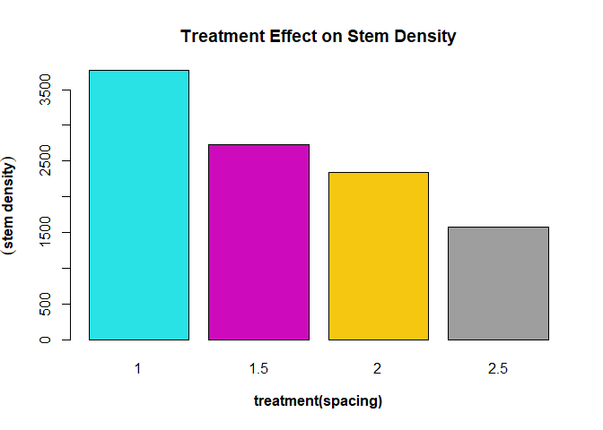

Forestry is a long time business that requires patience and careful
management. For forest landowners, the tree in the forest is the return
in investment, and as businessmen, it is important to track how our
investments are performing. Growth measurements are important to telling
us how our investments are performing as well as gives insight into how
our forest should be managed. Growth measures also gives us information
on the optimal time to harvest, as it also shows how the forest performs
after tending operation.


There are various characteristics of a stand that can affect the growth
of the stand. Those characteristics include:


```         
-   species composition

-   age

-   site quality

-   stand density or stocking

-   competition

-   silvicultural treatment

-   climatic conditions
```

## Increment

Increment is the increase in growth, diameter, basal area, height, volume, quality or value of individual tree crops during a given period. There are some terminologies and measures associated with tree increment.

-   Yield: this is the usable wood fiber per unit area at a particular age

-   Annual increment

$$G_a = Y_a− Y_{a-1}$$

-   Periodic Annual Increment: This measures the average productivity of the stand over certain period. Can sometimes be referred to CAI if it's between increment between current year and previous year.

$$PAI{a1,a2} = (Y_{a2} - Y_{a1})/a2 − a1$$

-   Mean Annual Increment: This measures the average productivity of the stand over its lifetime. 
$$MAI_a= Y_a/a$$
```
G = growth
Y = Volume for year a
a = year (2 is current and 1 is previous)
```
## Questions

We'll try to:
       
-   evaluate the volume growth for individual trees

-   estimate the periodic annual increment (PAI),

-   estimate the annual or yearly increment and

-   estimate the plot and treatment volume growth"


To do this we use the [tvol1012 data]('https://raw.githubusercontent.com/xrander/SLU-Plantation-Experimentation/master/Data/Lab3/tvol1012.txt') which consists of a revised data from 2 separate years, year 1980 and 1987 will be imported.


```r
library(doBy)
library(dplyr)
```

```
## 
## Attaching package: 'dplyr'
```

```
## The following object is masked from 'package:doBy':
## 
##     order_by
```

```
## The following objects are masked from 'package:stats':
## 
##     filter, lag
```

```
## The following objects are masked from 'package:base':
## 
##     intersect, setdiff, setequal, union
```

```r
library(lattice)
library(ggplot2)
library(car)
```

```
## Loading required package: carData
```

```
## 
## Attaching package: 'car'
```

```
## The following object is masked from 'package:dplyr':
## 
##     recode
```

```r
library(data.table)
```

```
## 
## Attaching package: 'data.table'
```

```
## The following objects are masked from 'package:dplyr':
## 
##     between, first, last
```

```r
library(TukeyC)
library('plotly')
```

```
## 
## Attaching package: 'plotly'
```

```
## The following object is masked from 'package:ggplot2':
## 
##     last_plot
```

```
## The following object is masked from 'package:stats':
## 
##     filter
```

```
## The following object is masked from 'package:graphics':
## 
##     layout
```

## Reading the data*


```r
tvol1012 <- read.table('https://raw.githubusercontent.com/xrander/SLU-Plantation-Experimentation/master/Data/Lab3/tvol1012.txt', header = T, sep = '\t', na.strings = 'NA', dec = '.', strip.white = T)

head(tvol1012)
```

```
##   plot nr voldm3.1980 voldm3.1987
## 1   11 10      125.96      219.81
## 2   11 12      122.08      232.79
## 3   11 13       80.61      141.57
## 4   11 14       79.99      154.98
## 5   11 16       94.26      159.08
## 6   11 17      134.58      238.82
```

**Importing Site Information Data**


```r
site1012 <- read.table('https://raw.githubusercontent.com/xrander/Slu_experiment/master/Data/Lab3/site1012export.txt',
                       header = T,
                       na.strings = 'NA',
                       strip.white = T,
                       dec = '.',
                       sep = '\t')
head(site1012)
```

```
##   plot    ba.sum areaha treatment     baha dm.length   densha  dm.sum  dd.sum
## 1   11 0.9938387 0.0400       2.5 24.84597        64 1600.000  8788.5 1265395
## 2   12 1.0252564 0.0324       2.0 31.64372        72 2222.222  9513.0 1305397
## 3   13 0.9689724 0.0288       1.5 33.64488        82 2847.222  9815.0 1233734
## 4   14 0.9635249 0.0288       1.0 33.45573       108 3750.000 10951.0 1226798
## 5   21 1.0437480 0.0400       2.5 26.09370        62 1550.000  8903.5 1328941
## 6   22 1.0456948 0.0324       2.0 32.27453        80 2469.136 10091.0 1331420
##    dm.mean  dd.mean      amd      qmd
## 1 137.3203 19771.79 13.73203 14.06122
## 2 132.1250 18130.51 13.21250 13.46496
## 3 119.6951 15045.54 11.96951 12.26602
## 4 101.3981 11359.24 10.13981 10.65797
## 5 143.6048 21434.54 14.36048 14.64054
## 6 126.1375 16642.75 12.61375 12.90068
```

### Estimating the PAI**


```r
tvol1012$pai <- (tvol1012$voldm3.1987 - tvol1012$voldm3.1980)/7  # we divide by 7 because that's the difference between 1987 and 1980

#we can estimate the annual increment
tvol1012$ai <- tvol1012$pai/7 #since this is 7 years interval and don't have the value for the immediate previous year, we estimate the average annual increment within that period.
head(tvol1012)
```

```
##   plot nr voldm3.1980 voldm3.1987       pai       ai
## 1   11 10      125.96      219.81 13.407143 1.915306
## 2   11 12      122.08      232.79 15.815714 2.259388
## 3   11 13       80.61      141.57  8.708571 1.244082
## 4   11 14       79.99      154.98 10.712857 1.530408
## 5   11 16       94.26      159.08  9.260000 1.322857
## 6   11 17      134.58      238.82 14.891429 2.127347
```

Next we sum pai, mean volume for 1980 and 1987 for each plots and merge it with the site information data (site1012)


```r
plotvol <- summaryBy(voldm3.1980 +
            voldm3.1987 +
            pai~plot,
          data = tvol1012, FUN = sum)
a_incrment <- summaryBy(ai~plot, data = tvol1012, FUN = sum)
```

Merging data with the data table 'site1012' from RLab2


```r
site1012 <- merge(site1012, plotvol, all = T)
site1012 <- merge(site1012, a_incrment, all = T)
```

Evaluating the per hectare values


```r
site1012$volm80ha <- site1012$voldm3.1980.sum/(site1012$areaha *1000)

site1012$volm87ha <- site1012$voldm3.1987.sum/(site1012$areaha*1000)
 
site1012$paiha <- round(site1012$pai.sum/(site1012$areaha*1000), 2)

site1012$ai <- round(site1012$ai.sum/(site1012$areaha*1000), 2)

head(site1012)
```

```
##   plot    ba.sum areaha treatment     baha dm.length   densha  dm.sum  dd.sum
## 1   11 0.9938387 0.0400       2.5 24.84597        64 1600.000  8788.5 1265395
## 2   12 1.0252564 0.0324       2.0 31.64372        72 2222.222  9513.0 1305397
## 3   13 0.9689724 0.0288       1.5 33.64488        82 2847.222  9815.0 1233734
## 4   14 0.9635249 0.0288       1.0 33.45573       108 3750.000 10951.0 1226798
## 5   21 1.0437480 0.0400       2.5 26.09370        62 1550.000  8903.5 1328941
## 6   22 1.0456948 0.0324       2.0 32.27453        80 2469.136 10091.0 1331420
##    dm.mean  dd.mean      amd      qmd voldm3.1980.sum voldm3.1987.sum  pai.sum
## 1 137.3203 19771.79 13.73203 14.06122         4395.40         7709.99 473.5129
## 2 132.1250 18130.51 13.21250 13.46496         4442.43         7621.58 454.1643
## 3 119.6951 15045.54 11.96951 12.26602         3937.37         7002.56 437.8843
## 4 101.3981 11359.24 10.13981 10.65797         3977.63         6878.00 414.3386
## 5 143.6048 21434.54 14.36048 14.64054         4576.61         7354.41 396.8286
## 6 126.1375 16642.75 12.61375 12.90068         4648.70         8026.96 482.6086
##     ai.sum volm80ha volm87ha paiha   ai
## 1 67.64469 109.8850 192.7498 11.84 1.69
## 2 64.88061 137.1120 235.2340 14.02 2.00
## 3 62.55490 136.7142 243.1444 15.20 2.17
## 4 59.19122 138.1122 238.8194 14.39 2.06
## 5 56.68980 114.4152 183.8603  9.92 1.42
## 6 68.94408 143.4784 247.7457 14.90 2.13
```


```r
paiviz <- ggplot(site1012, aes(as.factor(plot), paiha, fill = as.factor(treatment))) +
  geom_bar(stat = 'identity')+
  labs(title = 'Periodic Annual Increment',
       x = 'plots',
       y ='m3/ ha /yr ',
       fill = 'Spacing treatments') +
  theme(plot.title = element_text(face = 'bold'),
        axis.title.x = element_text(face = 'bold'),
        axis.title.y = element_text(face = 'bold'))

ggplotly(paiviz)
```

```{=html}
<div class="plotly html-widget html-fill-item-overflow-hidden html-fill-item" id="htmlwidget-fd03dfac2b6dda9ff992" style="width:672px;height:480px;"></div>
<script type="application/json" data-for="htmlwidget-fd03dfac2b6dda9ff992">{"x":{"data":[{"orientation":"v","width":[0.9,0.899999999999999],"base":[0,0],"x":[4,8],"y":[14.39,13.97],"text":["as.factor(plot): 14<br />paiha: 14.39<br />as.factor(treatment): 1","as.factor(plot): 24<br />paiha: 13.97<br />as.factor(treatment): 1"],"type":"bar","textposition":"none","marker":{"autocolorscale":false,"color":"rgba(248,118,109,1)","line":{"width":1.88976377952756,"color":"transparent"}},"name":"1","legendgroup":"1","showlegend":true,"xaxis":"x","yaxis":"y","hoverinfo":"text","frame":null},{"orientation":"v","width":[0.9,0.9],"base":[0,0],"x":[3,7],"y":[15.2,16.68],"text":["as.factor(plot): 13<br />paiha: 15.20<br />as.factor(treatment): 1.5","as.factor(plot): 23<br />paiha: 16.68<br />as.factor(treatment): 1.5"],"type":"bar","textposition":"none","marker":{"autocolorscale":false,"color":"rgba(124,174,0,1)","line":{"width":1.88976377952756,"color":"transparent"}},"name":"1.5","legendgroup":"1.5","showlegend":true,"xaxis":"x","yaxis":"y","hoverinfo":"text","frame":null},{"orientation":"v","width":[0.9,0.9],"base":[0,0],"x":[2,6],"y":[14.02,14.9],"text":["as.factor(plot): 12<br />paiha: 14.02<br />as.factor(treatment): 2","as.factor(plot): 22<br />paiha: 14.90<br />as.factor(treatment): 2"],"type":"bar","textposition":"none","marker":{"autocolorscale":false,"color":"rgba(0,191,196,1)","line":{"width":1.88976377952756,"color":"transparent"}},"name":"2","legendgroup":"2","showlegend":true,"xaxis":"x","yaxis":"y","hoverinfo":"text","frame":null},{"orientation":"v","width":[0.9,0.9],"base":[0,0],"x":[1,5],"y":[11.84,9.92],"text":["as.factor(plot): 11<br />paiha: 11.84<br />as.factor(treatment): 2.5","as.factor(plot): 21<br />paiha:  9.92<br />as.factor(treatment): 2.5"],"type":"bar","textposition":"none","marker":{"autocolorscale":false,"color":"rgba(199,124,255,1)","line":{"width":1.88976377952756,"color":"transparent"}},"name":"2.5","legendgroup":"2.5","showlegend":true,"xaxis":"x","yaxis":"y","hoverinfo":"text","frame":null}],"layout":{"margin":{"t":43.7625570776256,"r":7.30593607305936,"b":40.1826484018265,"l":37.2602739726027},"plot_bgcolor":"rgba(235,235,235,1)","paper_bgcolor":"rgba(255,255,255,1)","font":{"color":"rgba(0,0,0,1)","family":"","size":14.6118721461187},"title":{"text":"<b> Periodic Annual Increment <\/b>","font":{"color":"rgba(0,0,0,1)","family":"","size":17.5342465753425},"x":0,"xref":"paper"},"xaxis":{"domain":[0,1],"automargin":true,"type":"linear","autorange":false,"range":[0.4,8.6],"tickmode":"array","ticktext":["11","12","13","14","21","22","23","24"],"tickvals":[1,2,3,4,5,6,7,8],"categoryorder":"array","categoryarray":["11","12","13","14","21","22","23","24"],"nticks":null,"ticks":"outside","tickcolor":"rgba(51,51,51,1)","ticklen":3.65296803652968,"tickwidth":0.66417600664176,"showticklabels":true,"tickfont":{"color":"rgba(77,77,77,1)","family":"","size":11.689497716895},"tickangle":-0,"showline":false,"linecolor":null,"linewidth":0,"showgrid":true,"gridcolor":"rgba(255,255,255,1)","gridwidth":0.66417600664176,"zeroline":false,"anchor":"y","title":{"text":"<b> plots <\/b>","font":{"color":"rgba(0,0,0,1)","family":"","size":14.6118721461187}},"hoverformat":".2f"},"yaxis":{"domain":[0,1],"automargin":true,"type":"linear","autorange":false,"range":[-0.834,17.514],"tickmode":"array","ticktext":["0","5","10","15"],"tickvals":[0,5,10,15],"categoryorder":"array","categoryarray":["0","5","10","15"],"nticks":null,"ticks":"outside","tickcolor":"rgba(51,51,51,1)","ticklen":3.65296803652968,"tickwidth":0.66417600664176,"showticklabels":true,"tickfont":{"color":"rgba(77,77,77,1)","family":"","size":11.689497716895},"tickangle":-0,"showline":false,"linecolor":null,"linewidth":0,"showgrid":true,"gridcolor":"rgba(255,255,255,1)","gridwidth":0.66417600664176,"zeroline":false,"anchor":"x","title":{"text":"<b> m3/ ha /yr  <\/b>","font":{"color":"rgba(0,0,0,1)","family":"","size":14.6118721461187}},"hoverformat":".2f"},"shapes":[{"type":"rect","fillcolor":null,"line":{"color":null,"width":0,"linetype":[]},"yref":"paper","xref":"paper","x0":0,"x1":1,"y0":0,"y1":1}],"showlegend":true,"legend":{"bgcolor":"rgba(255,255,255,1)","bordercolor":"transparent","borderwidth":1.88976377952756,"font":{"color":"rgba(0,0,0,1)","family":"","size":11.689497716895},"title":{"text":"Spacing treatments","font":{"color":"rgba(0,0,0,1)","family":"","size":14.6118721461187}}},"hovermode":"closest","barmode":"relative"},"config":{"doubleClick":"reset","modeBarButtonsToAdd":["hoverclosest","hovercompare"],"showSendToCloud":false},"source":"A","attrs":{"207c31ef4096":{"x":{},"y":{},"fill":{},"type":"bar"}},"cur_data":"207c31ef4096","visdat":{"207c31ef4096":["function (y) ","x"]},"highlight":{"on":"plotly_click","persistent":false,"dynamic":false,"selectize":false,"opacityDim":0.2,"selected":{"opacity":1},"debounce":0},"shinyEvents":["plotly_hover","plotly_click","plotly_selected","plotly_relayout","plotly_brushed","plotly_brushing","plotly_clickannotation","plotly_doubleclick","plotly_deselect","plotly_afterplot","plotly_sunburstclick"],"base_url":"https://plot.ly"},"evals":[],"jsHooks":[]}</script>
```

The plot shows the PAI of each plots for the different spacing treatment while showing the annual increment of each plots.


```r
dens <- ggplot(site1012, aes(as.factor(plot), densha, fill = as.factor(treatment)))+
  geom_bar(stat = 'identity')+
  labs(title = 'Density Per Hectare',
       x = 'plots',
       y = 'stand density',
       fill = 'Space treatment') +
  theme(plot.title = element_text(face = 'bold'),
        axis.title.x = element_text(face = 'bold'),
        axis.title.y = element_text(face = 'bold'))

ggplotly(dens)
```

```{=html}
<div class="plotly html-widget html-fill-item-overflow-hidden html-fill-item" id="htmlwidget-42d4ae4096b5742701da" style="width:672px;height:480px;"></div>
<script type="application/json" data-for="htmlwidget-42d4ae4096b5742701da">{"x":{"data":[{"orientation":"v","width":[0.9,0.899999999999999],"base":[0,0],"x":[4,8],"y":[3750,3784.72222222222],"text":["as.factor(plot): 14<br />densha: 3750.000<br />as.factor(treatment): 1","as.factor(plot): 24<br />densha: 3784.722<br />as.factor(treatment): 1"],"type":"bar","textposition":"none","marker":{"autocolorscale":false,"color":"rgba(248,118,109,1)","line":{"width":1.88976377952756,"color":"transparent"}},"name":"1","legendgroup":"1","showlegend":true,"xaxis":"x","yaxis":"y","hoverinfo":"text","frame":null},{"orientation":"v","width":[0.9,0.9],"base":[0,0],"x":[3,7],"y":[2847.22222222222,2604.16666666667],"text":["as.factor(plot): 13<br />densha: 2847.222<br />as.factor(treatment): 1.5","as.factor(plot): 23<br />densha: 2604.167<br />as.factor(treatment): 1.5"],"type":"bar","textposition":"none","marker":{"autocolorscale":false,"color":"rgba(124,174,0,1)","line":{"width":1.88976377952756,"color":"transparent"}},"name":"1.5","legendgroup":"1.5","showlegend":true,"xaxis":"x","yaxis":"y","hoverinfo":"text","frame":null},{"orientation":"v","width":[0.9,0.9],"base":[0,0],"x":[2,6],"y":[2222.22222222222,2469.13580246914],"text":["as.factor(plot): 12<br />densha: 2222.222<br />as.factor(treatment): 2","as.factor(plot): 22<br />densha: 2469.136<br />as.factor(treatment): 2"],"type":"bar","textposition":"none","marker":{"autocolorscale":false,"color":"rgba(0,191,196,1)","line":{"width":1.88976377952756,"color":"transparent"}},"name":"2","legendgroup":"2","showlegend":true,"xaxis":"x","yaxis":"y","hoverinfo":"text","frame":null},{"orientation":"v","width":[0.9,0.9],"base":[0,0],"x":[1,5],"y":[1600,1550],"text":["as.factor(plot): 11<br />densha: 1600.000<br />as.factor(treatment): 2.5","as.factor(plot): 21<br />densha: 1550.000<br />as.factor(treatment): 2.5"],"type":"bar","textposition":"none","marker":{"autocolorscale":false,"color":"rgba(199,124,255,1)","line":{"width":1.88976377952756,"color":"transparent"}},"name":"2.5","legendgroup":"2.5","showlegend":true,"xaxis":"x","yaxis":"y","hoverinfo":"text","frame":null}],"layout":{"margin":{"t":43.7625570776256,"r":7.30593607305936,"b":40.1826484018265,"l":48.9497716894977},"plot_bgcolor":"rgba(235,235,235,1)","paper_bgcolor":"rgba(255,255,255,1)","font":{"color":"rgba(0,0,0,1)","family":"","size":14.6118721461187},"title":{"text":"<b> Density Per Hectare <\/b>","font":{"color":"rgba(0,0,0,1)","family":"","size":17.5342465753425},"x":0,"xref":"paper"},"xaxis":{"domain":[0,1],"automargin":true,"type":"linear","autorange":false,"range":[0.4,8.6],"tickmode":"array","ticktext":["11","12","13","14","21","22","23","24"],"tickvals":[1,2,3,4,5,6,7,8],"categoryorder":"array","categoryarray":["11","12","13","14","21","22","23","24"],"nticks":null,"ticks":"outside","tickcolor":"rgba(51,51,51,1)","ticklen":3.65296803652968,"tickwidth":0.66417600664176,"showticklabels":true,"tickfont":{"color":"rgba(77,77,77,1)","family":"","size":11.689497716895},"tickangle":-0,"showline":false,"linecolor":null,"linewidth":0,"showgrid":true,"gridcolor":"rgba(255,255,255,1)","gridwidth":0.66417600664176,"zeroline":false,"anchor":"y","title":{"text":"<b> plots <\/b>","font":{"color":"rgba(0,0,0,1)","family":"","size":14.6118721461187}},"hoverformat":".2f"},"yaxis":{"domain":[0,1],"automargin":true,"type":"linear","autorange":false,"range":[-189.236111111111,3973.95833333333],"tickmode":"array","ticktext":["0","1000","2000","3000"],"tickvals":[0,1000,2000,3000],"categoryorder":"array","categoryarray":["0","1000","2000","3000"],"nticks":null,"ticks":"outside","tickcolor":"rgba(51,51,51,1)","ticklen":3.65296803652968,"tickwidth":0.66417600664176,"showticklabels":true,"tickfont":{"color":"rgba(77,77,77,1)","family":"","size":11.689497716895},"tickangle":-0,"showline":false,"linecolor":null,"linewidth":0,"showgrid":true,"gridcolor":"rgba(255,255,255,1)","gridwidth":0.66417600664176,"zeroline":false,"anchor":"x","title":{"text":"<b> stand density <\/b>","font":{"color":"rgba(0,0,0,1)","family":"","size":14.6118721461187}},"hoverformat":".2f"},"shapes":[{"type":"rect","fillcolor":null,"line":{"color":null,"width":0,"linetype":[]},"yref":"paper","xref":"paper","x0":0,"x1":1,"y0":0,"y1":1}],"showlegend":true,"legend":{"bgcolor":"rgba(255,255,255,1)","bordercolor":"transparent","borderwidth":1.88976377952756,"font":{"color":"rgba(0,0,0,1)","family":"","size":11.689497716895},"title":{"text":"Space treatment","font":{"color":"rgba(0,0,0,1)","family":"","size":14.6118721461187}}},"hovermode":"closest","barmode":"relative"},"config":{"doubleClick":"reset","modeBarButtonsToAdd":["hoverclosest","hovercompare"],"showSendToCloud":false},"source":"A","attrs":{"207c3a3d28a9":{"x":{},"y":{},"fill":{},"type":"bar"}},"cur_data":"207c3a3d28a9","visdat":{"207c3a3d28a9":["function (y) ","x"]},"highlight":{"on":"plotly_click","persistent":false,"dynamic":false,"selectize":false,"opacityDim":0.2,"selected":{"opacity":1},"debounce":0},"shinyEvents":["plotly_hover","plotly_click","plotly_selected","plotly_relayout","plotly_brushed","plotly_brushing","plotly_clickannotation","plotly_doubleclick","plotly_deselect","plotly_afterplot","plotly_sunburstclick"],"base_url":"https://plot.ly"},"evals":[],"jsHooks":[]}</script>
```


### Percentage of Thinnings Removed

We can estimate the percentage of stand removed from thinning operation


```r
##first we estimate the density after thinning which is provided in site1012
density <- summaryBy(densha~treatment,
          data = site1012,
          FUN = mean)
 
## dens_ha.mean is the density after thinning, so we rename to 'after_thinning'
names(density)[2] <- 'after_thinning'

##now we estimate the density before thinning
density$before_thinning <- 10000/(density$treatment^2)

##percentage change in the stand can be estimated now.
## percentage change = (old - new)/old *100
density$percent_removed <- (density$before_thinning-
                              density$after_thinning)/density$before_thinning * 100
head(density)
```

```
##   treatment after_thinning before_thinning percent_removed
## 1       1.0       3767.361       10000.000        62.32639
## 2       1.5       2725.694        4444.444        38.67187
## 3       2.0       2345.679        2500.000         6.17284
## 4       2.5       1575.000        1600.000         1.56250
```


### Effect of treatment on stem density, quadratic mean diameter,and Periodic Annual Increment (PAI)

#### Stem density and treatment(spacing) design effect


```r
barplot(tapply(site1012$densha,
               site1012$treatment,
               FUN = mean),
        xlab = substitute(paste(bold('treatment(spacing)'))),
        ylab = substitute(paste(bold(('stem density')))),
        main = 'Treatment Effect on Stem Density',
        col = c(5:9))
```

<!-- -->

The space is having an effect on the diameter, the smaller the spacing,
the greater the stem/stand density

#### Treatment(spacing) effect on QMD


```r
barplot(tapply (site1012$qmd,
                site1012$treatment,
                FUN = mean),
        xlab = substitute(paste(bold('treatment(spacing)'))),
        ylim = c(0, 20),
        ylab = substitute(paste(bold('mean diameter(qmd)'))),
        main = 'treatment effect on QMD',
        col = c(10:13))
```

<!-- -->

QMD increases with spacing effect according to the bar plot, the effect
might diminish if spacing increases

#### Treatment(spacing) effect on Periodic annual increment(PAI)


```r
barplot(tapply(site1012$paiha,
               site1012$treatment,
               FUN = mean),
        xlab = substitute(paste(bold("Initial Spacing Treatment"))),
        ylab = substitute(paste(bold("PAI, m3/ha & year"))),
        col = c(2,13,15,20),
        ylim = c(0, 20),
        main = "Effect of Spacing on PAI")
```

<!-- -->


[Clone Performance Test](clone.html) <br>

[Homepage](index.html) <br>

[Specing Experiment](spacing_experiment.html) <br>

[Back to portfolio](http://olamideadu.com)
