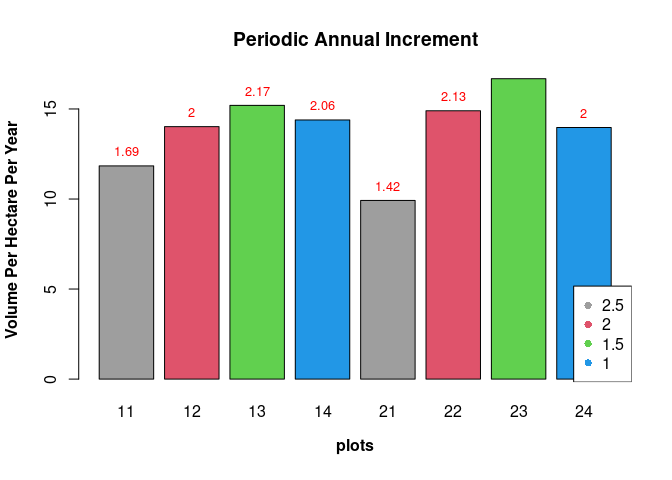
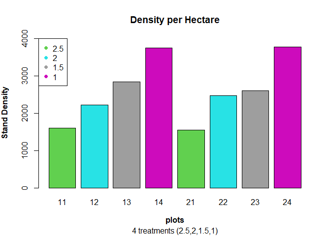
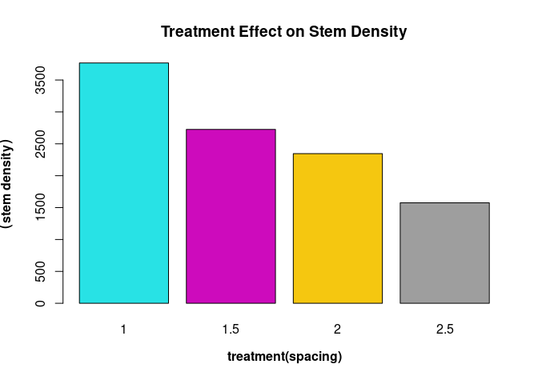
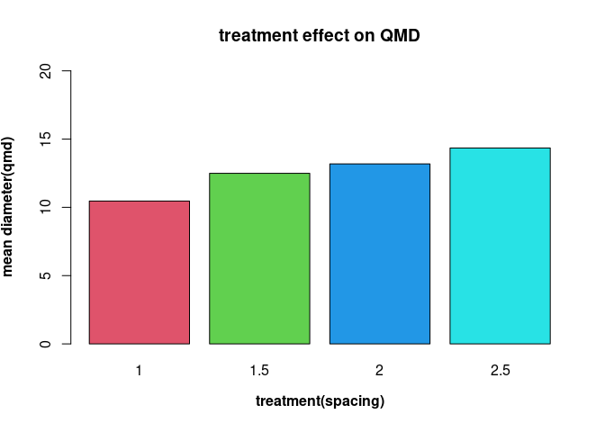
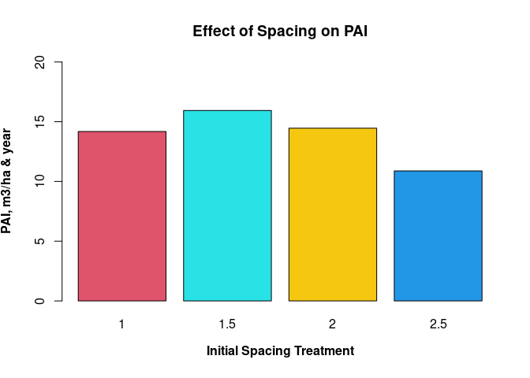

# Growth Measures - Exp III

[](https://serc.si.edu/sites/default/files/styles/slideshow-wide/public/pictures/QuantitativeEcologyLab/chris_carya_alba_crop.jpg?itok=yzN5!kN_i&timestamp=1663276331)

There are various characteristics of a stand that can affect the growth
of the stand. Those characteristics include:

    -   species composition

    -   age

    -   site quality

    -   stand density or stocking

    -   competition

    -   silvicultural treatment

    -   climatic conditions

## Increment

Increment is the increase in growth, diameter, basal area, height,
volume, quality or value of individual tree crops during a given period.
There are some terminologies and measures associated with tree
increment.

    -   Yield: this is the usable wood fiber per unit area at a particular age

    -   Annual increment

*G*<sub>*a*</sub> = *Y*<sub>*a*</sub> − *Y*<sub>*a* − 1</sub>

    -   Periodic Annual Increment: This measures the average productivity of the stand over certain period. Can sometimes be referred to CAI if it's between increment between current year and  previous year.

*P**A**I*<sub>*a*1, *a*2</sub> = *Y*<sub>*a*2</sub> − *Y*<sub>*a*1</sub>/*a*<sub>2</sub> − *a*<sub>1</sub>

    -   Mean Annual Increment: This measures the average productivity of the stand over its lifetime.

*M**A**I*<sub>*a*</sub> = *Y*<sub>*a*</sub>/*a*
G = growth Y = Volume for year a a = year (2 is current and 1 is
previous)

## Questions

We’ll try to:

    -   evaluate the volume growth for individual trees

    -   estimate the periodic annual increment (PAI),

    -   estimate the annual or yearly increment and

    -   estimate the plot and treatment volume growth"

To do this we use the tvol1012 data which consists of a revised data
from 2 separate years, year 1980 and 1987 will be imported.

``` r
library(doBy)
library(dplyr)
library(lattice)
library(ggplot2)
library(car)
library(data.table)
library(TukeyC)
```

*Reading the data*

``` r
tvol1012 <- read.table('https://raw.githubusercontent.com/xrander/SLU-Plantation-Experimentation/master/Data/Lab3/tvol1012.txt', header = T, sep = '\t', na.strings = 'NA', dec = '.', strip.white = T)

head(tvol1012)
```

    ##   plot nr voldm3.1980 voldm3.1987
    ## 1   11 10      125.96      219.81
    ## 2   11 12      122.08      232.79
    ## 3   11 13       80.61      141.57
    ## 4   11 14       79.99      154.98
    ## 5   11 16       94.26      159.08
    ## 6   11 17      134.58      238.82

**Importing Site Information Data**

``` r
site1012 <- read.table('https://raw.githubusercontent.com/xrander/Slu_experiment/master/Data/Lab3/site1012export.txt',
                       header = T,
                       na.strings = 'NA',
                       strip.white = T,
                       dec = '.',
                       sep = '\t')
head(site1012)
```

    ##   plot    ba.sum areaha treatment     baha dm.length   densha  dm.sum  dd.sum
    ## 1   11 0.9938387 0.0400       2.5 24.84597        64 1600.000  8788.5 1265395
    ## 2   12 1.0252564 0.0324       2.0 31.64372        72 2222.222  9513.0 1305397
    ## 3   13 0.9689724 0.0288       1.5 33.64488        82 2847.222  9815.0 1233734
    ## 4   14 0.9635249 0.0288       1.0 33.45573       108 3750.000 10951.0 1226798
    ## 5   21 1.0437480 0.0400       2.5 26.09370        62 1550.000  8903.5 1328941
    ## 6   22 1.0456948 0.0324       2.0 32.27453        80 2469.136 10091.0 1331420
    ##    dm.mean  dd.mean      amd      qmd
    ## 1 137.3203 19771.79 13.73203 14.06122
    ## 2 132.1250 18130.51 13.21250 13.46496
    ## 3 119.6951 15045.54 11.96951 12.26602
    ## 4 101.3981 11359.24 10.13981 10.65797
    ## 5 143.6048 21434.54 14.36048 14.64054
    ## 6 126.1375 16642.75 12.61375 12.90068

**Estimating the PAI**

``` r
tvol1012$pai <- (tvol1012$voldm3.1987 - tvol1012$voldm3.1980)/7  # we divide by 7 because that's the difference between 1987 and 1980

#we can estimate the annual increment
tvol1012$ai <- tvol1012$pai/7 #since this is 7 years interval and don't have the value for the immediate previous year, we estimate the average annual increment within that period.
head(tvol1012)
```

    ##   plot nr voldm3.1980 voldm3.1987       pai       ai
    ## 1   11 10      125.96      219.81 13.407143 1.915306
    ## 2   11 12      122.08      232.79 15.815714 2.259388
    ## 3   11 13       80.61      141.57  8.708571 1.244082
    ## 4   11 14       79.99      154.98 10.712857 1.530408
    ## 5   11 16       94.26      159.08  9.260000 1.322857
    ## 6   11 17      134.58      238.82 14.891429 2.127347

Next we sum pai, mean volume for 1980 and 1987 for each plots and merge
it with the site information data (site1012)

``` r
plotvol <- summaryBy(voldm3.1980 +
            voldm3.1987 +
            pai~plot,
          data = tvol1012, FUN = sum)
a_incrment <- summaryBy(ai~plot, data = tvol1012, FUN = sum)
```

Merging data with the data table ‘site1012’ from RLab2

``` r
site1012 <- merge(site1012, plotvol, all = T)
site1012 <- merge(site1012, a_incrment, all = T)
```

Evaluating the per hectare values

``` r
site1012$volm80ha <- site1012$voldm3.1980.sum/(site1012$areaha *1000)
```

``` r
site1012$volm87ha <- site1012$voldm3.1987.sum/(site1012$areaha*1000)

site1012$paiha <- round(site1012$pai.sum/(site1012$areaha*1000), 2)

site1012$ai <- round(site1012$ai.sum/(site1012$areaha*1000), 2)
head(site1012)
```

    ##   plot    ba.sum areaha treatment     baha dm.length   densha  dm.sum  dd.sum
    ## 1   11 0.9938387 0.0400       2.5 24.84597        64 1600.000  8788.5 1265395
    ## 2   12 1.0252564 0.0324       2.0 31.64372        72 2222.222  9513.0 1305397
    ## 3   13 0.9689724 0.0288       1.5 33.64488        82 2847.222  9815.0 1233734
    ## 4   14 0.9635249 0.0288       1.0 33.45573       108 3750.000 10951.0 1226798
    ## 5   21 1.0437480 0.0400       2.5 26.09370        62 1550.000  8903.5 1328941
    ## 6   22 1.0456948 0.0324       2.0 32.27453        80 2469.136 10091.0 1331420
    ##    dm.mean  dd.mean      amd      qmd voldm3.1980.sum voldm3.1987.sum  pai.sum
    ## 1 137.3203 19771.79 13.73203 14.06122         4395.40         7709.99 473.5129
    ## 2 132.1250 18130.51 13.21250 13.46496         4442.43         7621.58 454.1643
    ## 3 119.6951 15045.54 11.96951 12.26602         3937.37         7002.56 437.8843
    ## 4 101.3981 11359.24 10.13981 10.65797         3977.63         6878.00 414.3386
    ## 5 143.6048 21434.54 14.36048 14.64054         4576.61         7354.41 396.8286
    ## 6 126.1375 16642.75 12.61375 12.90068         4648.70         8026.96 482.6086
    ##     ai.sum volm80ha volm87ha paiha   ai
    ## 1 67.64469 109.8850 192.7498 11.84 1.69
    ## 2 64.88061 137.1120 235.2340 14.02 2.00
    ## 3 62.55490 136.7142 243.1444 15.20 2.17
    ## 4 59.19122 138.1122 238.8194 14.39 2.06
    ## 5 56.68980 114.4152 183.8603  9.92 1.42
    ## 6 68.94408 143.4784 247.7457 14.90 2.13

``` r
pai <- barplot(site1012$paiha,
        names.arg = c(11:14,21:24), 
        main= "Periodic Annual Increment",
        xlab = substitute(paste(bold("plots"))),
        ylab = substitute(paste(bold("Volume Per Hectare Per Year"))),
        col = c(8,2,3,4))
legend("bottomright",
         legend = c(2.5,2.0,1.5,1.0),
         pch = 16,
         col =c (8,2,3,4))
text(x = pai, y = site1012$paiha, label = site1012$ai, pos = 3, cex = 0.8, col = 'red')
```



The plot shows the PAI of each plots for the different spacing treatment
while showing the annual increment of each plots.

``` r
#Visualizing the density per hectare
dens <- barplot(site1012$densha, col = c(3,5,8,6),
        names.arg = c(as.character(site1012$plot)), 
        main= "Density per Hectare",
        sub = "4 treatments (2.5,2,1.5,1)",
        ylim = c(0, 4000),
        xlab = substitute(paste(bold("plots"))),
        ylab = substitute(paste(bold("Stand Density"))),
        )
legend("topleft",
         legend = c(2.5,2.0,1.5,1.0),
         pch = 16,
         col = c(3,5,8,6))
text (x = dens, y = site1012$dens_ha, label = site1012$dens_ha, pos = 3, cex = 0.7, col = 'Red')
```



### Percentage of Thinnings Removed

We can estimate the percentage of stand removed from thinning operation

``` r
##first we estimate the density after thinning which is provided in site1012
density <- summaryBy(densha~treatment,
          data = site1012,
          FUN = mean)
 
## dens_ha.mean is the density after thinning, so we rename to 'after_thinning'
names(density)[2] <- 'after_thinning'

##now we estimate the density before thinning
density$before_thinning <- 10000/(density$treatment^2)

##percentage change in the stand can be estimated now.
## percentage change = (old - new)/old *100
density$percent_removed <- (density$before_thinning-
                              density$after_thinning)/density$before_thinning * 100
head(density)
```

    ##   treatment after_thinning before_thinning percent_removed
    ## 1       1.0       3767.361       10000.000        62.32639
    ## 2       1.5       2725.694        4444.444        38.67187
    ## 3       2.0       2345.679        2500.000         6.17284
    ## 4       2.5       1575.000        1600.000         1.56250

### Effect of treatment on stem density, quadratic mean diameter,and Periodic Annual Increment (PAI)

#### Stem density and treatment(spacing) design effect

``` r
barplot(tapply(site1012$densha,
               site1012$treatment,
               FUN = mean),
        xlab = substitute(paste(bold('treatment(spacing)'))),
        ylab = substitute(paste(bold(('stem density')))),
        main = 'Treatment Effect on Stem Density',
        col = c(5:9))
```



The space is having an effect on the diameter, the smaller the spacing,
the greater the stem/stand density

#### Treatment(spacing) effect on QMD

``` r
barplot(tapply (site1012$qmd,
                site1012$treatment,
                FUN = mean),
        xlab = substitute(paste(bold('treatment(spacing)'))),
        ylim = c(0, 20),
        ylab = substitute(paste(bold('mean diameter(qmd)'))),
        main = 'treatment effect on QMD',
        col = c(10:13))
```



QMD increases with spacing effect according to the bar plot, the effect
might diminish if spacing increases

#### Treatment(spacing) effect on Periodic annual increment(PAI)

``` r
barplot(tapply(site1012$paiha,
               site1012$treatment,
               FUN = mean),
        xlab = substitute(paste(bold("Initial Spacing Treatment"))),
        ylab = substitute(paste(bold("PAI, m3/ha & year"))),
        col = c(2,13,15,20),
        ylim = c(0, 20),
        main = "Effect of Spacing on PAI")
```


