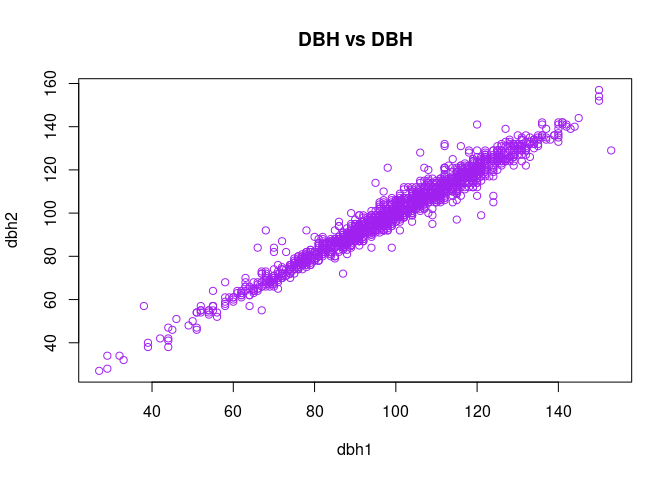
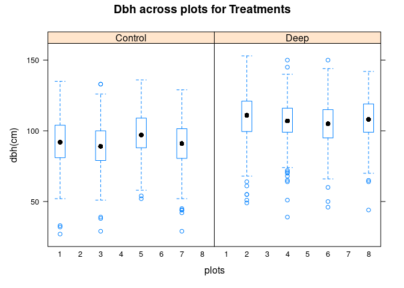
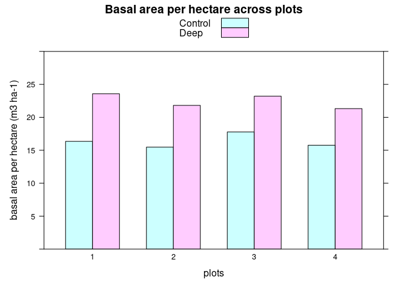
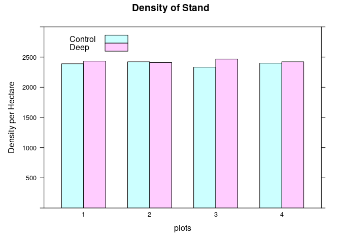

# Site Preparation Experiment on LodgePole Pine - Experiment (VII) (2)

This experiment is a soil scarification experiment with Lodegepole Pine
in Västerbotten, Sweden. The treatments were either planting after soil
scarification using deep plowing (deep), or planting without any site
preparation (control). The size of the treatment plots were 30\*30 m and
the experiment was replicated in 4 blokcs. The plantation was made in
1988 and the experiment was remeasured after several years, to 2012,
when all trees in the treatment plots were cross calipered at dbh (mm).

## Questions

For this data, I’ll be exploring the data and then calculating the basal
area/ha and stem density/ha for every block and treatment. I seek to
answer the following:

-   What effect have a radical soil scarification method such as deep
    plowing on:

    -   survival and

    -   growth of lodgepole pine on the site

In other words: Is there a significant effect of treatment if we test
for:

-   stem density and

-   basal area.

``` r
# loading libraries

library(doBy)
library(dplyr)
library(lattice)
library(ggplot2)
library(car)
library(data.table)
library(TukeyC)
```

**Importing the data**

``` r
L_pine <- read.table('https://raw.githubusercontent.com/xrander/Slu_experiment/master/Data/Lab%207/deepcult_lodgepolepine.txt',
           header = T,
           sep = '\t',
           na.strings = 'NA',
           dec = '.',
           strip.white = T)
head(L_pine)
```

    ##   plot block treenr treatment dbh1 dbh2 height dead
    ## 1    1     1      1   Control  110  112     NA   NA
    ## 2    1     1      2   Control  101  102     NA   NA
    ## 3    1     1      3   Control  109  112     NA   NA
    ## 4    1     1      4   Control   81   85     NA   NA
    ## 5    1     1      5   Control  115  117     NA   NA
    ## 6    1     1      6   Control  100  106     NA   NA

**Little Data Exploration**

``` r
str(L_pine)
```

    ## 'data.frame':    1799 obs. of  8 variables:
    ##  $ plot     : int  1 1 1 1 1 1 1 1 1 1 ...
    ##  $ block    : int  1 1 1 1 1 1 1 1 1 1 ...
    ##  $ treenr   : int  1 2 3 4 5 6 7 8 9 10 ...
    ##  $ treatment: chr  "Control" "Control" "Control" "Control" ...
    ##  $ dbh1     : int  110 101 109 81 115 100 95 98 107 79 ...
    ##  $ dbh2     : int  112 102 112 85 117 106 91 96 107 83 ...
    ##  $ height   : int  NA NA NA NA NA NA NA NA NA NA ...
    ##  $ dead     : int  NA NA NA NA NA NA NA NA NA NA ...

I will change the data types of ‘plot’, ‘block’, and ‘treatment’ into
factor data type

``` r
plot(L_pine$dbh1, L_pine$dbh2,
     col = 'purple',
     xlab = 'dbh1',
     ylab = 'dbh2',
     main = 'DBH vs DBH')
```



``` r
L_pine$plot <- as.factor(L_pine$plot)
L_pine$block <- as.factor(L_pine$block)
L_pine$treatment <- as.factor(L_pine$treatment)
```

### Survival

``` r
with(L_pine, table(treatment, dead))
```

    ##          dead
    ## treatment  1
    ##   Control 40
    ##   Deep    24

**subsetting only living trees**

``` r
L_pine$dead <- ifelse(is.na(L_pine$dead) == TRUE,0 , L_pine$dead)
```

``` r
L_pine1 <- subset(L_pine, dead== 0) # this returns values for only living trees, 1 means dead and 0 means alive
```

``` r
summary(L_pine1)
```

    ##       plot     block       treenr         treatment        dbh1       
    ##  8      :222   1:434   Min.   : 1.000   Control:859   Min.   : 27.00  
    ##  2      :219   2:435   1st Qu.: 4.000   Deep   :876   1st Qu.: 88.00  
    ##  3      :218   3:432   Median : 8.000                 Median :101.00  
    ##  6      :218   4:434   Mean   : 8.032                 Mean   : 99.33  
    ##  4      :217           3rd Qu.:12.000                 3rd Qu.:112.00  
    ##  7      :216           Max.   :15.000                 Max.   :153.00  
    ##  (Other):425                                                          
    ##       dbh2            height           dead  
    ##  Min.   : 27.00   Min.   : 72.0   Min.   :0  
    ##  1st Qu.: 88.00   1st Qu.: 94.0   1st Qu.:0  
    ##  Median :101.00   Median :102.0   Median :0  
    ##  Mean   : 99.82   Mean   :101.6   Mean   :0  
    ##  3rd Qu.:112.00   3rd Qu.:111.0   3rd Qu.:0  
    ##  Max.   :157.00   Max.   :133.0   Max.   :0  
    ##                   NA's   :1606

``` r
bwplot(dbh1~plot | treatment, data = L_pine1,
       main = 'Dbh across plots for Treatments',
       ylab = 'dbh(cm)',
       xlab = 'plots')
```



**getting the mean dbh**

``` r
L_pine1$dbh <- (L_pine1$dbh1 + L_pine1$dbh2)/2000
```

**Evaluating basal area**

``` r
L_pine1$ba <- (L_pine1$dbh/2)^2 * pi
```

``` r
summary(L_pine1)
```

    ##       plot     block       treenr         treatment        dbh1       
    ##  8      :222   1:434   Min.   : 1.000   Control:859   Min.   : 27.00  
    ##  2      :219   2:435   1st Qu.: 4.000   Deep   :876   1st Qu.: 88.00  
    ##  3      :218   3:432   Median : 8.000                 Median :101.00  
    ##  6      :218   4:434   Mean   : 8.032                 Mean   : 99.33  
    ##  4      :217           3rd Qu.:12.000                 3rd Qu.:112.00  
    ##  7      :216           Max.   :15.000                 Max.   :153.00  
    ##  (Other):425                                                          
    ##       dbh2            height           dead        dbh         
    ##  Min.   : 27.00   Min.   : 72.0   Min.   :0   Min.   :0.02700  
    ##  1st Qu.: 88.00   1st Qu.: 94.0   1st Qu.:0   1st Qu.:0.08800  
    ##  Median :101.00   Median :102.0   Median :0   Median :0.10100  
    ##  Mean   : 99.82   Mean   :101.6   Mean   :0   Mean   :0.09957  
    ##  3rd Qu.:112.00   3rd Qu.:111.0   3rd Qu.:0   3rd Qu.:0.11200  
    ##  Max.   :157.00   Max.   :133.0   Max.   :0   Max.   :0.15350  
    ##                   NA's   :1606                                 
    ##        ba           
    ##  Min.   :0.0005726  
    ##  1st Qu.:0.0060821  
    ##  Median :0.0080118  
    ##  Mean   :0.0080541  
    ##  3rd Qu.:0.0098520  
    ##  Max.   :0.0185057  
    ## 

**Basal area of only living trees**

``` r
L_pineba <- summaryBy (ba + dbh ~plot+block+treatment,
data = L_pine1,
na.rm = T,
keep.names = T,
FUN = sum)

head(L_pineba)
```

    ##   plot block treatment       ba    dbh
    ## 1    1     1   Control 1.471621 19.733
    ## 2    2     1      Deep 2.121139 24.020
    ## 3    3     2   Control 1.392638 19.330
    ## 4    4     2      Deep 1.962766 23.030
    ## 5    5     3   Control 1.599848 20.393
    ## 6    6     4      Deep 1.918627 22.778

**Estimating basal area per hectare**

``` r
L_pineba$baha <- L_pineba$ba * 10000/(30*30)
```

**Visualizing basal area per hectare**

``` r
barchart(baha~block,
         group = treatment,
         data = L_pineba,
         ylab = 'basal area per hectare (m3 ha-1)',
         xlab = 'plots',
         ylim = c(0, 30),
         main = 'Basal area per hectare across plots',
         auto.key = list(corners = c(0.05, 0.95)))
```



### Stem Density

``` r
L_pinedens <- summaryBy(ba~plot+block+treatment,
                        data = L_pine1, FUN = length)
L_pinedens$dens_ha <- L_pinedens$ba.length * 10000 / (30*30) 
```

``` r
barchart(dens_ha~block,
         group = treatment,
         data = L_pinedens,
         ylab = 'Density per Hectare',
         xlab = 'plots',
         ylim = c(0, 3000),
         main = 'Density of Stand',
         auto.key = list(corner = c(0.1, 0.95)))
```



## Analysis of Variance

``` r
M_ba <- lm(baha~block+treatment,
   data = L_pineba)
Anova(M_ba)
```

    ## Anova Table (Type II tests)
    ## 
    ## Response: baha
    ##           Sum Sq Df  F value    Pr(>F)    
    ## block      5.631  3   5.5025 0.0975220 .  
    ## treatment 75.241  1 220.5562 0.0006624 ***
    ## Residuals  1.023  3                       
    ## ---
    ## Signif. codes:  0 '***' 0.001 '**' 0.01 '*' 0.05 '.' 0.1 ' ' 1

``` r
M_dens <- lm(dens_ha~block+treatment,
   data = L_pinedens)
Anova(M_dens)
```

    ## Anova Table (Type II tests)
    ## 
    ## Response: dens_ha
    ##           Sum Sq Df F value Pr(>F)
    ## block      293.2  3  0.0512 0.9820
    ## treatment 4459.9  1  2.3369 0.2238
    ## Residuals 5725.3  3

Basal area was significantly higher in the deep plowing treatment but
has no significant difference in stem density indicating that the
primary reason to the good response of the deep plowing has brrn on
growth more than on survival.

<br> [Mixed Forest Experiment](mixed_forest.md) <br>

[Homepage](Readme.md) <br>

[Back to portfolio](https://xrander.github.io)
