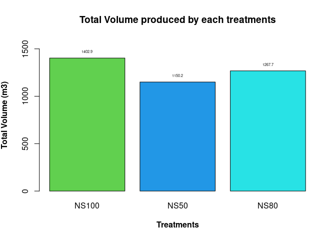
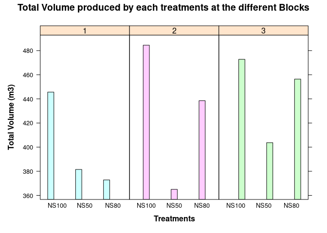

# Mixed Forest Experiment

This an experiment on the site 8556.Is there a significant difference in
net and gross production between the monoculture and mixtures? Does the
Norway spruce trees in the treatments differ in mean diameter? This is
one of the common questions in Southern Sweden. Many forests in southern
Sweden is managed as mixtures of Norway spruce and birch. This is a 38-
year old stand where an experiment has been established in the
precommercial thinning stage. The purpose of the experiment has been,
and is, to evaluate this different forest types over time, where one of
the species (birch) is fast growing in the establishment phase and the
other tree species (Norway spruce) is expected to catch up in growth in
the more mature phase. One of the questions for forest owners that want
to use the mixture of Norway spruce and birch is how to manage the
difference in growth rhythm and how to keep both species during the full
rotation of the stand.

**Experimental design** The experiment is organized in three blocks and
the treatments were randomly assigned to plots of about 0.1 ha each, one
treatment plot in each block.

-   Monoculture: 100 % Norway spruce (NS)

-   Admixture: 80 % Norway spruce and 20 % birch (NS80)

-   Mixed: 50 % Norway spruce and 50 % birch (NS50)

The experiment has been revised 5 times (including thinning 3 times)
after the beginning of the experiment. In every thinning the mixture
percentage in basal area, has been retained. In the data-set that I will
be working with, I have a sample plot data at the time of second
revision, which is the first remeasurement after the first thinning. The
initial age at revision 1 and treatments, varies for the sites (between
32 and 48 years) and so do the time between revision 1 and 2 (7-15
years).

``` r
#loading libraries
library(doBy)
library(dplyr)
library(lattice)
library(ggplot2)
library(car)
library(data.table)
library(TukeyC)
```

**Importing the data**

``` r
mix <- read.table('https://raw.githubusercontent.com/xrander/Slu_experiment/master/Data/Last%20straw/TaskE_mix.txt',
           header = T,sep = '\t',
           na.strings = 'NA',
           strip.white = T,
           dec = '.')
mix
```

    ##   plotno block treatment   N    G standingvol paiha harvestvol  dbh
    ## 1      1     1      NS50 699 19.6       181.1  11.4      181.9 18.5
    ## 2      2     1     NS100 573 22.0       222.7  18.7      200.8 22.1
    ## 3      3     3      NS80 526 22.1       216.6  14.9      217.2 22.6
    ## 4      4     2      NS80 584 21.8       214.9  16.8      201.7 21.9
    ## 5      5     2      NS50 634 19.6       173.7  10.8      170.6 20.7
    ## 6      6     3      NS50 541 20.3       187.3  11.3      193.9 22.5
    ## 7      7     3     NS100 512 22.0       222.2  15.8      227.2 23.4
    ## 8      8     1      NS80 619 19.4       175.9  11.8      177.2 19.7
    ## 9      9     2     NS100 462 21.7       216.8  19.5      243.0 24.7

**Data Description** The data-set includes data from revision 2:

-   Block: block

-   Plotno: plot number

-   Treatment: treatment code (same as listed above)

-   Standingvol: standing volume per hectare (m3 ha-1 )

-   Harvestvol: harvested volume in thinnings and measured dead volume
    (m3 ha-1 )

-   Paiha: Measured periodic annual increment at latest revision (m3
    ha-1 year-1)

-   Dbh: Mean dbh of Norway spruce at latest revision, age 38 (cm)

**Questions** - What is total volume production at the last revision?

-   Can you find any statistical differences between the selected
    treatments at this time, in terms of total volume production, PAI,
    dbh?

-   Show with some figures that you understand the data and your
    results.The data-set includes data from revision 2:

**A Little Exploration**

``` r
str(mix)
```

    ## 'data.frame':    9 obs. of  9 variables:
    ##  $ plotno     : int  1 2 3 4 5 6 7 8 9
    ##  $ block      : int  1 1 3 2 2 3 3 1 2
    ##  $ treatment  : chr  "NS50" "NS100" "NS80" "NS80" ...
    ##  $ N          : int  699 573 526 584 634 541 512 619 462
    ##  $ G          : num  19.6 22 22.1 21.8 19.6 20.3 22 19.4 21.7
    ##  $ standingvol: num  181 223 217 215 174 ...
    ##  $ paiha      : num  11.4 18.7 14.9 16.8 10.8 11.3 15.8 11.8 19.5
    ##  $ harvestvol : num  182 201 217 202 171 ...
    ##  $ dbh        : num  18.5 22.1 22.6 21.9 20.7 22.5 23.4 19.7 24.7

``` r
summary(mix)
```

    ##      plotno      block    treatment               N               G        
    ##  Min.   :1   Min.   :1   Length:9           Min.   :462.0   Min.   :19.40  
    ##  1st Qu.:3   1st Qu.:1   Class :character   1st Qu.:526.0   1st Qu.:19.60  
    ##  Median :5   Median :2   Mode  :character   Median :573.0   Median :21.70  
    ##  Mean   :5   Mean   :2                      Mean   :572.2   Mean   :20.94  
    ##  3rd Qu.:7   3rd Qu.:3                      3rd Qu.:619.0   3rd Qu.:22.00  
    ##  Max.   :9   Max.   :3                      Max.   :699.0   Max.   :22.10  
    ##   standingvol        paiha         harvestvol         dbh       
    ##  Min.   :173.7   Min.   :10.80   Min.   :170.6   Min.   :18.50  
    ##  1st Qu.:181.1   1st Qu.:11.40   1st Qu.:181.9   1st Qu.:20.70  
    ##  Median :214.9   Median :14.90   Median :200.8   Median :22.10  
    ##  Mean   :201.2   Mean   :14.56   Mean   :201.5   Mean   :21.79  
    ##  3rd Qu.:216.8   3rd Qu.:16.80   3rd Qu.:217.2   3rd Qu.:22.60  
    ##  Max.   :222.7   Max.   :19.50   Max.   :243.0   Max.   :24.70

Changing the data type of plot no, block and treatment

``` r
mix$plotno <- as.factor(mix$plotno)
mix$block <- as.factor(mix$block)
mix$treatment <- as.factor(mix$treatment)
```

## Total Volume Produced

``` r
mix$total_vol <- mix$standingvol + mix$harvestvol + mix$dbh
```

**VOlume Produced according to the treatments**

``` r
Total_vol_mix <- summaryBy(total_vol~treatment, data = mix, FUN = sum)
Total_vol_mix
```

    ##   treatment total_vol.sum
    ## 1     NS100        1402.9
    ## 2      NS50        1150.2
    ## 3      NS80        1267.7

**Visualizing the result**

``` r
mixb <- barplot(total_vol.sum~treatment,
         data = Total_vol_mix,
         ylab = substitute(paste(bold('Total Volume (m3)'))),
         col = c(3:5),
         xlab = substitute(paste(bold('Treatments'))),
         main = 'Total Volume produced by each treatments',
         ylim = c(0, 1600))
text (x = mixb, y = Total_vol_mix$total_vol.sum, label = Total_vol_mix$total_vol.sum, pos = 3, cex = 0.45)
```



``` r
barchart(total_vol~treatment | block,
         data = mix,
         ylab = substitute(paste(bold('Total Volume (m3)'))),
         group = block,
         xlab = substitute(paste(bold('Treatments'))),
         main = 'Total Volume produced by each treatments at the different Blocks',
         box.ratio = 2,)
```



``` r
#Experiment design
ftable(mix$block, mix$treatment)
```

    ##    NS100 NS50 NS80
    ##                   
    ## 1      1    1    1
    ## 2      1    1    1
    ## 3      1    1    1

## Analysis of Variance

``` r
## pai
mix_paiha <- lm(paiha ~ block+treatment , data = mix)

##tot_vol
mix_tvol <- lm(total_vol ~ block+treatment , data = mix)

##dbh
mix_dbh <- lm(dbh~block+treatment, data = mix)
```

``` r
## tot_vol
anova(mix_tvol)
```

    ## Analysis of Variance Table
    ## 
    ## Response: total_vol
    ##           Df  Sum Sq Mean Sq F value  Pr(>F)  
    ## block      2  3051.8  1525.9  2.5707 0.19147  
    ## treatment  2 10660.3  5330.1  8.9796 0.03318 *
    ## Residuals  4  2374.3   593.6                  
    ## ---
    ## Signif. codes:  0 '***' 0.001 '**' 0.01 '*' 0.05 '.' 0.1 ' ' 1

``` r
##dbh
anova(mix_dbh)
```

    ## Analysis of Variance Table
    ## 
    ## Response: dbh
    ##           Df  Sum Sq Mean Sq F value  Pr(>F)  
    ## block      2 13.0756  6.5378  8.9832 0.03316 *
    ## treatment  2 12.7222  6.3611  8.7405 0.03467 *
    ## Residuals  4  2.9111  0.7278                  
    ## ---
    ## Signif. codes:  0 '***' 0.001 '**' 0.01 '*' 0.05 '.' 0.1 ' ' 1

``` r
##pai
anova(mix_paiha)
```

    ## Analysis of Variance Table
    ## 
    ## Response: paiha
    ##           Df Sum Sq Mean Sq F value  Pr(>F)  
    ## block      2  5.896   2.948  0.8059 0.50806  
    ## treatment  2 70.056  35.028  9.5762 0.02985 *
    ## Residuals  4 14.631   3.658                  
    ## ---
    ## Signif. codes:  0 '***' 0.001 '**' 0.01 '*' 0.05 '.' 0.1 ' ' 1

### Post Hoc Test

``` r
summary(TukeyC(mix_paiha, which = 'treatment'))
```

    ## Goups of means at sig.level = 0.05 
    ##       Means G1 G2
    ## NS100 18.00  a   
    ## NS80  14.50  a  b
    ## NS50  11.17     b
    ## 
    ## Matrix of the difference of means above diagonal and
    ## respective p-values of the Tukey test below diagonal values
    ##       NS100  NS80  NS50
    ## NS100 0.000 3.500 6.833
    ## NS80  0.177 0.000 3.333
    ## NS50  0.026 0.198 0.000

``` r
summary(TukeyC(mix_dbh, which = 'treatment'))
```

    ## Goups of means at sig.level = 0.05 
    ##       Means G1 G2
    ## NS100 23.40  a   
    ## NS80  21.40  a  b
    ## NS50  20.57     b
    ## 
    ## Matrix of the difference of means above diagonal and
    ## respective p-values of the Tukey test below diagonal values
    ##       NS100  NS80  NS50
    ## NS100 0.000 2.000 2.833
    ## NS80  0.094 0.000 0.833
    ## NS50  0.033 0.515 0.000

[Previous page](Thinning_experiment.md) <br>

[Homepage](Readme.md) <br>

[Back to portfolio](https://xrander.github.io)
