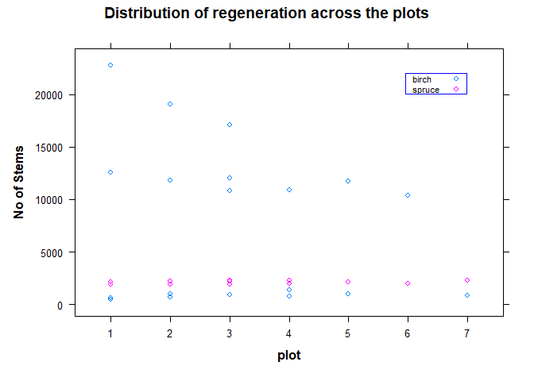

# Thinning Intensity and Frequency Experiment of Birch and Scotch Pine - Exp IV

<br>


<br>*source: forestrypedia.com* <br>
Data used in this experiment are from different pre-commercial thinning treatments (PCT) which are thereafter simulated in Heureka (Swedish support decision system). The stand development was simulated with some thinning operations included. Data provided is from every 5 year period.

**Data Description**

-   age: the age of the stand

-   site: the site number (1 for spruce and 6 birch)

-   stdens: stem density (st/ha)

-   ba: basal area (m^2/ha)

-   spruce_dgv: quadratic mean dbh for spruce in cm

-   birch_dgv: quadratic mean dbh for birch in cm

-   stand_vol: standing volume

-   harv_vol: harvested volume

-   mor_vol: mortality volume in m^3 at the age


```r
# loading libraries

library(doBy)
library(dplyr)
```

```
## 
## Attaching package: 'dplyr'
```

```
## The following object is masked from 'package:doBy':
## 
##     order_by
```

```
## The following objects are masked from 'package:stats':
## 
##     filter, lag
```

```
## The following objects are masked from 'package:base':
## 
##     intersect, setdiff, setequal, union
```

```r
library(lattice)
library(ggplot2)
library(car)
```

```
## Loading required package: carData
```

```
## 
## Attaching package: 'car'
```

```
## The following object is masked from 'package:dplyr':
## 
##     recode
```

```r
library(data.table)
```

```
## 
## Attaching package: 'data.table'
```

```
## The following objects are masked from 'package:dplyr':
## 
##     between, first, last
```

```r
library(TukeyC)
```

**importing data**


```r
lab4mai <- read.table('https://raw.githubusercontent.com/xrander/SLU-Plantation-Experimentation/master/Data/Lab%204/lab4mai%20(2).txt',
           header = T, sep = '\t',
           na.strings = 'NA', dec = '.',
           strip.white = T)
```

We can inspect the data structure to investigate if the variables are in the data type we want.


```r
str(lab4mai)
```

```
## 'data.frame':	50 obs. of  9 variables:
##  $ site      : int  1 1 1 1 1 1 1 1 1 1 ...
##  $ age       : int  5 10 15 20 25 30 35 40 45 50 ...
##  $ stdens    : num  2019 1999 1985 1970 1948 ...
##  $ ba        : num  0.0834 1.7468 7.0915 14.9834 22.4206 ...
##  $ stand_vol : num  0.6 4.5 22.5 66.8 126.6 ...
##  $ harv_vol  : num  0 0 0 0 0 ...
##  $ mor_vol   : num  0 0.01 0.03 0.15 0.64 1.44 2.74 4.25 3.77 3.31 ...
##  $ spruce_dgv: num  1.35 3.8 7.18 10.32 12.73 ...
##  $ birch_dgv : num  0 0 0 0 0 0 0 0 0 0 ...
```


This is important to do whenever we import data as some integer may be in character format.

## Questions

For this data we will do some exploration, we then find:

    -   total volume

    -   total yield,

    -   CAI and MAI

    -   correct the figure with thinning age

    -   find how many thinnings were done for both species

    -   decide if thinnings done were heavy or not.

## Total Volume Estimation

Given the data we have, we can get the total volume produce by adding all the volumes:
$$totvol = standvol harvvol + morvol$$


```r
lab4mai$tot_vol <-lab4mai$stand_vol + lab4mai$harv_vol + lab4mai$mor_vol
```

We subset the data according to species


```r
birch <- subset(lab4mai, site==6)
spruce <- subset(lab4mai, site==1)
```

**A little exploration**


```r
par(mar = c(5, 4, 4, 4) + 0.5)

plot(birch$age, birch$stdens, type = "l",
     ylim = c(0,2500),
     col = 'red',
     xlab = substitute(paste(bold('age'))),
     ylab = substitute(paste(bold('Stand density'))),
     main = 'Stand density and height relationship')
points(birch$age, birch$stdens,
         col = 'blue',
       pch = 19)
par(new = TRUE)
plot(spruce$age, spruce$stdens, type = "l",
     ylim = c(0,2500),
     col = 'black',
     axes = FALSE,
     xlab = "",
     ylab = "")
points(spruce$age, spruce$stdens,
         col = 'purple',
       pch = 16)
axis(side = 4, at = pretty(range(spruce$stdens)))
mtext (substitute(paste(bold('Stand density'))), side = 4, line = 3)
legend('topright', legend = c('birch', 'spruce'),
       pch = c(19,16),
       col = c('blue', 'purple'))
```

<!-- -->


The plot above from our little exploration gives us an idea of the number of thinnings that have occurred for both species. Birch was thinned once while Spruce was thinned thrice.

## Total Yield Estimation

To estimate the total yield, we evaluate the cumulative of all the volume removed from the forest then add it to the standing volume.


```r
# cumulative of birch
birch$sum_harv <- cumsum(birch$harv_vol)
birch$sum_mor <- cumsum(birch$mor_vol)

# total yield or volume for birch
birch$sumvol <- birch$sum_harv + birch$sum_mor + birch$stand_vol

# cumulative ofspruce
spruce$sum_harv <- cumsum(spruce$harv_vol)
spruce$sum_mor <- cumsum(spruce$mor_vol)


# total yield or volume for spruce
spruce$sumvol <- spruce$sum_harv + spruce$sum_mor + spruce$stand_vol
```

Visualizing the result and comparing the respective standing volume between the two species)


```r
par (mar = c(5,4,4,4) + 0.3)
plot(birch$age, birch$stand_vol,
     col = 'red',
     xlab = substitute(paste(bold('Age (years)'))),
     ylab = substitute(paste(bold('Volume (m3)'))),
     main = 'Stand Volume Development',
     pch = 19,
     cex = 0.5,
     type = 'b',
     xlim = c(0,140),
     ylim = c(0,1000))
points (birch$age,birch$sumvol,
          pch = 19,
         col ='red',
        cex = 0.7,
        type = 'b')
par (new = TRUE)
plot(spruce$age, spruce$sumvol,
     col = 'purple',
     type = 'b',
     cex = 0.7,
     pch = 16,
     xlab = "",
     ylab = "",
     axes = FALSE)
points(spruce$age,spruce$stand_vol,
       col ='purple',
       pch = 16,
       cex = 0.5,
       type = 'b')
axis (side = 4,
      at = pretty(range(spruce$sumvol)))
mtext(substitute(paste(bold('Volume (m3)'))),
      side = 4,
      line = 3)
legend("topleft", 
       legend = c('birch', 'spruce'),
       pch = c(19,16),
       col = c('red', 'purple'))
legend ("bottomright",
        legend = c('standing volume', 'total yield'),
        pch = c(19),
        cex = c(0.5, 1))
```

<!-- -->

## CAI and MaI

**birch**


```r
birch$last_vol <- shift(birch$stand_vol) ## this brings the previous measurement forward to the current row

## CAI
birch$cai <- (birch$stand_vol + birch$harv_vol + 
  birch$mor_vol - birch$last_vol)/5

## MAI
birch$mai <- birch$sumvol/birch$age
```

**spruce**


```r
spruce$last_vol <- shift(spruce$stand_vol) # Last measurement brought to the current row

## CAI
spruce$cai <- (spruce$stand_vol + spruce$harv_vol + 
                spruce$mor_vol - spruce$last_vol)/5

## Spruce MAI
spruce$mai <- spruce$sumvol/spruce$age
```

**Birch CAI and MAI**


```r
plot(birch$age, birch$mai,
     type = 'b',
     pch = 18,
     col = 'red',
     ylim = c(0,15),
     xlim = c(0, 140),
     main = 'MAI and CAI',
     ylab = substitute(paste(bold('Increment (m3 ha-1 yr-1)'))),
     xlab = substitute(paste(bold('age (years)'))))
points(birch$age, birch$cai,
        type = 'b',
        pch = 20,
        col = 'green')
legend("topleft",
         legend = c("MAI", "CAI"),
         pch = c(18, 20),
         col = c('red', 'green'))
```

<!-- -->


**Spruce CAI and MAI**


```r
plot(spruce$age, spruce$mai,
     type = 'b',
     pch = 18,
     col = 'red',
     ylim = c(0,20),
     xlim = c(0, 140),
     main = 'MAI and CAI',
     ylab = substitute(paste(bold('Increment (m3 ha-1 yr-1)'))),
     xlab = substitute(paste(bold('age (years)'))))
points(spruce$age, spruce$cai,
         type = 'b',
         pch = 20,
         col = 'green')
legend("topleft",
         legend = c("MAI", "CAI"),
         pch = c(18, 20),
         col = c('red', 'green'))
```

<!-- -->


## Correcting Thinning Age

Usually the year of harvest or thinning is usually having two volumes and time. The first is the volume before we harvest and the second is the volume we harvest. They are usually the same, but  time of harvest differs by days, or months. Since forestry is a business that involves calculating stand volume on some yearly period. It is usually costly and unprofitable to carry out inventory every year, thus, we do it between certain periods, 5 to 10 years, while we still monitor the stand between such period. Now we adjust the year of thinning and standing volume to show the age before harvest.


```r
# Birch
birch_thinned <- subset(birch, harv_vol>0)
birch_thinned$stand_vol <- birch_thinned$stand_vol + birch_thinned$harv_vol
birch_thinned$age <- birch_thinned$age  - 0.01

# Spruce
spruce_thinned <- subset(spruce, harv_vol >0)
spruce_thinned$stand_vol <- spruce_thinned$stand_vol + spruce_thinned$harv_vol
spruce_thinned$age <- spruce_thinned$age  - 0.01

head(birch_thinned)
```

```
##    site   age stdens      ba stand_vol harv_vol mor_vol spruce_dgv birch_dgv
## 39    6 69.99 1465.7 40.6077     522.5 225.9165   10.85       7.01     20.72
##    tot_vol sum_harv sum_mor sumvol last_vol  cai      mai
## 39  533.35 225.9165   62.48 584.98    495.3 7.61 8.356857
```


```r
head(spruce_thinned)
```

```
##    site   age stdens      ba stand_vol harv_vol mor_vol spruce_dgv birch_dgv
## 7     1 34.99 1890.1 36.9272     286.2 140.2849    2.74      16.77      0.00
## 10    1 49.99  816.2 38.4784     386.4 134.5849    3.31      25.87      0.00
## 14    1 69.99  565.9 43.2437     509.9 181.8588    6.55      36.13      7.43
##    tot_vol sum_harv sum_mor   sumvol last_vol    cai       mai
## 7   288.94 140.2849    5.01 291.2100    201.2 17.548  8.320286
## 10  389.71 274.8698   16.34 543.0249    302.2 17.502 10.860498
## 14  516.45 456.7286   41.74 826.5098    449.3 13.430 11.807283
```


Since this data is obtained, we can merge the table to the previous to have the corrected thinning age


```r
# Birch
birch_new <- merge(birch, birch_thinned, all = T)

# Spruce
spruce_new <- merge(spruce, spruce_thinned, all = T)
```

We can now visualize the new stand development


```r
par (mar = c(5,4,4,4) + 0.2)

plot(birch_new$age, birch_new$stand_vol,
     col = 'red',
     xlab = substitute(paste(bold('Age (years)'))),
     ylab = substitute(paste(bold('Volume (m3)'))),
     main = 'Stand Volume Development',
     pch = 19,
     type = 'b',
     xlim = c(0,140),
     ylim = c(0,1000),
     cex = 0.5) 
points (birch_new$age,birch_new$sumvol,
          pch = 19,
         col ='red',
        type = 'b',
        cex = 0.7) 
par(new = TRUE)
plot(spruce_new$age, spruce_new$sumvol,
     col = 'green',
     type = 'b',
     axes = FALSE,
     pch = 17,
     xlab = "",
     ylab = "",
     cex = 0.7)
points(spruce_new$age,spruce_new$stand_vol,
       col ='green',
       pch = 17,
       type = 'b',
       cex = 0.5) 
axis (side = 4, 
      at = pretty(range(spruce_new$sumvol)))
mtext(substitute(paste(bold('Volume (m3)'))),
                       side = 4,
                       line = 3)
legend("topleft", 
       legend = c('birch', 'spruce'),
       pch = c(19,17),
       col = c('red', 'green'))
legend ("bottomright",
        legend = c('standing volume', 'total yield'),
        pch = c(17),
        cex = c(0.5, 1))
```

<!-- -->


## How many Thinnings

From the figure above we can see that spruce was thinned 3 times while birch was thinned once.

## Heavy or Light Thinning(s)?

The definition of what is heavy or not is something that varies depending on the parameter used for thinning viz basal area or stand density, but for simplicity, stand density will be the parameter used to determine the thinning intensity. Based on the stand density or number of trees removed from the stand, thinning ≤ 25% is regarded as light thinning, 50% regarded as moderate, and > 50% is regarded as heavy thinning (Gonçalves, 2021). Using thinning intensity or degree formula provided by Gonçalves 2021.
<br>

$$RN = Nrem/Nt$$
Where
Nrem = Number of trees removed
Nt = Total number of trees

**For spruce**

| Age       | Stand_density | Thinning intensity | Light or Heavy? |
|-----------|---------------|--------------------|-----------------|
| 35 and 40 | 1890.1-842.8  | 55.4%              | Heavy           |
| 50 and 55 | 816.2/517.6   | 36.6%              | Moderate        |
| 70 and 75 | 565.9 - 340.9 | 39.8%              | Moderate        |

Thinning for Spruce

**For Birch**

| Age   | Stand_density  | Thinning intensity | Light or Heavy? |
|-------|----------------|--------------------|-----------------|
| 70-75 | 1465.7 - 785.5 | 46.4%              | Moderate        |

Thinning for Birch

# Mean Test of Regeneration - Exp (VII) (1)

The stem density inventory of regeneration is made from clear cuts labeled A,B,C, and D. Two species were regenerated, Norway Spruce and Birch were the species measured. Norway spruce was planted and Birch was naturally regenerated. The same plots were sed for the clearcuts but the number of plots varied between sites. The regenerations are already 6 years of age.


## Question

The aim of this session is to compare two means, individual species stem density mean vs mean value of all inventory plots from all sites.


```r
regen <- read.table('https://raw.githubusercontent.com/xrander/Slu_experiment/master/Data/Lab%207/regenerationsprucebirch.txt',
           header = T, dec = '.',
           strip.white = T,
           sep = '\t',
           na.strings = 'NA')
```

**Data Description**

-   site = site_id A, B, C or D

-   plot = plot id 1 - 7

-   species = spruce or birch

-   density = stems per ha

**Data Exploration**


```r
str(regen)
```

```
## 'data.frame':	38 obs. of  4 variables:
##  $ site   : chr  "A" "A" "A" "B" ...
##  $ plot   : int  1 2 3 1 2 3 4 1 2 3 ...
##  $ species: chr  "spruce" "spruce" "spruce" "spruce" ...
##  $ density: int  2100 2200 2200 1900 2200 2300 2000 1900 1900 2200 ...
```


changing plot to factor data type


```r
regen$plot <- as.factor(regen$plot)
```


```r
str(regen)
```

```
## 'data.frame':	38 obs. of  4 variables:
##  $ site   : chr  "A" "A" "A" "B" ...
##  $ plot   : Factor w/ 7 levels "1","2","3","4",..: 1 2 3 1 2 3 4 1 2 3 ...
##  $ species: chr  "spruce" "spruce" "spruce" "spruce" ...
##  $ density: int  2100 2200 2200 1900 2200 2300 2000 1900 1900 2200 ...
```


```r
summary(regen)
```

```
##      site           plot    species             density     
##  Length:38          1:8   Length:38          Min.   :  459  
##  Class :character   2:8   Class :character   1st Qu.: 1900  
##  Mode  :character   3:8   Mode  :character   Median : 2150  
##                     4:6                      Mean   : 4922  
##                     5:4                      3rd Qu.: 8361  
##                     6:2                      Max.   :22793  
##                     7:2
```

From the summary we can notice that we have unequal replications of the plots in the sites


```r
xyplot(density~plot, data = regen,
       group = species,
       main = 'Distribution of regeneration across the plots',
       ylab = substitute(paste(bold('No of Stems'))),
       xlab = substitute(paste(bold('plot'))),
       auto.key = list(corner = c(0.9,0.9), border = 'blue', cex = 0.7))
```

<!-- -->

**getting a view of the experiment design**


```r
table(regen$site, regen$plot)
```

```
##    
##     1 2 3 4 5 6 7
##   A 2 2 2 0 0 0 0
##   B 2 2 2 2 0 0 0
##   C 2 2 2 2 2 0 0
##   D 2 2 2 2 2 2 2
```

    
**Comparing mean**


```r
mean_1 <- summaryBy(density~species, data = regen, FUN = c(mean,sd, length))
mean_1
```

```
##   species density.mean density.sd density.length
## 1   birch     7728.789  7345.5638             19
## 2  spruce     2115.789   146.2994             19
```


This is the general mean without regards for the differences in the site replications.


```r
sitemean <- summaryBy(density~species + site, data = regen, na.rm = T, keep.names = T, FUN = mean)

sitemean
```

```
##   species site   density
## 1   birch    A 19665.333
## 2   birch    B   864.000
## 3   birch    C 11793.200
## 4   birch    D  3632.714
## 5  spruce    A  2166.667
## 6  spruce    B  2100.000
## 7  spruce    C  2080.000
## 8  spruce    D  2128.571
```

    

```r
mean_2 <- summaryBy(density~species, data = sitemean,
        FUN = c(mean, sd, length))
mean_2
```

```
##   species density.mean density.sd density.length
## 1   birch     8988.812 8496.13741              4
## 2  spruce     2118.810   37.61905              4
```


**Estimating the standard error**


```r
mean_1$st_err <- mean_1$density.sd/sqrt(mean_1$density.length)
mean_2$str_err <- mean_2$density.sd/sqrt(mean_2$density.length)
```

[Poplar Cuttings Experiment](cuttings.html) <br>

[Homepage](Readme.html) <br>

[Clone Performance Experiment](clone.html) <br>

[Back to portfolio](https://olamideadu.com)
