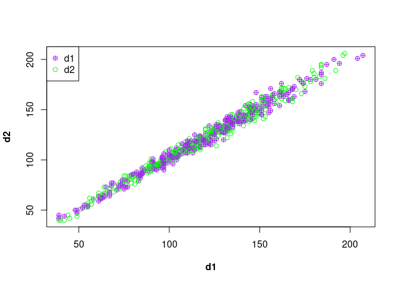
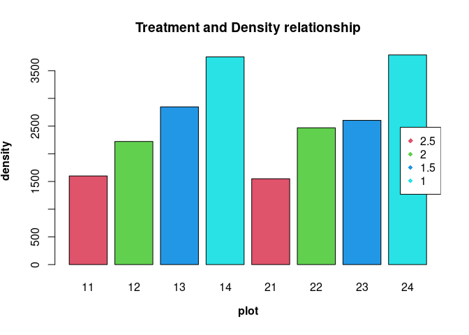
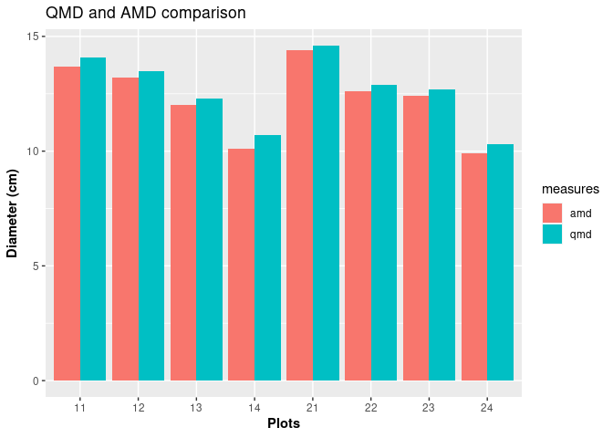

# Spacing Experiment of Scotch Pine - Exp II


Numerous experiment have been executed to check the effect of spacing on
the productivity of a stand. Without drawing into conclusion and relying
on facts from already established truths. I’ll explore the to see the
effect of spacing on Scotch pine and determine if there are differences
between the spacing treatments.

This experiment is a long-term experiment to test the effect of four
different spacing treatments 1m, 1.5m, 2m, and 2.5m across eight plots.
The experiment is designed such that two plots are assigned a treatment,
in this case the plots. The plots are also of varying sizes.

*The Design of the experiment using R*

``` r
plot = c(11:14, 21:24)
## plot here denotes the plots number or names

areaha = c(0.04, 0.0324, 0.0288, 0.0288, 0.04, 0.0324, 0.0288, 0.0288)
## areaha is the area per hectare of each plots

treatment = c(2.5, 2, 1.5 ,1)
### **nb**: 2.5 implies 2.5*2.5 and 2 implies 2*2 and so on.

### creating the data frame for the plots with their properties
exp1012 <- data.frame(plot, areaha, treatment)
head(exp1012)
```

    ##   plot areaha treatment
    ## 1   11 0.0400       2.5
    ## 2   12 0.0324       2.0
    ## 3   13 0.0288       1.5
    ## 4   14 0.0288       1.0
    ## 5   21 0.0400       2.5
    ## 6   22 0.0324       2.0

``` r
library(doBy)
library(dplyr)
library(lattice)
library(ggplot2)
library(car)
library(data.table)
library(TukeyC)
```

*importing the data*

``` r
### importing data
dbh1012 <- read.table("https://raw.githubusercontent.com/xrander/SLU-Plantation-Experimentation/master/Data/Lab2/dbhlist_exp1012.txt",
           header = T, sep = "\t", na.strings = "NA", dec = ".", strip.white = TRUE)
head(dbh1012)
```

    ##   plot nr  d1  d2
    ## 1   11  2 152 159
    ## 2   11  3 134 126
    ## 3   11  4 156 171
    ## 4   11  6 158 160
    ## 5   11  7  97  90
    ## 6   11  8 154 159

The data used for this analysis can be obtained
[here](https://raw.githubusercontent.com/xrander/SLU-Plantation-Experimentation/master/Data/Lab2/dbhlist_exp1012.txt).

**Data Description**

-   plot: the plot number

-   nr: the tree number

-   d1: cross caliper diameter measurement 1

-   d2: cross caliper diameter measurement 2, 90 degrees to measurement
    1

------------------------------------------------------------------------

## Quick exploration

The data will be investigated to see if there’s anything strange with
the data

``` r
plot(dbh1012$d1, dbh1012$d2,
     xlab = substitute(paste(bold('d1'))),
     ylab = substitute(paste(bold('d2'))),
     col = c('purple', 'green'),
     pch = c(10,21))
legend('topleft',
       legend = c('d1', 'd2'),
       col = c('purple', 'green'),
       pch = c(10,21))
```



The data seems to be alright, we can now proceed with the analysis

## Questions

We’ll be:

    -   estimating the basal area

    -   evaluating the stand density

    -   evaluating the AMD and QMD

    -   Plot the basal area vs the stand density

### Basal Area Estimation

Basal area is the average amount of an area occupied by tree stems,
defined as the cross-sectional area of all stems in a stand measured at
breast height (dbh) and express as per unit of land area.The formula of
dbh is
*B**A* = *π*(*D**B**H*/2)<sup>2</sup>
Where: - BA = Basal area

-   DBH = diameter at breast height (1.3m above ground)

``` r
## average of the two diameter
dbh1012$dm <- (dbh1012$d1 + dbh1012$d2)/2

## squared valued to be used for quadratic mean estimation
dbh1012$dd <- dbh1012$dm^2

## basal area estimation
dbh1012$ba <- pi * ((dbh1012$dm/2)^2)
```

-   dm: mean of both diameter

-   dd: dbh squared

-   ba: basal area

The sum of basal area for each plots can be measured now using doBy’s
`summaryBy` function and the result merge with `site1012` to have a more
robust data set

``` r
plotba <-summaryBy(ba~plot, data = dbh1012, FUN = sum)

site1012 <- merge(exp1012, plotba, all = T)

site1012
```

    ##   plot areaha treatment    ba.sum
    ## 1   11 0.0400       2.5  993838.7
    ## 2   12 0.0324       2.0 1025256.4
    ## 3   13 0.0288       1.5  968972.4
    ## 4   14 0.0288       1.0  963524.9
    ## 5   21 0.0400       2.5 1043748.0
    ## 6   22 0.0324       2.0 1045694.8
    ## 7   23 0.0288       1.5  953649.5
    ## 8   24 0.0288       1.0  903224.4

Now we can estimate the basal area per hectare and basal area of each
treatments.

``` r
## Estimating the basal area per hectare
site1012$baha <- (1/site1012$areaha) * site1012$ba.sum

##converting to basal area per hectare from mm2 to m2
site1012$baham2 <- round((site1012$baha/1000000),2)

## Estimating the basal area per treatment
trtmean1012 <- round(summaryBy(baham2~treatment,
                         data = site1012, FUN = mean), 1)
site1012
```

    ##   plot areaha treatment    ba.sum     baha baham2
    ## 1   11 0.0400       2.5  993838.7 24845968  24.85
    ## 2   12 0.0324       2.0 1025256.4 31643716  31.64
    ## 3   13 0.0288       1.5  968972.4 33644876  33.64
    ## 4   14 0.0288       1.0  963524.9 33455726  33.46
    ## 5   21 0.0400       2.5 1043748.0 26093700  26.09
    ## 6   22 0.0324       2.0 1045694.8 32274532  32.27
    ## 7   23 0.0288       1.5  953649.5 33112830  33.11
    ## 8   24 0.0288       1.0  903224.4 31361958  31.36

``` r
barplot(site1012$baham2,
        names.arg = site1012$plot,
        col = c(2,3,4,5),
        ylab = substitute(paste(bold('Basal Area (m2/ha)'))),
        xlab = substitute(paste(bold('plot'))),
        main = 'Basal area across sites')
legend('right',
       legend = unique(site1012$treatment),
       pch = 18,
       cex = 1.0,
       col = c(2,3,4,5))
```


------------------------------------------------------------------------

### Stand Density Estimation

Stand density is a quantitative measurement of a forest. It describes
the number of individuals (trees) on a unit area in either absolute or
relative terms. To read more on stand density click
[here](https://www.sciencedirect.com/topics/agricultural-and-biological-sciences/stand-density#:~:text=Stand%20density%20is%20a%20quantitative,Avery%20and%20Burkhart%2C%201994).)

**Estimating the stand density** To calculate the density we need some
information. - The size of the forest: This is usually expressed in ha
or m2

-   The size of sample plots: this is important to calculate the total
    number of plots in the stand.

-   The number of trees in a sample plot or the plot density

``` r
## To derive the plot density
plotdens <- summaryBy(nr~plot, data = dbh1012, FUN = length)


## we merge the plot density to the site information
site1012 <- merge (site1012, plotdens, all = T)


## After this we can get the density per hectare
site1012$dens_ha <- round((site1012$nr.length * (1/site1012$areaha)), 1)

barplot(site1012$dens_ha,
        names.arg = site1012$plot,
        xlab = substitute(paste(bold("plot"))),
        ylab = substitute(paste(bold("density"))),
        main = "Treatment and Density relationship",
        col = c(2,3,4,5))
legend('right',
       legend = unique(site1012$treatment),
       pch = 18,
       cex = 1.0,
       col = c(2,3,4,5))
```



The chart shows there’s a marked difference across plots. Plots with the
lowest treatment, i.e., spacing have the higher density

### Deriving Arithmetic Mean Diameter(AMD) and Quadratic Mean Diameter(QMD)

The quadratic mean diameter symbolized as QMD is the square root of the
summation of the dbh squared of trees divided by the number of trees.
$$QMD = \sqrt{(\sum d_i^2)/n}$$
Where d = diameter squared n = number of trees

QMD is considered more appropriate than AMD (Arithmetic Mean Diameter)
for characterizing the group of trees which have been measured. QMD
assigns greater weight to larger trees, read more
[here](https://www.fs.usda.gov/pnw/olympia/silv/publications/opt/436_CurtisMarshall2000.pdf)

``` r
plotdbh <- summaryBy(dm+dd~plot, data = dbh1012, FUN = c(mean, sum))

## Merging values to site1012
site1012 <- merge(site1012, plotdbh, all = T)

##Converting dm.mean and dm.sum from millimeters to centimeter
site1012$dm.mean_cm <- site1012$dm.mean/10

site1012$dm.sum_cm <- site1012$dm.sum/10

## "site1012$dm.mean_cm" is synonymous to AMD therefore
site1012$amd = site1012$dm.mean_cm

#converting dd.mean and dd.sum from mm^2 to cm ^2
site1012$dd.mean_cm <- site1012$dd.mean/100

site1012$dd.sum_cm <- site1012$dd.sum/100

#Estimating the Quadratic Mean DIameter
site1012$qmd <- sqrt(site1012$dd.sum/site1012$nr.length)/10
```

### Basal area stand density relationship

``` r
site1012[,c("baham2", "dens_ha")]
```

    ##   baham2 dens_ha
    ## 1  24.85  1600.0
    ## 2  31.64  2222.2
    ## 3  33.64  2847.2
    ## 4  33.46  3750.0
    ## 5  26.09  1550.0
    ## 6  32.27  2469.1
    ## 7  33.11  2604.2
    ## 8  31.36  3784.7

we create a new table to hold the amd and qmd. We do this to compare the
values using a barplot.

``` r
amd_qmd <- data.frame(plot = rep(site1012$plot, times = 2),
                      treatment = rep(site1012$treatment, times = 2),
                      diameter = round(c(site1012$amd, site1012$qmd), 1),
                      measures = rep(c('amd', 'qmd'),
                                     each = 8))
amd_qmd
```

    ##    plot treatment diameter measures
    ## 1    11       2.5     13.7      amd
    ## 2    12       2.0     13.2      amd
    ## 3    13       1.5     12.0      amd
    ## 4    14       1.0     10.1      amd
    ## 5    21       2.5     14.4      amd
    ## 6    22       2.0     12.6      amd
    ## 7    23       1.5     12.4      amd
    ## 8    24       1.0      9.9      amd
    ## 9    11       2.5     14.1      qmd
    ## 10   12       2.0     13.5      qmd
    ## 11   13       1.5     12.3      qmd
    ## 12   14       1.0     10.7      qmd
    ## 13   21       2.5     14.6      qmd
    ## 14   22       2.0     12.9      qmd
    ## 15   23       1.5     12.7      qmd
    ## 16   24       1.0     10.3      qmd

``` r
ggplot(data = amd_qmd, aes(x = as.character(plot), y = diameter, fill = measures)) + 
  geom_bar (position = "dodge", stat = "identity") +
  labs(title = "QMD and AMD comparison",
       x = substitute(paste(bold('Plots'))),
       y = substitute(paste(bold('Diameter (cm)'))))
```


